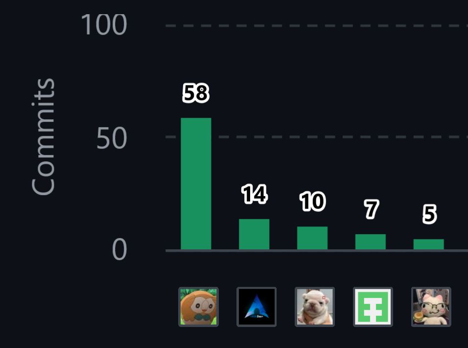

# Project Report Collaboration Insights

Repositorio de Github del informe: [https://github.com/andeva-upc/atelier-report-11848](https://github.com/andeva-upc/atelier-report-11848)

Organización de GitHub de Andeva: [https://github.com/andeva-upc](https://github.com/andeva-upc)

##### Primer Avance (AV1):
##### Reporte de la colaboración:

El primer avance del reporte tuvo aporte de todos los integrantes de andeva. A continuación, se describe los principales aportes de cada integrante.

- El integrante Luis Daniel Granda Ibarra, realizó el sección de Lean UX Process, el artefacto de Empathy Mapping, ayuda en las User Stories, desarrollo del artefacto de Impact Mapping y creación de los wireframes como mock-ups de Web Applications UX/UI Design.

- El integrante Joel Huamani Estefanero, realizó el sección de Startup Profile, Solution Profile y Segmentos Objetivo en relación al capítulo 1. Además, desarrollo las User Stories, Product Backlog, Style Guidelines, Information Architecture, creación de wireframes y mock-ups de la Landing Page como de Web Applications UX/UI Design.
- El integrante Aldo Jeanfranco Machacca Soto, se encargó de los competidores, creación de los secciones relacionado al C4, Class Diagram y Database Diagram.
- La integrante Mariana Hortencia Morocho Pinedo, realizó el Needfinding y reación de los wireframes como mock-ups de Web Applications UX/UI Design.
- El integrante Adiel Abdiaz Sanchez Santin, se encargó del Big Picture Event Storming, Ubiquitous Language, Design-Level Event Storming y aporte en el desarrollo del Class Diagram.

Finalmente, este gráfico representa la cantidad de commits realizados por cada miembro del equipo en el repositorio del proyecto. Cada barra representa a un miembro del equipo y la altura de la barra indica el número total de commits realizados por esa persona.
&emsp;&emsp;&emsp;&emsp;

&emsp;&emsp;&emsp;&emsp;

