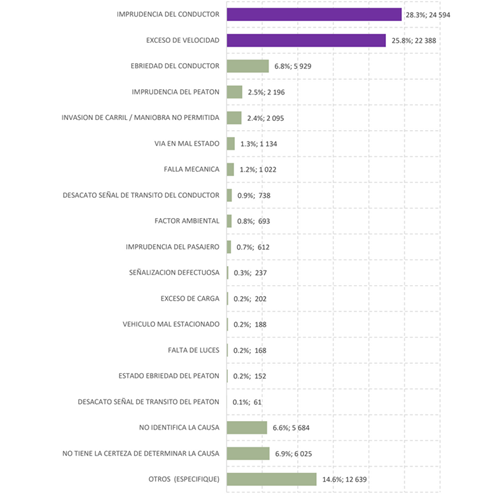
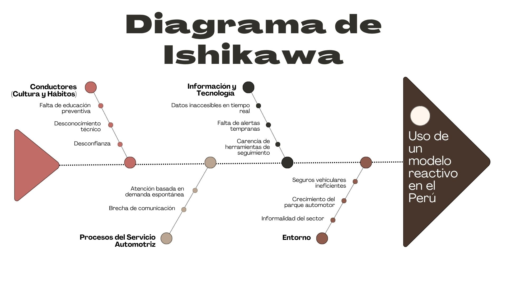

## 1.2. Solution Profile {#cap-1-2}

&emsp;&emsp;&emsp;&emsp;A continuación, se darán a conocer los detalles del perfil de la solución respaldada por antecedentes sólidos y confiables. Aparte de ello, el uso de técnicas como “Diagrama de Ishikawa”, “5W’s y 2H’s” y “Lean UX Canvas”.

### 1.2.1.&emsp;&emsp;*Antecedentes y Problemática* {#cap-1-2-1}

&emsp;&emsp;&emsp;&emsp;En Lima, el modelo de actuar ante fallos mecánicos imprevistos es reactivo. Por ello, buscamos quitar el modelo actual e instaurar un modelo proactivo que beneficie a los conductores económicamente, dándole una mayor vida útil a su vehículo, como también a los talleres, proporcionándoles una fuente de clientes fieles.

&emsp;&emsp;&emsp;&emsp;Según el informe del sector automotor, realizado por la Asociación Automotriz del Perú, señala que en los últimos dos meses del año 2026 se vendieron 41,584 unidades de vehículos livianos, representando un aumento del 36.8% respecto al año pasado en el mismo periodo (AAP, 2026, p. 5).

**Figura 2**

*Venta de vehículos livianos y pesados en el periodo enero-febrero 2026*

&emsp;&emsp;&emsp;&emsp;Con respecto a la gráfica de la Figura 3. Los resultados indican una tendencia anual a seguir comprando vehículos livianos y grandes (AAP, 2026, p. 7) que requieren de un servicio para poder mantener a estos mismos en las máximas condiciones.

**Figura 3**

*Ventas de vehículos livianos y pesados desde enero del 2020 a enero del 2026*

&emsp;&emsp;&emsp;&emsp;Hay varias formas como los seguros vehiculares, pero son muy volátiles, con servicios pésimos o no son una opción viable económicamente. Por otra parte, los 38000 talleres de Lima Metropolitana y del Callao presentaron Por otra parte, los 38000 talleres de Lima Metropolitana y del Callao presentaron pérdidas del 30% a 40%, lo que conlleva a que hay un bajo uso de estos debido a la disparidad de precios entre talleres, generando baja fidelización y flujo de clientes (Fiestas et al., 2021).

&emsp;&emsp;&emsp;&emsp;El no contar con un servicio de mantenimiento o arreglo de fallas mecánicas lleva a que según el boletín estadístico anual de siniestralidad vial 2024, realizado por el Observatorio Nacional de Seguridad Vial, señala que de un total de 87757 siniestros de tránsitos a nivel nacional el 1,2% de muertes son por partes de fallas mecánicas y de un 0,2% por falta de luces (ONSV, 2025, p. 17). Esto representaría que el 1,4% de los siniestros de tránsito son por factores vehiculares, los porcentajes pueden sonar bajos, pero en total hablamos de 1190 siniestros que pudieron haberse evitado con un mantenimiento adecuado.

**Figura 4**

*Porcentajes de siniestros según su causa, 2024*

&emsp;&emsp;&emsp;&emsp;Por ello, en andeva hemos considerado pertinente elaborar dos artefactos que pongan en perspectiva los aspectos fundamentales de la problemática que aborda “X”. Por un lado, mediante 2 diagramas de Ishikawa identificamos las causas raíz que explican el constante uso de un modelo reactivo en el Perú y baja fidelización conductor-taller.

**Figura 5**

*Diagrama de Ishikawa, efecto: Uso de un modelo reactivo en el Perú*

**Figura 6**

*Diagrama de Ishikawa, efecto: Baja fidelización conductor-taller*

&emsp;&emsp;&emsp;&emsp;Por otro lado, mediante el diagrama 5W’s + 2H’s delimitamos operativamente el problema y la solución.

**Figura 7**

*Diagrama 5W’s + 2H’s - atelier*

