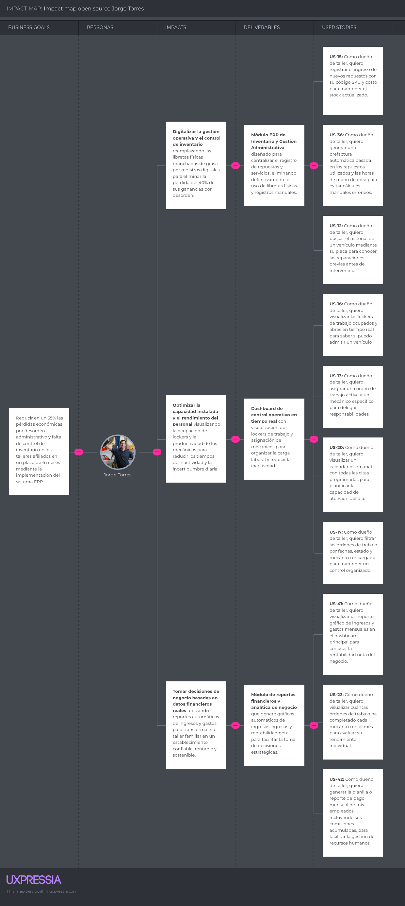
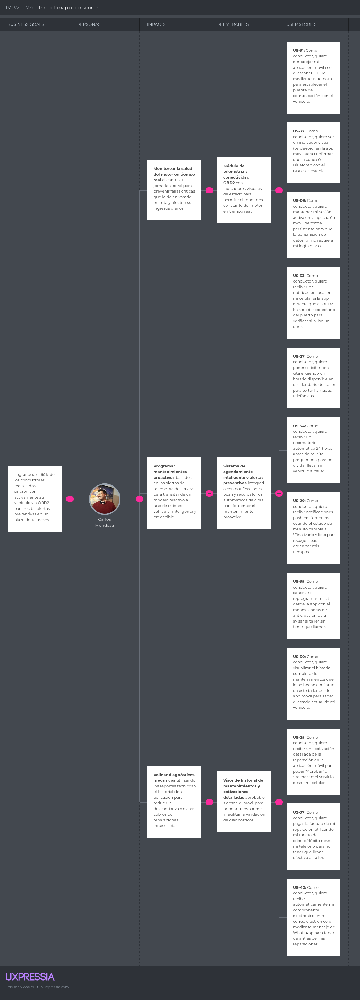

## 3.2. Impact Mapping {#cap-3-2}

### Segmento objetivo 1: Dueños o administradores de talleres automotrices independientes en Lima

### Segmento objetivo 2: Conductores de vehículos particulares de Lima

