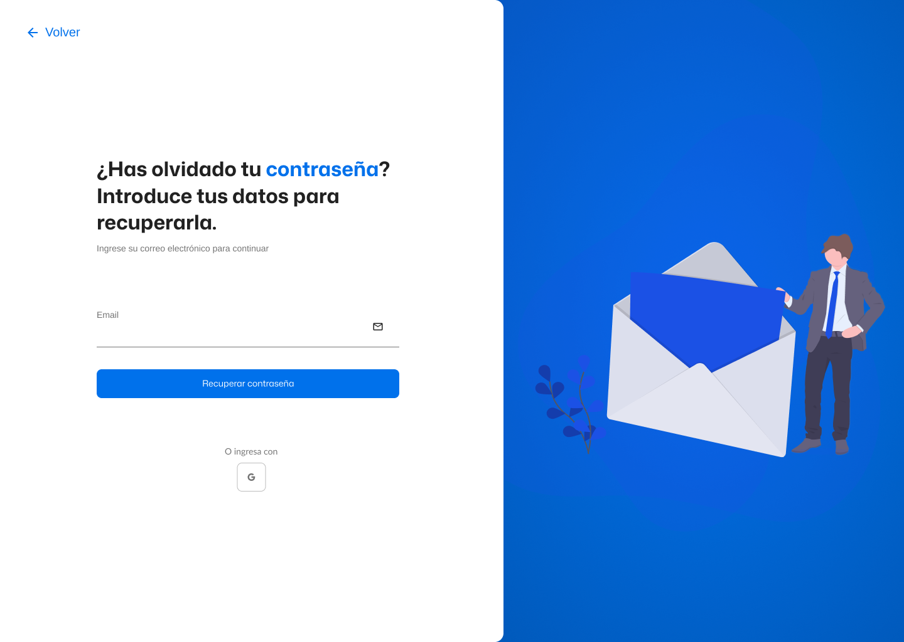
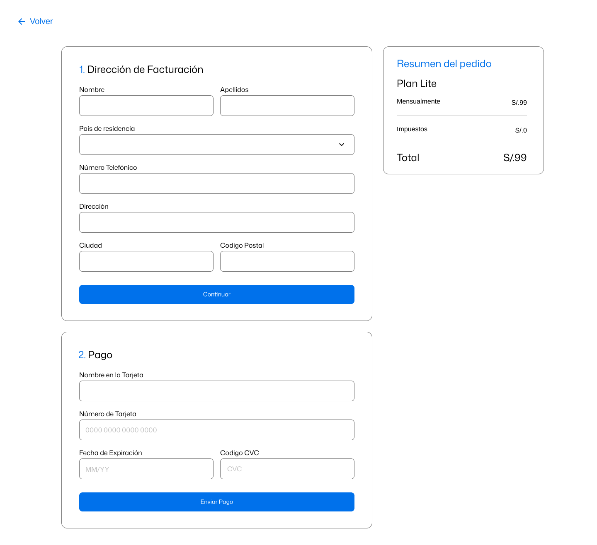
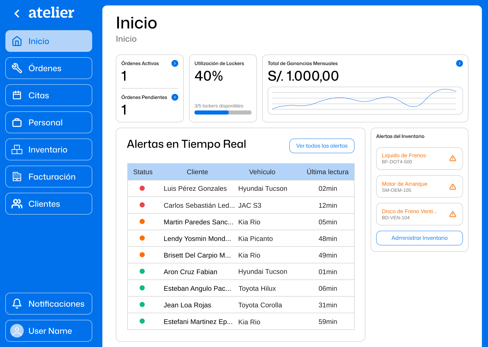
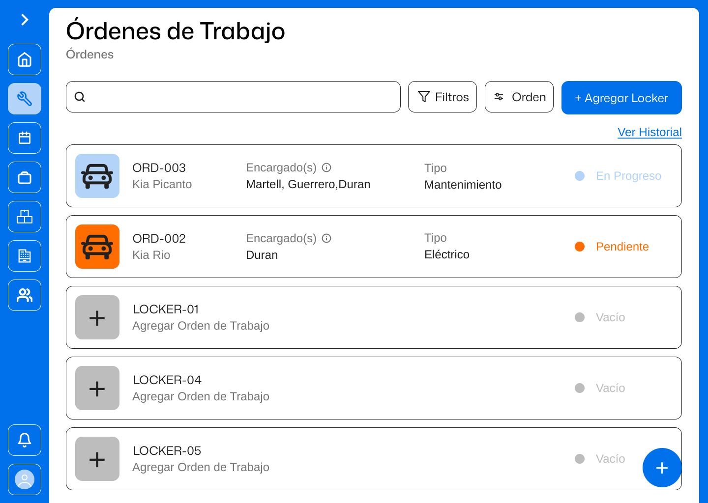
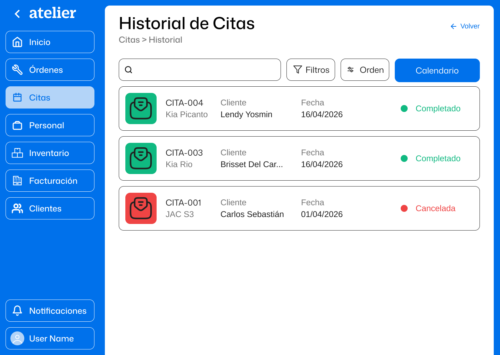
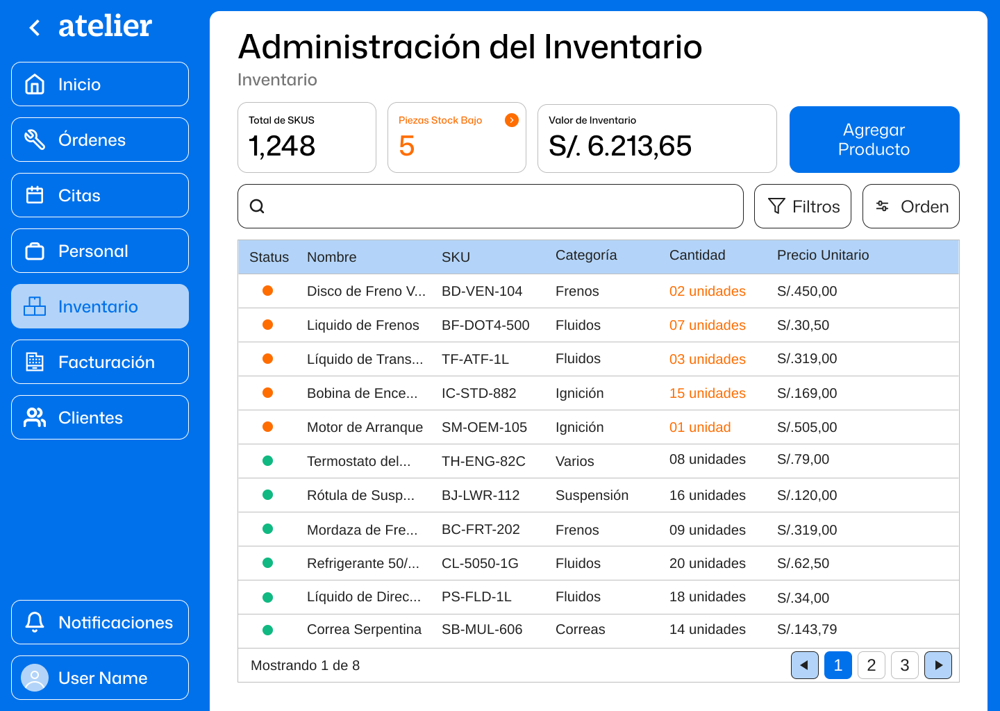
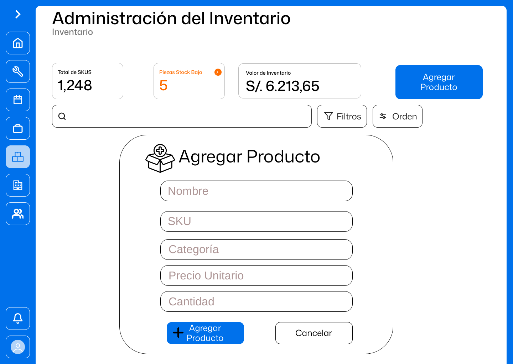
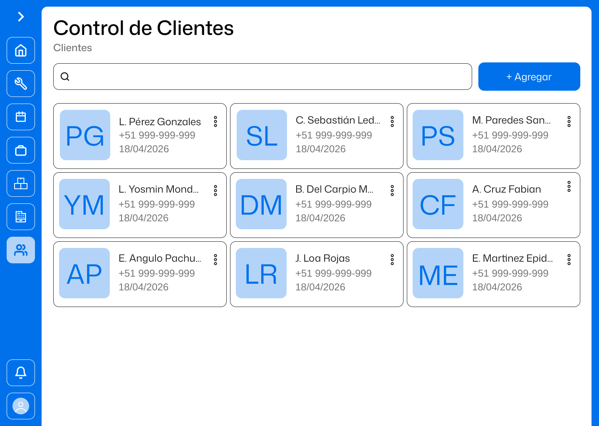

## 4.4. Web Applications UX/UI Design {#cap-4-4}

### 4.4.1.&emsp;&emsp;*Web Applications Wireframes* {#cap-4-4-1}

### 4.4.2.&emsp;&emsp;*Web Applications Mock-ups* {#cap-4-4-2}

&emsp;&emsp;&emsp;&emsp;En esta sección se exponen los prototipos de la plataforma web, los cuales consisten en representaciones de media y alta fidelidad que ilustran las funciones esenciales del sistema. Dichos diseños se han desarrollado tomando como base los esquemas estructurales o wireframes elaborados con anterioridad.

**Inicio**

*Mock-up del inicio de la plataforma web*

**DashBoard**

*Mock-up del DashBoard de la plataforma web*

**Órdenes de trabajo**

*Mock-up de Órdenes de trabajo de la plataforma web*

**Citas**

*Mock-up de Citas de la plataforma web*

**Personal**

*Mock-up de Personal de la plataforma web*

**Inventario**

*Mock-up de Inventario de la plataforma web*

**Facturación**

*Mock-up de Facturación de la plataforma web*

**Clientes**

*Mock-up de Clientes de la plataforma web*

### 4.4.3.&emsp;&emsp;*Web Applications Wireflow Diagrams* {#cap-4-4-3}

### 4.4.4.&emsp;&emsp;*Web Applications Userflow Diagrams* {#cap-4-4-4}
