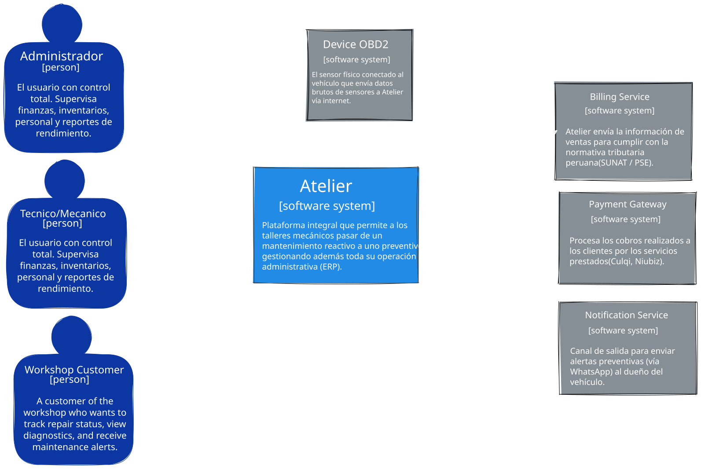
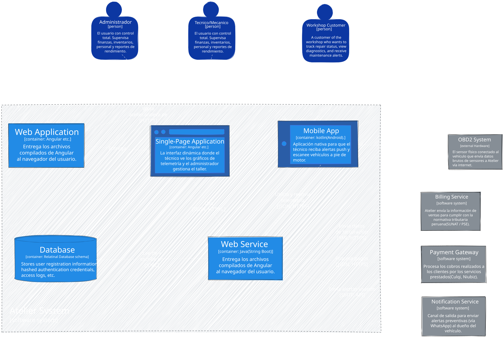
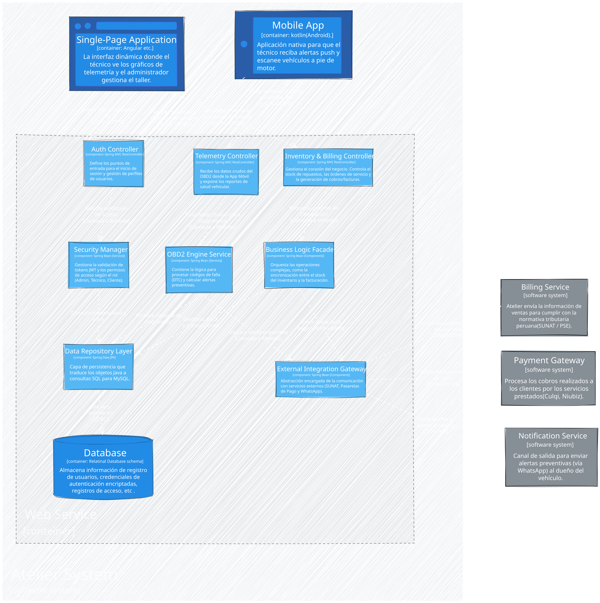

## 4.6. Domain-Driven Software Architecture {#cap-4-6}

&emsp;&emsp;&emsp;&emsp;En esta sección se expone la arquitectura de software de atelier, nuestra plataforma tecnológica orientada a transformar el mantenimiento automotriz de un modelo reactivo a uno predictivo e inteligente. Para representar esta arquitectura de manera estructurada y comprensible para todos los perfiles técnicos y de negocio, empleamos el modelo C4. Este marco nos permite documentar el sistema jerárquicamente a través de distintos niveles de abstracción. A continuación, se detallan los conceptos correspondientes a los niveles de Contexto, Contenedores y Componentes, enfocándonos en cómo los elementos tecnológicos de la solución interactúan para erradicar las ineficiencias del sector y brindar valor tanto al conductor como al taller.

### 4.6.2.&emsp;&emsp;*Software Architecture Context Diagram* {#cap-4-6-2}

&emsp;&emsp;&emsp;&emsp;El nivel de Contexto (Nivel 1) proporciona una perspectiva global, ilustrando cómo el ecosistema atelier se inserta e interactúa dentro de su entorno operativo. En este nivel, se identifican a los actores principales: el conductor particular, que busca transparencia y previsión sobre la salud de su vehículo a través de la interpretación de la telemetría; y el administrador del taller independiente, que necesita reemplazar la gestión empírica y manual (libretas, WhatsApp) para centralizar su operación. Asimismo, se visualizan los sistemas externos vitales para la automatización, tales como la entidad de facturación electrónica y las pasarelas de pago para el cierre comercial de los servicios. Esta visión enfoca las fronteras del sistema y demuestra cómo atelier actúa como el núcleo unificador entre el vehículo, el taller y los servicios financieros, omitiendo los detalles técnicos.

**Figura X**

*Software Architecture Context Diagram*

	
### 4.6.3.&emsp;&emsp;*Software Architecture Container Diagrams* {#cap-4-6-3}

&emsp;&emsp;&emsp;&emsp;El nivel de Contenedores (Nivel 2) expande el contexto general para mostrar las diferentes aplicaciones y flujos de información que materializan nuestra propuesta de valor. Aquí se diagrama la separación lógica y tecnológica entre la aplicación móvil (utilizada por los conductores para visualizar su dashboard de salud vehicular, recibir alertas preventivas en lenguaje claro y agendar citas en menos de 3 pasos), la aplicación web tipo ERP (herramienta del taller para gestionar agendas, inventario de repuestos y monitorear los vehículos de sus clientes en riesgo), y la API Backend que expone la seguridad y operativa del negocio. Adicionalmente, se representan las bases de datos encargadas de consolidar los historiales vehiculares y el almacenamiento de la telemetría en tiempo real recolectada por el hardware OBD2. Este nivel es crítico para comprender la interconexión y despliegue del software a gran escala.

**Figura X**

*Software Architecture Container Diagrams*

### 4.6.4.&emsp;&emsp;*Software Architecture Components Diagrams* {#cap-4-6-4}

&emsp;&emsp;&emsp;&emsp;El nivel de Componentes (Nivel 3) realiza un acercamiento a cada contenedor individual para desglosar sus bloques de construcción internos lógicos. Tomando como ejemplo la API Backend, aquí detallamos la estructura interna de módulos fundamentales para el negocio: el motor predictivo de fallas (encargado de procesar los datos de entrada del IoT y emitir notificaciones preventivas al detectar riesgos), el módulo gestor de citas y flujos recurrentes, el controlador del inventario y los componentes de facturación. El propósito principal de este nivel es guiar directamente al equipo de Ingeniería de Software de andeva, estableciendo un mapa riguroso de responsabilidades internas, dependencias de código y tecnologías, para así garantizar un desarrollo robusto y respaldar el crecimiento proyectado en la demanda de transacciones y datos recurrentes de los talleres y conductores.

**Figura X**

*Software Architecture Components Diagrams*

