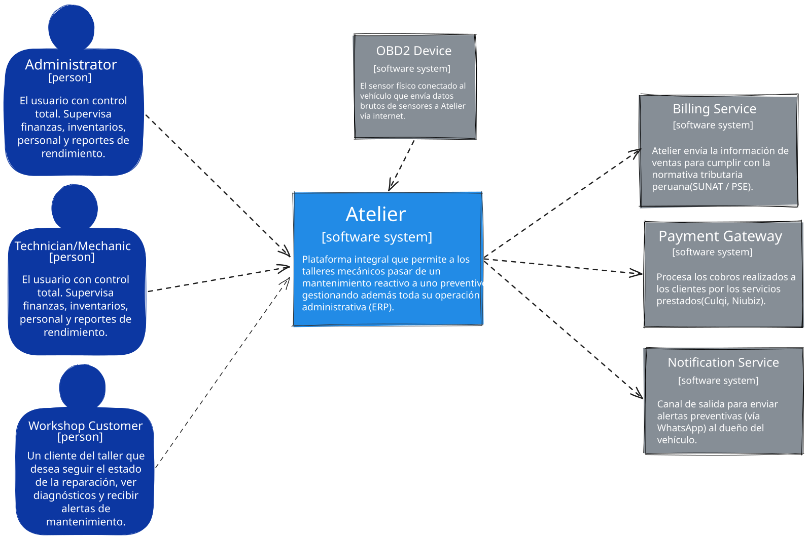
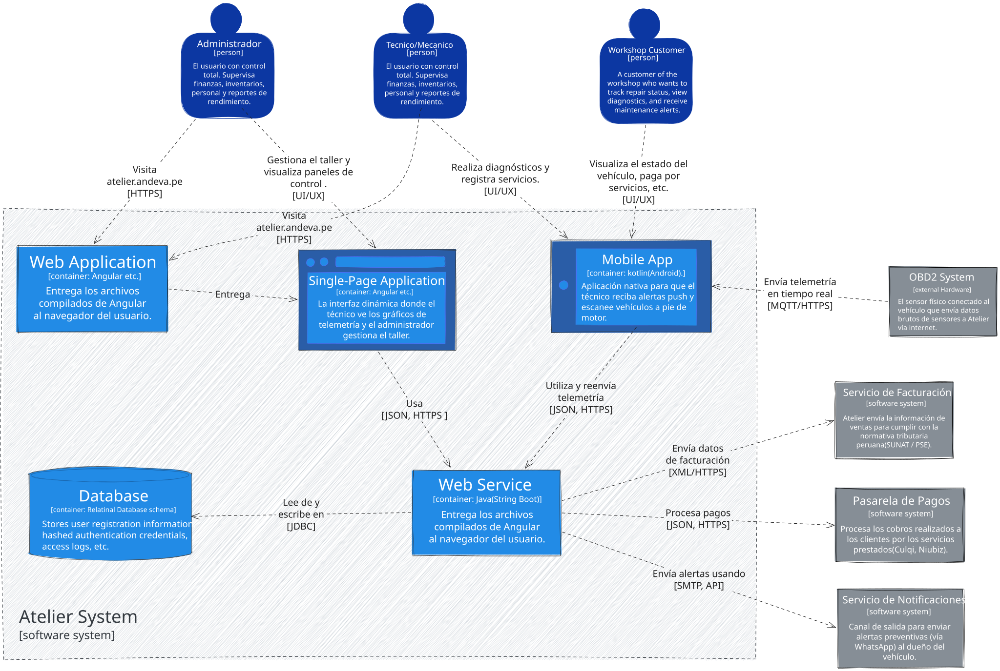
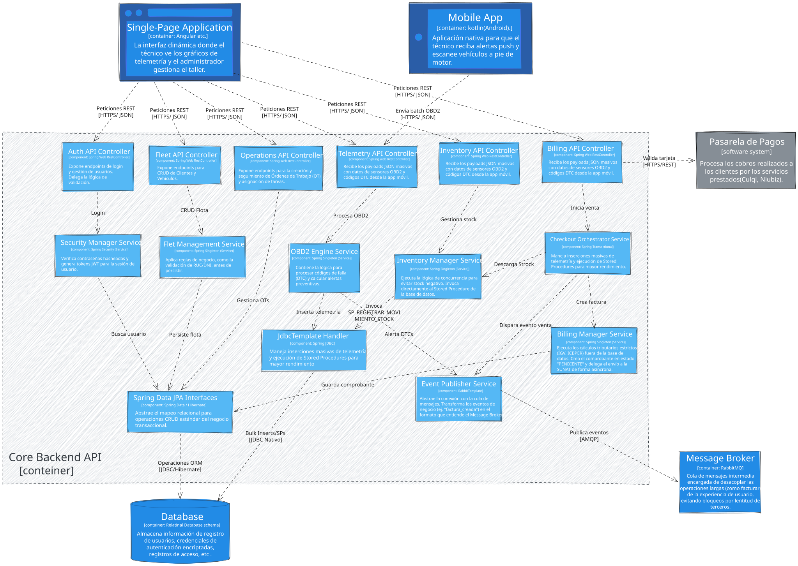

## 4.6. Domain-Driven Software Architecture {#cap-4-6}

&emsp;&emsp;&emsp;&emsp;La presente sección expone el diseño estructural y funcional de la plataforma **atelier** bajo los lineamientos del Diseño Orientado al Dominio (*Domain-Driven Design* o DDD). La adopción de este paradigma avanzado de ingeniería asegura que nuestra arquitectura de software se encuentre rigurosamente alineada con las complejas reglas de negocio de la startup. Este enfoque nos permite modelar con alta fidelidad los procesos críticos de nuestro ecosistema corporativo: la ingesta y análisis predictivo de telemetría vehicular (OBD2) y la provisión de un Enterprise Resource Planning (ERP) centrado en el mantenimiento preventivo y la eficiencia operativa de los talleres mecánicos. Mediante esta aproximación estratégica, logramos una separación evidente y mantenible del conocimiento del dominio respecto a la tecnología subyacente.

### 4.6.1.&emsp;&emsp;*Design-Level Event Storming* {#cap-4-6-1}

&emsp;&emsp;&emsp;&emsp;*(Pendiente - En este apartado se detallará el modelado de los eventos de dominio a nivel de diseño, abarcando de forma granular los comandos, modelos de proyección, agregados y lógicas de políticas de negocio para los distintos subdominios tácticos que operan en la plataforma).*

### 4.6.2.&emsp;&emsp;*Software Architecture Context Diagram* {#cap-4-6-2}

&emsp;&emsp;&emsp;&emsp;El diagrama de contexto (Nivel 1 del modelo C4) proporciona una panorámica fundamental orientada a comprender el alcance global del proyecto. En este nivel inicial de abstracción, se ilustra a **atelier** como un sistema central dinámico interactuando dentro de su entorno operativo cotidiano. El modelo identifica nítidamente a los actores primarios (administradores y dueños de los talleres, mecánicos operativos y los conductores) y delinea las fronteras lógicas al exponer sus interacciones con dependencias funcionales críticas, tales como los módulos IoT de escaneo permanente OBD2 integrados a los vehículos, las pasarelas de transacción financiera integradas y los servicios externos de mensajería para alertas.

**Figura XX**

*Software Architecture Context Diagram*

### 4.6.3.&emsp;&emsp;*Software Architecture Container Diagrams* {#cap-4-6-3}

&emsp;&emsp;&emsp;&emsp;El diagrama de contenedores (Nivel 2 del modelo C4) profundiza en la estructura subyacente, desagregando el ecosistema global en unidades de despliegue y servicio autónomas. En esta topología se identifican de manera explícita las aplicaciones interactivas del cliente (la aplicación web ERP robusta para la gestión administrativa y la aplicación móvil empleada en piso por los mecánicos), comunicándose a nivel de red con una sólida capa de servicios. Asimismo, el mapeo detalla los sistemas de persistencia diferenciada, destacando la sinergia entre bases de datos relacionales estandarizadas ideales para el control transaccional del inventario y las citas, y bases de datos especializadas para series de tiempo, optimizadas estrictamente para procesar el denso volumen de datos telemétricos capturados recurrentemente.

**Figura XX**

*Software Architecture Container Diagram*

### 4.6.4.&emsp;&emsp;*Software Architecture Components Diagrams* {#cap-4-6-4}

&emsp;&emsp;&emsp;&emsp;El diagrama de componentes (Nivel 3 del modelo C4) ofrece una disección exhaustiva de los contenedores más relevantes, focalizándose principalmente en la arquitectura interna de la API backend. Este nivel táctico exhibe la estructuración del código en módulos lógicos y responsabilidades aisladas, mostrando abiertamente las interfaces y el flujo de dependencias instaurado entre ellos. Concretamente, se exponen los microservicios, dominios o controladores técnicos delegados para orquestar comportamientos de negocio complejos, destacándose flujos de altísima importancia como la sincronización asíncrona de datos telemétricos interconectados procesados en tiempo real, el flujo transaccional de facturación y la gestión meticulosa de refacciones e insumos mecánicos.

**Figura XX**

*Software Architecture Components Diagram*

