## 4.6. Domain-Driven Software Architecture {#cap-4-6}

&emsp;&emsp;&emsp;&emsp;La presente sección expone el diseño estructural y funcional de la plataforma **atelier** bajo los lineamientos del Diseño Orientado al Dominio (*Domain-Driven Design* o DDD). La adopción de este paradigma avanzado de ingeniería asegura que nuestra arquitectura de software se encuentre rigurosamente alineada con las complejas reglas de negocio de la startup. Este enfoque nos permite modelar con alta fidelidad los procesos críticos de nuestro ecosistema corporativo: la ingesta y análisis predictivo de telemetría vehicular (OBD2) y la provisión de un Enterprise Resource Planning (ERP) centrado en el mantenimiento preventivo y la eficiencia operativa de los talleres mecánicos. Mediante esta aproximación estratégica, logramos una separación evidente y mantenible del conocimiento del dominio respecto a la tecnología subyacente.

### 4.6.1.&emsp;&emsp;*Design-Level Event Storming* {#cap-4-6-1}

&emsp;&emsp;&emsp;&emsp;El Design-Level Event Storming profundiza en los *Bounded Contexts* de la plataforma, conectando la visión general de negocio con la arquitectura técnica de software basada en *Domain-Driven Design* (DDD). A través de este proceso iterativo, modelamos con el mayor nivel de detalle los comandos, eventos, políticas y pantallas que dan vida al ecosistema predictivo y de gestión del taller.

**Paso 1: Collect Domain Events**

&emsp;&emsp;&emsp;&emsp;Se identificaron y colocaron secuencialmente todos los eventos de dominio clave (post-its naranjas) que representan cambios de estado inmutables en el sistema. Se mapearon 30 eventos escritos en tiempo pasado, abarcando desde el *onboarding* inicial ("Taller registrado", "Dispositivo OBD2 vinculado"), pasando por el flujo predictivo ("Anomalía de motor detectada"), el ciclo operativo ("Orden de trabajo creada", "Reparación completada"), hasta el cierre financiero ("Pago procesado exitosamente", "Factura electrónica emitida").

**Figura X**

*Collect Domain Events*

**Paso 2: Timelines y Bounded Contexts**

&emsp;&emsp;&emsp;&emsp;Una vez identificados todos los eventos, los organizamos en una línea de tiempo cronológica y los agrupamos en módulos delimitados (*frames*) para establecer nuestros sub-dominios. Identificamos 6 flujos claros: la gestión de usuarios y perfiles, la predicción de fallas mediante telemetría IoT, el envío de alertas de fidelización (CRM), el agendamiento de citas, la operación mecánica interna (ERP Core) y finalmente, el control de inventario y pagos.

**Figura X**

*Timelines y Bounded Contexts*

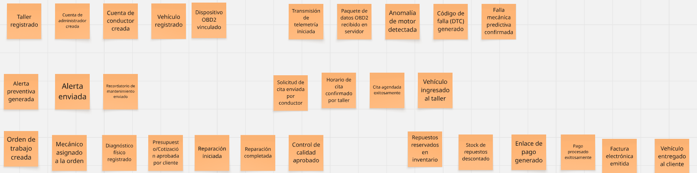

**Paso 3: Commands y Actors**

&emsp;&emsp;&emsp;&emsp;En este paso, respondimos a la pregunta "¿Quién hace qué?". Agregamos los actores (post-its amarillos pequeños) como el Dueño, Conductor, Mecánico o Administrador, junto con los comandos (post-its azules en infinitivo) que ellos ejecutan para detonar los eventos. Por ejemplo: el actor "Conductor" ejecuta el comando "Solicitar Revisión", lo que genera el evento "Solicitud de cita recibida". Los comandos ejecutados por el sistema, como "Ingestar Datos", se colocaron sin actor humano.

**Figura X**

*Commands y Actors*

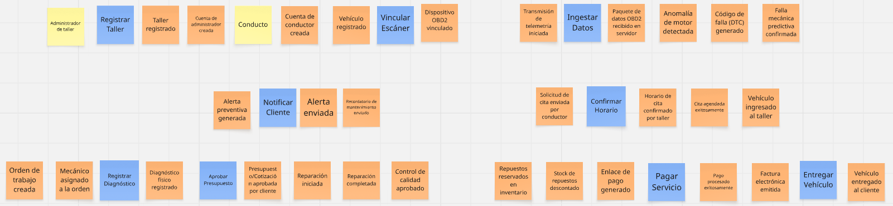

**Paso 4: Policies (Reglas de Negocio)**

&emsp;&emsp;&emsp;&emsp;Incorporamos las políticas del sistema (post-its lilas/morados), que representan las automatizaciones y reglas de negocio reactivas que conectan distintos contextos. Estas se redactan bajo la premisa "Siempre que pase X, hacer Y". Por ejemplo: *"Siempre que la IA confirme una falla predictiva, generar alerta urgente"*, o *"Siempre que se complete la reparación, descontar automáticamente los repuestos usados del stock"*.

**Figura X**

*Policies*

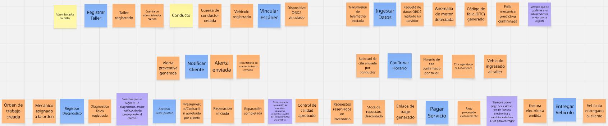

**Paso 5: Pain Points, External Systems y Read Models**

&emsp;&emsp;&emsp;&emsp;Añadimos las capas de interfaz de usuario, dependencias de terceros y análisis de riesgos. Colocamos los modelos de lectura (post-its verdes), que son las pantallas que el usuario debe visualizar antes de actuar (ej. "Dashboard de Agenda" o "Resumen de Cobro"). Además, integramos los sistemas externos (post-its rosados) como el Hardware OBD2, el Motor IA Andeva, la Pasarela Niubiz/Stripe y la API SUNAT. Finalmente, añadimos los "Pain Points" (post-its rojos rotados) con preguntas críticas para la arquitectura, tales como: *¿Qué pasa si el OBD2 pierde conexión a internet?* o *¿Qué ocurre si el cliente rechaza el presupuesto?*.

**Figura X**

*Read Models y External Systems*

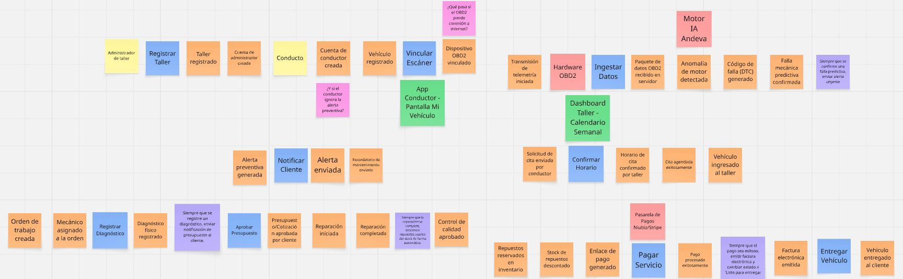

**Paso 6: Detalle de Bounded Contexts y Aggregates**

&emsp;&emsp;&emsp;&emsp;En la fase final, procedimos a identificar las entidades raíz o "Agregados" (post-its amarillos grandes) para cada contexto delimitado, asegurando la consistencia transaccional de cada módulo. A continuación, se detalla cada uno de los 6 Bounded Contexts definidos:

&emsp;&emsp;&emsp;&emsp;**a) Usuarios:** Este contexto gestiona la identidad y el acceso al sistema. Contiene los agregados `PerfilTaller`, `PerfilConductor` y `VehiculoCliente`, encargados de vincular la identidad digital de las personas con los registros físicos del taller y los vehículos.

**Figura X**

*Design-Level: Contexto de Usuarios*

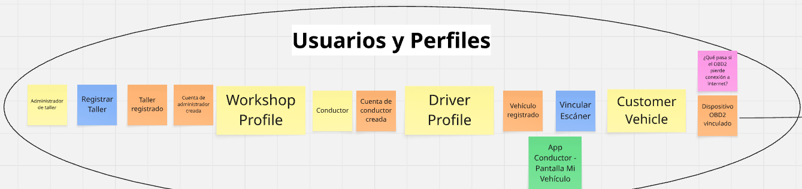

&emsp;&emsp;&emsp;&emsp;**b) Telemetría:** Representa el núcleo tecnológico predictivo. Se encarga de la ingesta masiva de datos provenientes del hardware OBD2 en el agregado `FlujoTelemetria` y utiliza el agregado `AlertaDiagnostico` para procesar y confirmar las fallas mecánicas detectadas.

**Figura X**

*Design-Level: Contexto de Telemetría*

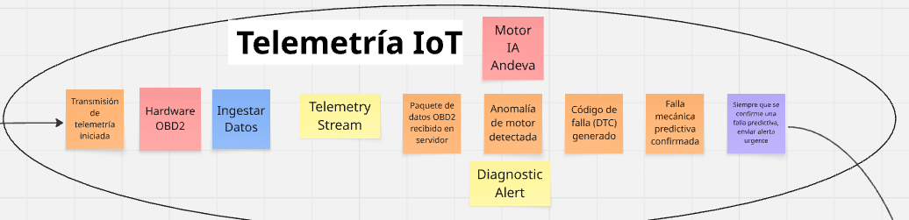

&emsp;&emsp;&emsp;&emsp;**c) Alertas:** Este contexto controla la comunicación proactiva y automatizada con el cliente. Gestiona las políticas que transforman los diagnósticos técnicos en notificaciones enviadas a la aplicación móvil para fidelizar al conductor.

**Figura X**

*Design-Level: Contexto de Alertas*

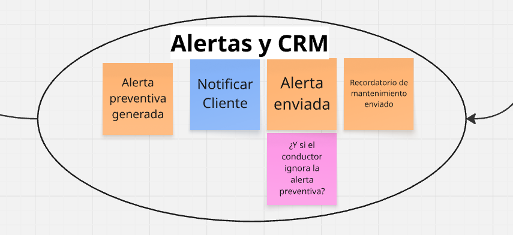

&emsp;&emsp;&emsp;&emsp;**d) Citas:** Administra el embudo de recepción del taller. Utiliza el agregado `CitaVehicular` para coordinar de forma síncrona la disponibilidad física de las estaciones de trabajo con las necesidades de mantenimiento preventivo de los clientes.

**Figura X**

*Design-Level: Contexto de Citas*

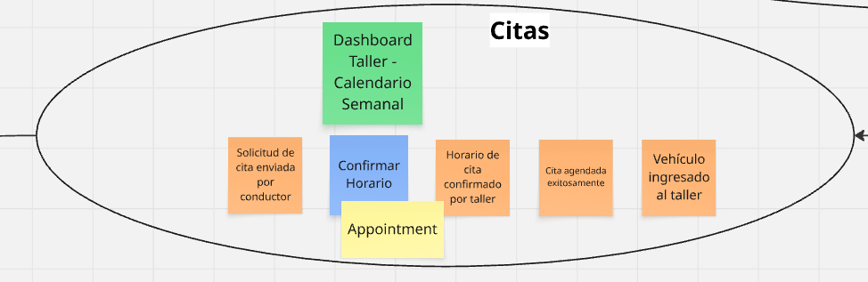

&emsp;&emsp;&emsp;&emsp;**e) Taller:** Es el corazón operativo del sistema. Todo el flujo gira en torno al agregado central `OrdenDeTrabajo`, el cual controla el ciclo de vida de la reparación, desde la asignación del mecánico hasta el diagnóstico físico y la culminación del servicio.

**Figura X**

*Design-Level: Contexto de Taller*

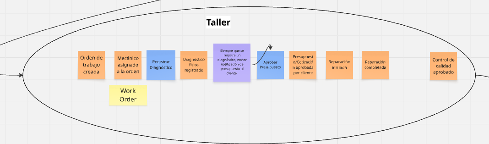

&emsp;&emsp;&emsp;&emsp;**f) Pagos y Stock:** Maneja la integridad de los recursos y el cierre financiero. Agrupa el agregado `ItemInventario` para el descuento automático de repuestos usados, y los agregados `TransaccionPago` junto con `FacturaElectronica` para procesar el cobro y emitir comprobantes legales.

**Figura X**

*Design-Level: Contexto de Pagos y Stock*

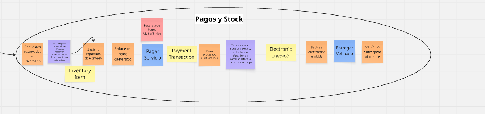

### 4.6.2.&emsp;&emsp;*Software Architecture Context Diagram* {#cap-4-6-2}

&emsp;&emsp;&emsp;&emsp;El diagrama de contexto (Nivel 1 del modelo C4) proporciona una panorámica fundamental orientada a comprender el alcance global del proyecto. En este nivel inicial de abstracción, se ilustra a **atelier** como un sistema central dinámico interactuando dentro de su entorno operativo cotidiano. El modelo identifica nítidamente a los actores primarios (administradores y dueños de los talleres, mecánicos operativos y los conductores) y delinea las fronteras lógicas al exponer sus interacciones con dependencias funcionales críticas, tales como los módulos IoT de escaneo permanente OBD2 integrados a los vehículos, las pasarelas de transacción financiera integradas y los servicios externos de mensajería para alertas.

**Figura XX**

*Software Architecture Context Diagram*

### 4.6.3.&emsp;&emsp;*Software Architecture Container Diagrams* {#cap-4-6-3}

&emsp;&emsp;&emsp;&emsp;El diagrama de contenedores (Nivel 2 del modelo C4) profundiza en la estructura subyacente, desagregando el ecosistema global en unidades de despliegue y servicio autónomas. En esta topología se identifican de manera explícita las aplicaciones interactivas del cliente (la aplicación web ERP robusta para la gestión administrativa y la aplicación móvil empleada en piso por los mecánicos), comunicándose a nivel de red con una sólida capa de servicios. Asimismo, el mapeo detalla los sistemas de persistencia diferenciada, destacando la sinergia entre bases de datos relacionales estandarizadas ideales para el control transaccional del inventario y las citas, y bases de datos especializadas para series de tiempo, optimizadas estrictamente para procesar el denso volumen de datos telemétricos capturados recurrentemente.

**Figura XX**

*Software Architecture Container Diagram*

### 4.6.4.&emsp;&emsp;*Software Architecture Components Diagrams* {#cap-4-6-4}

&emsp;&emsp;&emsp;&emsp;Los diagramas de componentes (Nivel 3 del modelo C4) ofrecen una disección exhaustiva de los contenedores más relevantes del ecosistema **atelier**. Este nivel táctico exhibe la estructuración del código en módulos lógicos, responsabilidades aisladas y el flujo de dependencias instaurado entre ellos para satisfacer las reglas de negocio del dominio. A continuación, se exponen las arquitecturas internas de los 4 contenedores principales de la plataforma:

&emsp;&emsp;&emsp;&emsp;**a) Core Backend API:** Exhibe la estructuración de la lógica de negocio transaccional, dominios y controladores técnicos delegados para orquestar comportamientos complejos, destacándose flujos de altísima importancia como la sincronización de datos telemétricos, el flujo transaccional de facturación y la gestión de refacciones e insumos.

**Figura XX**

*Component Diagram: Core Backend API*

&emsp;&emsp;&emsp;&emsp;**b) Single-Page Application:** Muestra la arquitectura de la interfaz web en Angular. Agrupa la capa de enrutamiento y seguridad con las vistas gerenciales (Dashboard), el módulo de citas y la revisión de gráficos predictivos de telemetría. Además, encapsula las peticiones hacia la API principal.

**Figura XX**

*Component Diagram: Single-Page Application*

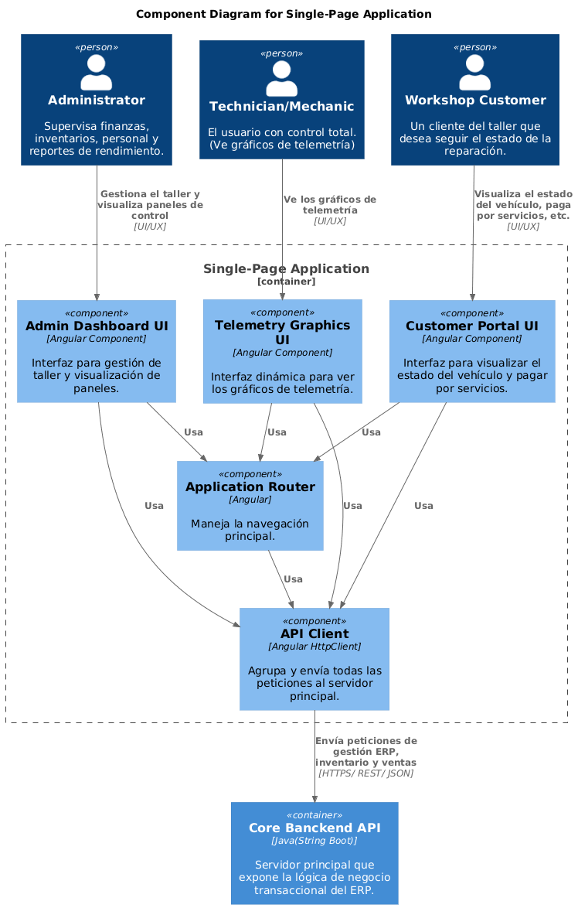

&emsp;&emsp;&emsp;&emsp;**c) Mobile App:** Detalla los componentes internos de la aplicación Android (Kotlin) utilizada por los mecánicos a pie de motor. Destaca la gestión de diagnósticos vehiculares, el empaquetado y envío de telemetría OBD2 en lotes, y la recepción de notificaciones push.

**Figura XX**

*Component Diagram: Mobile App*

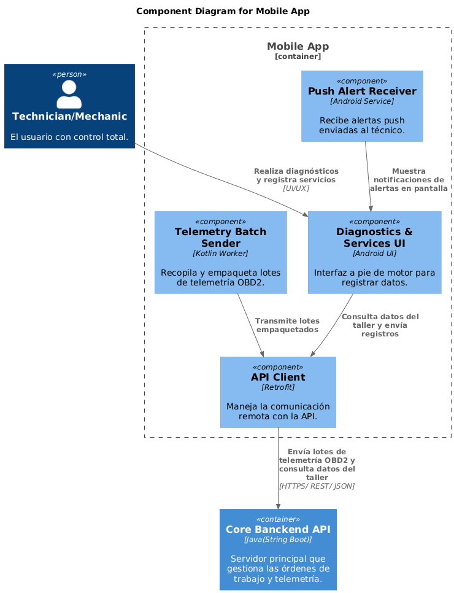

&emsp;&emsp;&emsp;&emsp;**d) Async Worker Service:** Ilustra el procesador de tareas asíncronas y pesadas. Escucha eventos desde la cola de mensajes (RabbitMQ) y orquesta la comunicación con sistemas externos como la validación tributaria (SUNAT / PSE) y el envío de alertas preventivas (WhatsApp), evitando bloqueos en la experiencia del usuario final.

**Figura XX**

*Component Diagram: Async Worker Service*

