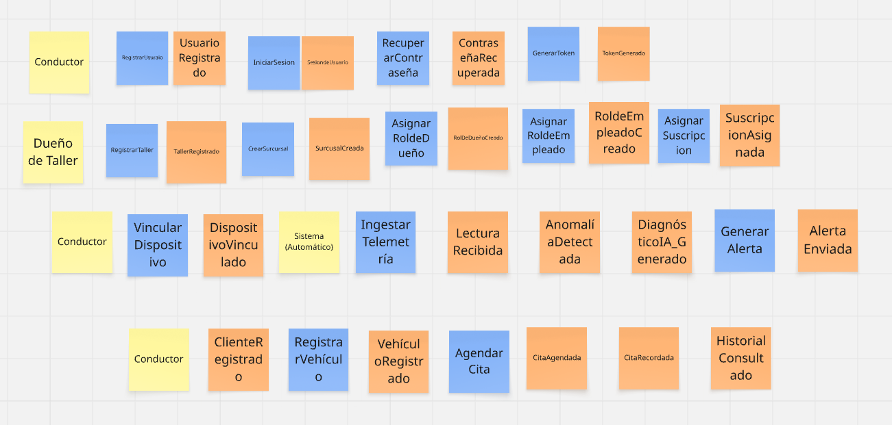
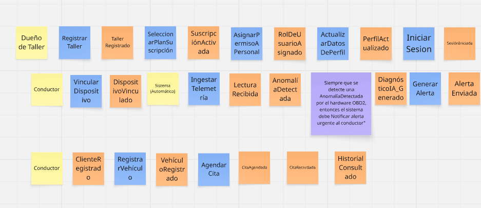
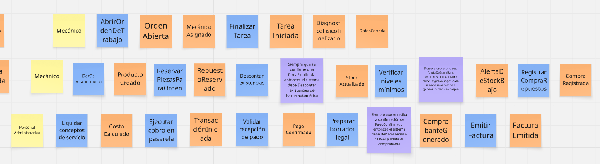
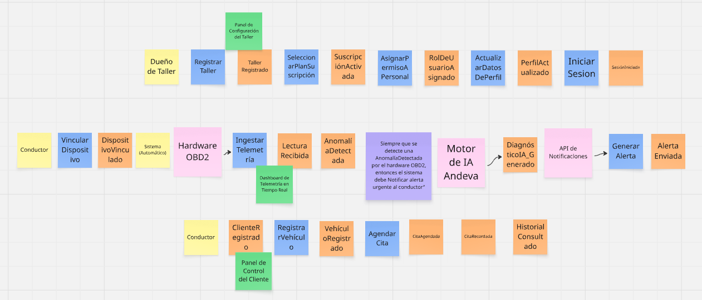
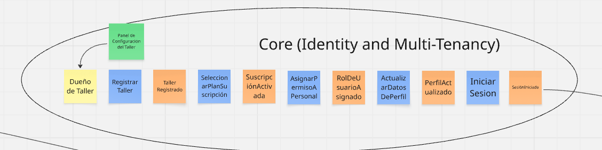
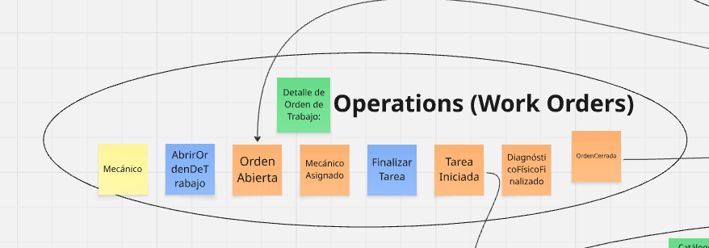
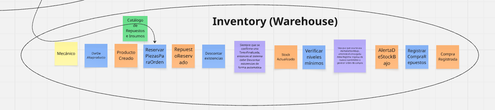

## 4.6. Domain-Driven Software Architecture {#cap-4-6}

&emsp;&emsp;&emsp;&emsp;La presente sección expone el diseño estructural y funcional de la plataforma **atelier** bajo los lineamientos del Diseño Orientado al Dominio (*Domain-Driven Design* o DDD). La adopción de este paradigma avanzado de ingeniería asegura que nuestra arquitectura de software se encuentre rigurosamente alineada con las complejas reglas de negocio de la startup. Este enfoque nos permite modelar con alta fidelidad los procesos críticos de nuestro ecosistema corporativo: la ingesta y análisis predictivo de telemetría vehicular (OBD2) y la provisión de un Enterprise Resource Planning (ERP) centrado en el mantenimiento preventivo y la eficiencia operativa de los talleres mecánicos. Mediante esta aproximación estratégica, logramos una separación evidente y mantenible del conocimiento del dominio respecto a la tecnología subyacente.

### 4.6.1.&emsp;&emsp;*Design-Level Event Storming* {#cap-4-6-1}

&emsp;&emsp;&emsp;&emsp;El Design-Level Event Storming profundiza en los *Bounded Contexts* de la plataforma, conectando la visión general de negocio con la arquitectura técnica de software basada en *Domain-Driven Design* (DDD). A través de este proceso iterativo, modelamos con el mayor nivel de detalle los comandos, eventos, políticas y pantallas que dan vida al ecosistema predictivo y de gestión del taller.

**Paso 1: Collect Domain Events**

&emsp;&emsp;&emsp;&emsp;Se identificaron y colocaron secuencialmente todos los eventos de dominio clave (post-its naranjas) que representan cambios de estado inmutables en el sistema. Se mapearon eventos escritos en tiempo pasado, abarcando desde el registro inicial del taller (`TallerRegistrado`), pasando por la ingesta de telemetría (`LecturaRecibida`) y el flujo operativo (`OrdenAbierta`), hasta el cierre financiero (`FacturaEmitida`).

**Figura 47**

*Collect Domain Events*

**Paso 2: Timelines y Bounded Contexts**

&emsp;&emsp;&emsp;&emsp;Una vez identificados todos los eventos, los organizamos en una línea de tiempo cronológica y los agrupamos en módulos delimitados (*frames*) para establecer nuestros sub-dominios. Identificamos 6 flujos claros alineados al diseño de software: Core (Identidad y Multi-tenencia), IoT (Hardware y Telemetría), Fleet (Gestión de Flota), Operations (Órdenes de Trabajo), Inventory (Almacén) y Billing (Facturación y Pagos).

**Figura 48**

*Timelines y Bounded Contexts*

**Paso 3: Commands y Actors**

&emsp;&emsp;&emsp;&emsp;En este paso, respondimos a la pregunta "¿Quién hace qué?". Agregamos los actores (post-its amarillos pequeños) como el Dueño, Conductor, Mecánico o Almacenero, junto con los comandos (post-its azules en infinitivo) que ellos ejecutan para detonar los eventos. Debido a la extensión del flujo técnico, este se visualiza en dos secciones.

**Figura 49**

*Commands y Actors - Parte 1*

**Figura 50**

*Commands y Actors - Parte 2*

**Paso 4: Policies (Reglas de Negocio)**

&emsp;&emsp;&emsp;&emsp;Incorporamos las políticas del sistema (post-its lilas/morados), que representan las automatizaciones y reglas de negocio reactivas que conectan distintos contextos. Estas se redactan bajo la premisa "Siempre que pase X, hacer Y". Por ejemplo: *"Siempre que el sistema IoT detecte una anomalía, notificar al conductor para agendar una cita de mantenimiento"*.

**Figura 51**

*Policies - Parte 1*

**Figura 52**

*Policies - Parte 2*

**Paso 5: Pain Points, External Systems y Read Models**

&emsp;&emsp;&emsp;&emsp;Añadimos las capas de interfaz de usuario, dependencias de terceros y análisis de riesgos. Colocamos los modelos de lectura (post-its verdes), que son las pantallas necesarias para la toma de decisiones. Además, integramos los sistemas externos (post-its rosados) como el Hardware OBD2, el Motor IA Andeva, la Pasarela de Pagos y la API de SUNAT.

**Figura 53**

*Read Models y External Systems - Parte 1*

**Figura 54**

*Read Models y External Systems - Parte 2*

**Paso 6: Detalle de Bounded Contexts y Aggregates**

&emsp;&emsp;&emsp;&emsp;En la fase final, procedimos a identificar las entidades raíz o "Agregados" (post-its amarillos grandes) para cada contexto delimitado, asegurando la consistencia transaccional de cada módulo. A continuación, se detalla cada uno de los 6 Bounded Contexts definidos:

&emsp;&emsp;&emsp;&emsp;**a) Core:** Este contexto gestiona la identidad y el acceso multi-inquilino. Contiene los agregados `Tenant`, `Profile` y `Subscription`, encargados de vincular la identidad digital con la suscripción comercial del taller.

**Figura 55**

*Design-Level: Contexto de Core*

&emsp;&emsp;&emsp;&emsp;**b) IoT:** Representa el núcleo tecnológico predictivo. Se encarga de la ingesta de datos en el agregado `TelemetryRecord` y utiliza el agregado `Device` para gestionar el hardware vinculado a los vehículos.

**Figura 56**

*Design-Level: Contexto de IoT*

&emsp;&emsp;&emsp;&emsp;**c) Fleet:** Administra la relación con el cliente y su flota. Utiliza los agregados `Customer`, `Vehicle` y `Appointment` para coordinar las necesidades de mantenimiento preventivo.

**Figura 57**

*Design-Level: Contexto de Fleet*

&emsp;&emsp;&emsp;&emsp;**d) Operations:** Es el corazón operativo del sistema. Todo el flujo gira en torno al agregado central `WorkOrder` y las tareas técnicas `MaintenanceTask`, controlando el ciclo de vida de la reparación.

**Figura 58**

*Design-Level: Contexto de Operations*

&emsp;&emsp;&emsp;&emsp;**e) Inventory:** Gestiona la integridad de los suministros del taller. Agrupa los agregados `Product` y `WarehouseItem` para el descuento automático de repuestos e insumos usados.

**Figura 59**

*Design-Level: Contexto de Inventory*

&emsp;&emsp;&emsp;&emsp;**f) Billing:** Maneja el cierre financiero y legal. Utiliza los agregados `PaymentTransaction` e `Invoice` para procesar cobros y emitir comprobantes electrónicos ante las entidades tributarias.

**Figura 60**

*Design-Level: Contexto de Billing*

&emsp;&emsp;&emsp;&emsp;**g) IAM:** Contexto especializado en la Identidad y Gestión de Accesos (Identity & Access Management). Su responsabilidad exclusiva es manejar el registro, inicio de sesión y recuperación de credenciales mediante los agregados `User` y `UserStatus`.

**Figura 61**

*Design-Level: Contexto de IAM*

&emsp;&emsp;&emsp;&emsp;Para una visualización interactiva y en máxima resolución del *Design-Level Event Storming* completo, se puede acceder a nuestra pizarra oficial: [Atelier Design-Level Event Storming (Miro Board)](https://miro.com/welcomeonboard/d2pUcVdMSVllNHRvRU05UGEzQXE5OSs3UGJmQWw0TlhmUDEwcWpPWG9vTTdGWERndEZ1cFEwZThkYVVMbjUxaUkyUk9nV2tBaEdqNm85SVJYZFZ5c0VtNkUvVTB0dUJhNnRjMXdseDVrcG1QT3FVVmh1U0RGRk8vY0dyUlQ4emV3VHhHVHd5UWtSM1BidUtUYmxycDRnPT0hdjE=?share_link_id=354791055916).

### 4.6.2.&emsp;&emsp;*Software Architecture Context Diagram* {#cap-4-6-2}

&emsp;&emsp;&emsp;&emsp;El diagrama de contexto (Nivel 1 del modelo C4) proporciona una panorámica fundamental orientada a comprender el alcance global del proyecto. En este nivel inicial de abstracción, se ilustra a **atelier** como un sistema central dinámico interactuando dentro de su entorno operativo cotidiano. El modelo identifica nítidamente a los actores primarios (administradores y dueños de los talleres, mecánicos operativos y los conductores) y delinea las fronteras lógicas al exponer sus interacciones con dependencias funcionales críticas, tales como los módulos IoT de escaneo permanente OBD2 integrados a los vehículos, las pasarelas de transacción financiera integradas y los servicios externos de mensajería para alertas.

**Figura 62**

*Software Architecture Context Diagram*

### 4.6.3.&emsp;&emsp;*Software Architecture Container Diagrams* {#cap-4-6-3}

&emsp;&emsp;&emsp;&emsp;El diagrama de contenedores (Nivel 2 del modelo C4) profundiza en la estructura subyacente, desagregando el ecosistema global en unidades de despliegue y servicio autónomas. En esta topología se identifican de manera explícita las aplicaciones interactivas del cliente (la aplicación web ERP robusta para la gestión administrativa y la aplicación móvil empleada en piso por los mecánicos), comunicándose a nivel de red con una sólida capa de servicios. Asimismo, el mapeo detalla los sistemas de persistencia diferenciada, destacando la sinergia entre bases de datos relacionales estandarizadas ideales para el control transaccional del inventario y las citas, y bases de datos especializadas para series de tiempo, optimizadas estrictamente para procesar el denso volumen de datos telemétricos capturados recurrentemente.

**Figura 63**

*Software Architecture Container Diagram*

### 4.6.4.&emsp;&emsp;*Software Architecture Components Diagrams* {#cap-4-6-4}

&emsp;&emsp;&emsp;&emsp;Los diagramas de componentes (Nivel 3 del modelo C4) ofrecen una disección exhaustiva de los contenedores más relevantes del ecosistema **atelier**. Este nivel táctico exhibe la estructuración del código en módulos lógicos, responsabilidades aisladas y el flujo de dependencias instaurado entre ellos para satisfacer las reglas de negocio del dominio. A continuación, se exponen las arquitecturas internas de los 4 contenedores principales de la plataforma:

&emsp;&emsp;&emsp;&emsp;**a) Core Backend API:** Exhibe la estructuración de la lógica de negocio transaccional, dominios y controladores técnicos delegados para orquestar comportamientos complejos, destacándose flujos de altísima importancia como la sincronización de datos telemétricos, el flujo transaccional de facturación y la gestión de refacciones e insumos.

**Figura 64**

*Component Diagram: Core Backend API*

&emsp;&emsp;&emsp;&emsp;**b) Single-Page Application:** Muestra la arquitectura de la interfaz web en Angular. Agrupa la capa de enrutamiento y seguridad con las vistas gerenciales (Dashboard), el módulo de citas y la revisión de gráficos predictivos de telemetría. Además, encapsula las peticiones hacia la API principal.

**Figura 65**

*Component Diagram: Single-Page Application*

&emsp;&emsp;&emsp;&emsp;**c) Mobile App:** Detalla los componentes internos de la aplicación Android (Kotlin) utilizada por los mecánicos a pie de motor. Destaca la gestión de diagnósticos vehiculares, el empaquetado y envío de telemetría OBD2 en lotes, y la recepción de notificaciones push.

**Figura 66**

*Component Diagram: Mobile App*

&emsp;&emsp;&emsp;&emsp;**d) Async Worker Service:** Ilustra el procesador de tareas asíncronas y pesadas. Escucha eventos desde la cola de mensajes (RabbitMQ) y orquesta la comunicación con sistemas externos como la validación tributaria (SUNAT / PSE) y el envío de alertas preventivas (WhatsApp), evitando bloqueos en la experiencia del usuario final.

**Figura 67**

*Component Diagram: Async Worker Service*

