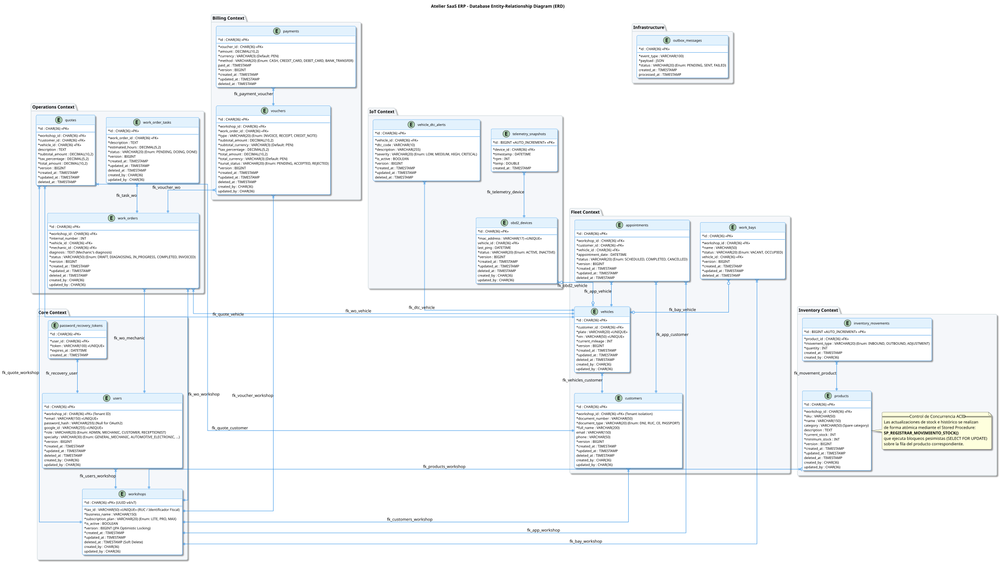
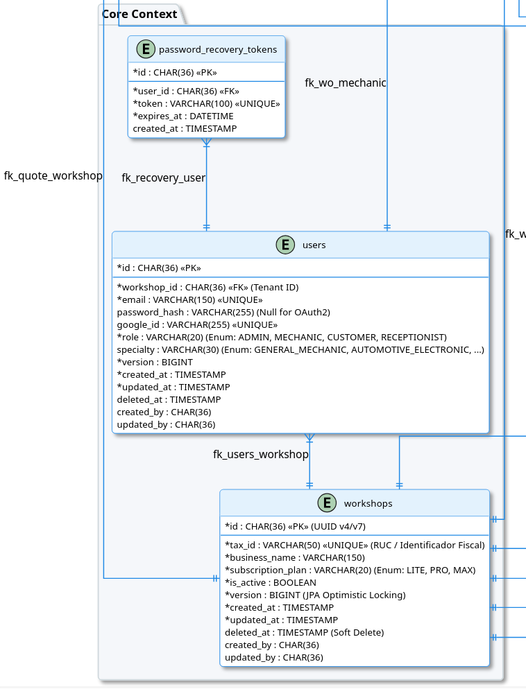
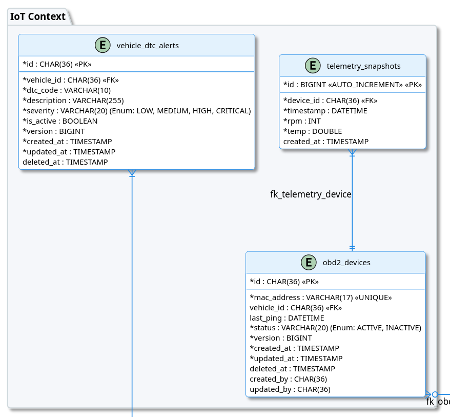
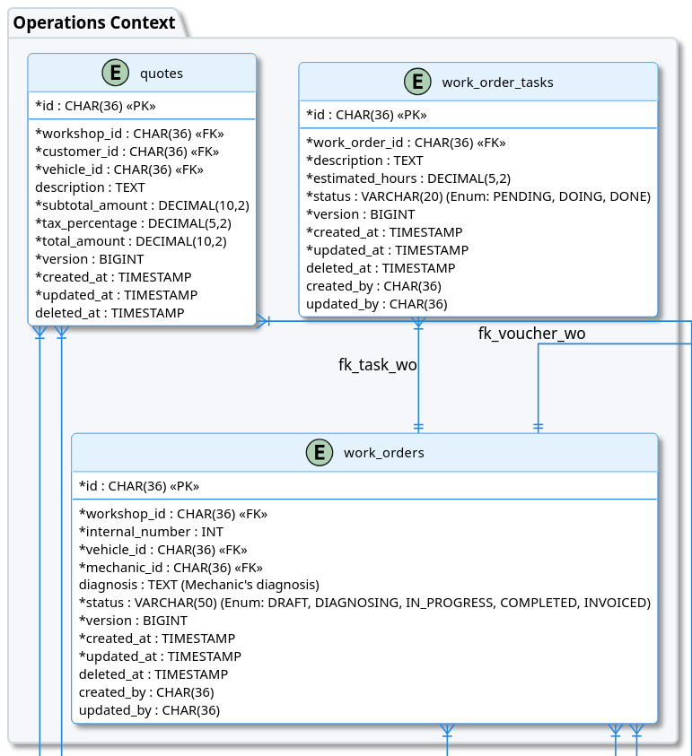
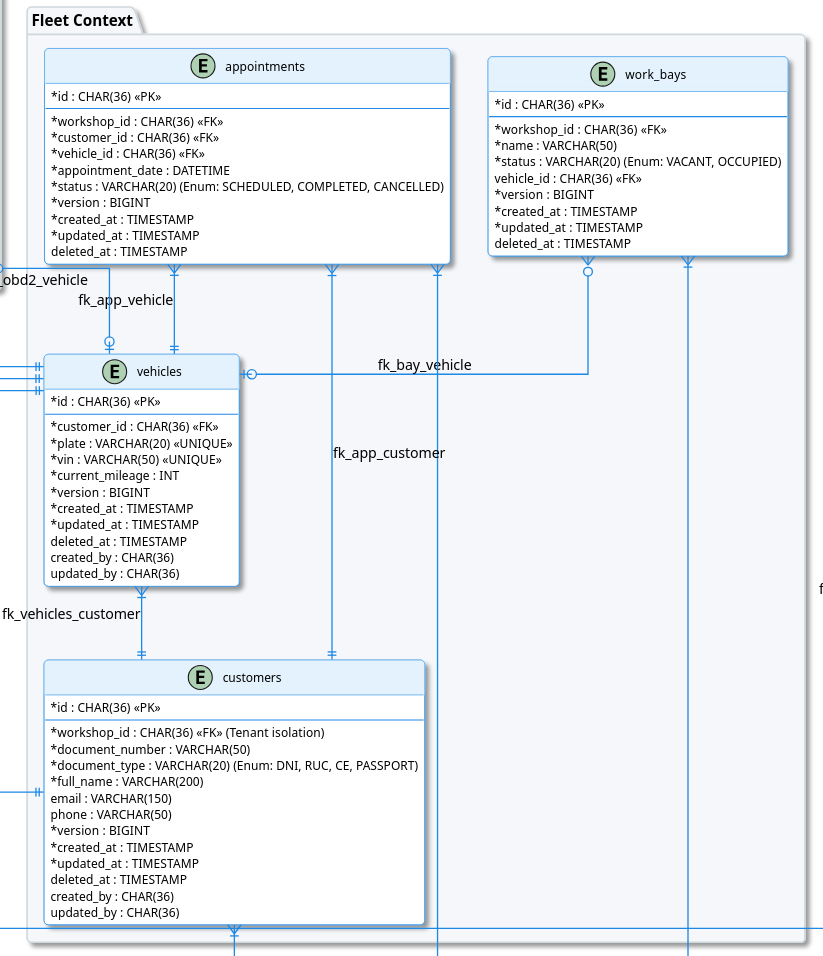
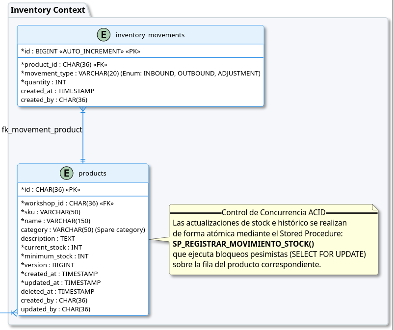
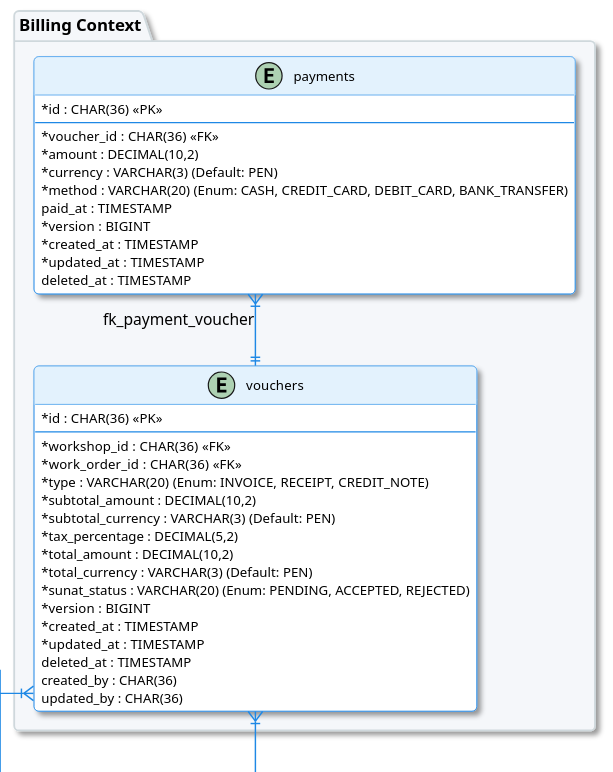

## 4.8. Database Design {#cap-4-8}

&emsp;&emsp;&emsp;&emsp;En esta sección se presentan y explican los diagramas de base de datos (*Database Diagrams*) para cada *Bounded Context* de la plataforma **atelier**. Estos diagramas ilustran la estructura de persistencia de datos, resumiendo las principales características consideradas en el diseño e identificando los objetos de base de datos necesarios para cada módulo.

### 4.8.1.&emsp;&emsp;Database Diagrams {#cap-4-8-1}

&emsp;&emsp;&emsp;&emsp;A continuación se presenta el diagrama de base de datos general, abarcando la totalidad de la aplicación. Posteriormente, el diseño se desglosa y detalla según cada *Bounded Context*.

**Figura XX**

*Database Diagram*

&emsp;&emsp;&emsp;&emsp;A continuación, se detallan los diagramas de base de datos relacional para cada *Bounded Context*. Cada diagrama especifica los objetos que permitirán la persistencia de la información, evidenciando las tablas, columnas, restricciones (*constraints* como *primary keys* y *foreign keys*) y las relaciones entre tablas.

**Bounded Context: Core (Identity and Multi-Tenancy)**

&emsp;&emsp;&emsp;&emsp;El siguiente diagrama detalla la estructura de tablas para la gestión de usuarios, roles, talleres y suscripciones, estableciendo las bases para el esquema *multi-tenant* de la plataforma.

**Figura XX**

*Database Diagram - Core (Identity and Multi-Tenancy)*

**Bounded Context: IoT (Hardware and Telemetry)**

&emsp;&emsp;&emsp;&emsp;En este diagrama se exponen las tablas encargadas de almacenar la configuración de dispositivos y los registros de telemetría provenientes de los escáneres OBD2.

**Figura XX**

*Database Diagram - IoT (Hardware and Telemetry)*

**Bounded Context: Operations (Work Orders)**

&emsp;&emsp;&emsp;&emsp;El diagrama ilustra el esquema de base de datos para la operación de los talleres, estructurando la persistencia de las órdenes de trabajo, citas y tareas mecánicas.

**Figura XX**

*Database Diagram - Operations (Work Orders)*

**Bounded Context: Fleet (Fleet Management)**

&emsp;&emsp;&emsp;&emsp;Este modelo describe las tablas requeridas para administrar el registro de clientes y los vehículos de sus flotas respectivas, asociados a cada taller.

**Figura XX**

*Database Diagram - Fleet (Fleet Management)*

**Bounded Context: Inventory (Warehouse)**

&emsp;&emsp;&emsp;&emsp;El diagrama presenta la estructura relacional para la gestión del catálogo de repuestos, productos e insumos, controlando el stock y movimientos en los almacenes.

**Figura XX**

*Database Diagram - Inventory (Warehouse)*

**Bounded Context: Billing (Invoicing and Payments)**

&emsp;&emsp;&emsp;&emsp;Finalmente, este diagrama detalla las tablas relacionadas con la facturación, los pagos, impuestos y el registro de comprobantes financieros de los servicios realizados.

**Figura XX**

*Database Diagram - Billing (Invoicing and Payments)*

