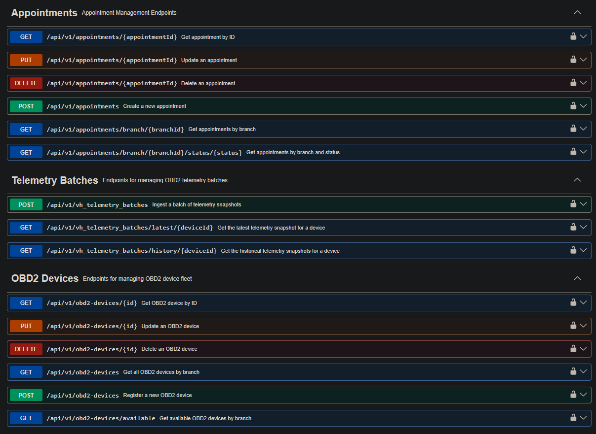
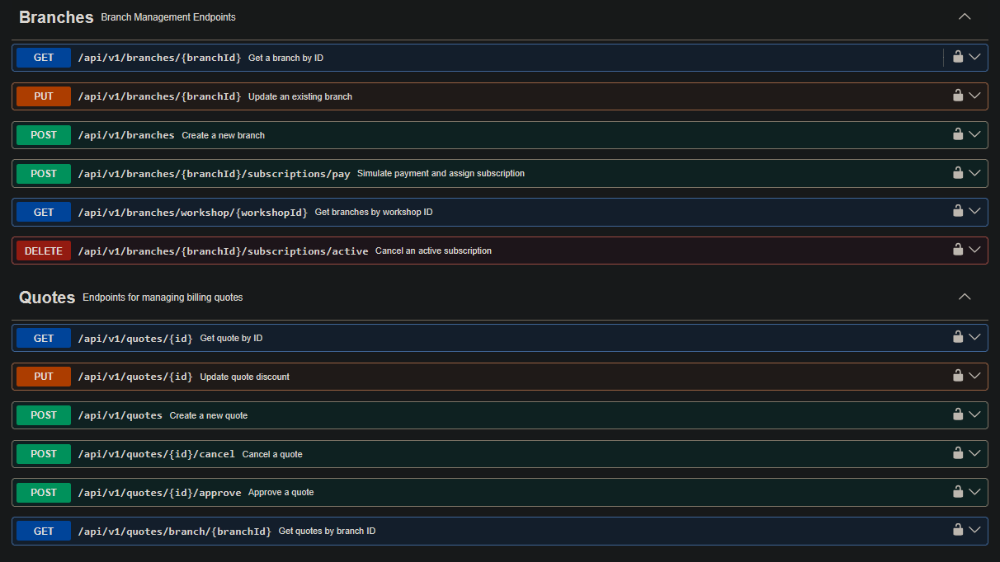
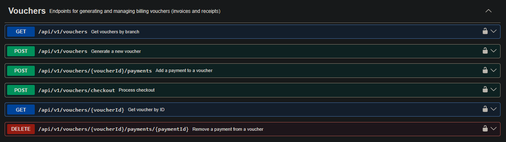
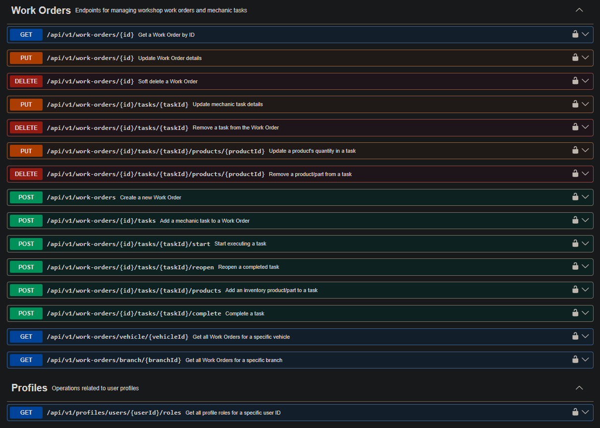
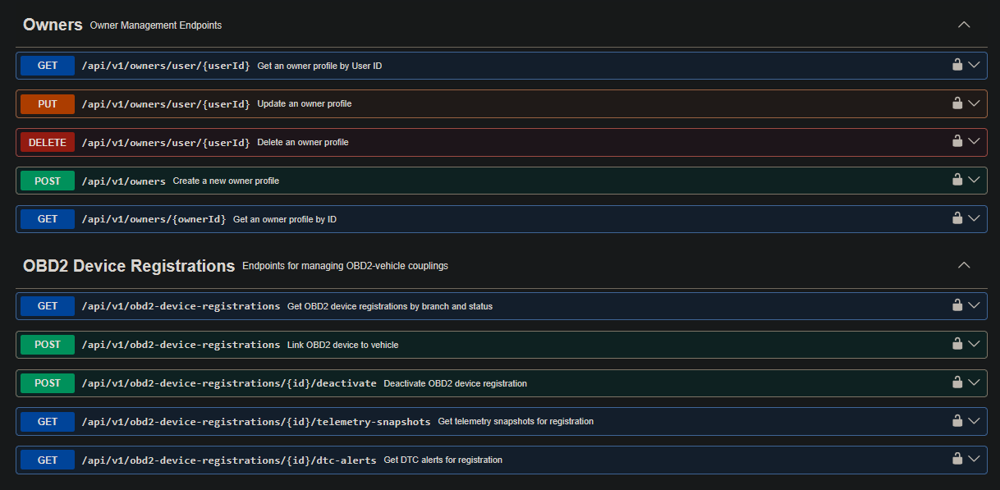
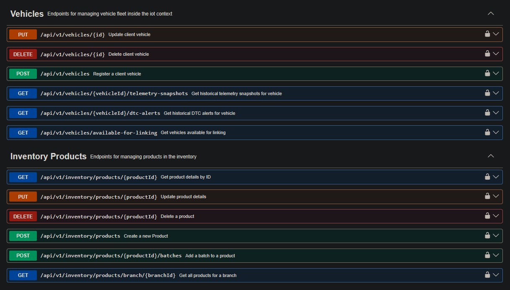
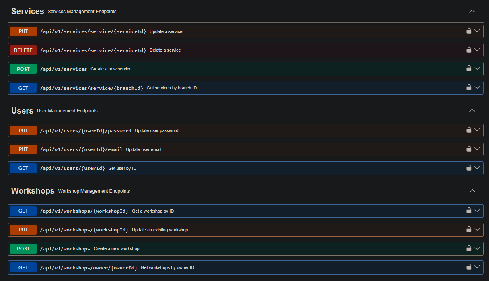
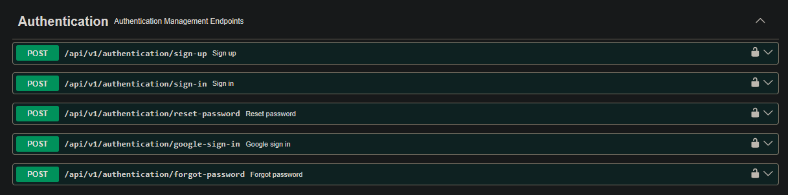

## 5.2. Landing Page, Services & Applications Implementation {#cap-5-2}

### 5.2.1.&emsp;&emsp;*Sprint 1* {#cap-5-2-1}

#### 5.2.1.1.&emsp;&emsp;*Sprint Planning 1* {#cap-5-2-1-1}

&emsp;&emsp;&emsp;&emsp;En esta sección se especifican los aspectos principales del Sprint Planning Meeting para el primer sprint del proyecto atelier. El objetivo central de esta iteración está enfocado exclusivamente en el desarrollo, maquetación y despliegue de la Landing Page, la cual servirá como la principal herramienta de captación de clientes y presentación de la propuesta de valor.

&emsp;&emsp;&emsp;&emsp;A continuación, se presenta el cuadro de resumen del sprint planning meeting siguiendo la estructura establecida:

**Tabla 21**

*Tabla de Sprint 1 de atelier*

| Sprint # | Sprint 1 |
|:--------:|:--------|
|    **Sprint Planning Background**      |    --      |
|    Date      |    2026-04-21      |
|    Time      |    07:00 PM      |
|    Location      |    Reunión virtual mediante el canal de voz de Discord      |
|    Prepared By      |     Huamani Estefanero, Joel     |
|    Attendees     |     Huamani Estefanero, Joel/Granda Ibarra, Luis Daniel/Machacca Soto, Aldo Jeanfranco/Morocho Pinedo, Mariana Hortencia/Sanchez Santin, Adiel Abdiaz     |
|    Sprint 1 – 1 Review Summary      |    --      |
|    Sprint 1 – 1 Retrospective Summary      |     --     |
|     **Sprint Goal & User Stories**     |          |
|     Sprint 1 Goal     |     Our focus is on offering a comprehensive and attractive initial digital presence through a fully functional landing page for the atelier platform. We believe it delivers a clear understanding of the ERP and IoT value proposition, transparent comparison of subscription plans, and trust in the brand to our target audience. This will be confirmed when visitors access the site to seamlessly navigate through the service modules across different devices, read the legal policies, and interact with the landing page.     |
|     Sprint 1 Velocity     |     8     |
|     Sum of Story Points     |   8       |

#### 5.2.1.2.&emsp;&emsp;*Aspect Leaders and Collaborators* {#cap-5-2-1-2}

&emsp;&emsp;&emsp;&emsp;Dado que el objetivo exclusivo de este primer sprint es la construcción de la Landing Page de Atelier, los principales aspectos que se toman en cuenta corresponden a los subconjuntos del alcance funcional. Estos aspectos son: Propuesta de Valor, Exploración de Módulos, Planes de Suscripción, Presentación del Equipo y Información Legal y Footer.

**Tabla 22**

*Leadership-and-Collaboration Matrix*

<table style="width: 100%; table-layout: fixed; word-wrap: break-word; font-size: 0.8em;">
<thead>
<tr>
<th>Team Member</th>
<th>GitHub Username</th>
<th>Propuesta de Valor</th>
<th>Exploración de Módulos</th>
<th>Planes de Subcripción</th>
<th>Presentación de Equipo</th>
<th>Información Legal y Footer</th>
</tr>
</thead>
<tbody>
<tr>
<td>Granda Ibarra, Luis Daniel</td>
<td>danieltyuyu</td>
<td></td>
<td>L</td>
<td></td>
<td></td>
<td></td>
</tr>
<tr>
<td>Huamani Estefanero, Joel</td>
<td>shouydev</td>
<td>L</td>
<td>C</td>
<td></td>
<td>C</td>
<td>C</td>
</tr>
<tr>
<td>Machacca Soto, Aldo Jeanfranco</td>
<td>AldoDev20</td>
<td></td>
<td></td>
<td>L</td>
<td></td>
<td></td>
</tr>
<tr>
<td>Morocho Pinedo, Mariana Hortencia</td>
<td>Patto04</td>
<td></td>
<td></td>
<td></td>
<td></td>
<td>L</td>
</tr>
<tr>
<td>Sanchez Santin, Adiel Abdiaz</td>
<td>xs4el</td>
<td></td>
<td></td>
<td></td>
<td>L</td>
<td></td>
</tr>
</tbody>
</table>

#### 5.2.1.3.&emsp;&emsp;*Sprint Backlog 1* {#cap-5-2-1-3}

&emsp;&emsp;&emsp;&emsp;Como se estableció en el Sprint Planning, el objetivo principal de este primer sprint es el desarrollo, maquetación y despliegue de la primera versión funcional de la Landing Page de Atelier. Esto implica implementar todas las secciones visuales que comuniquen la propuesta de valor, los planes de suscripción, el equipo desarrollador y la adaptabilidad móvil.

&emsp;&emsp;&emsp;&emsp;A continuación, se presenta una captura de pantalla del sprint backlog en la herramienta de gestión Trello, junto con su respectivo enlace público: [https://trello.com/b/uvBe5RgN/atelier-sprint-backlog-1](https://trello.com/b/uvBe5RgN/atelier-sprint-backlog-1).

**Figura**

*Captura de Pantalla del Sprint Backlog #1 atelier en Trello*

&emsp;&emsp;&emsp;&emsp;Seguidamente, se detalla la tabla de control de estado con la descomposición de las User Stories en tareas específicas asignadas a los miembros del equipo, estimadas en horas y con su estado actual de progreso.

**Tabla 23**

*Sprint Backlog #1 atelier*

<table style="width: 100%; table-layout: fixed; word-wrap: break-word; font-size: 0.6em;">
    <thead>
      <tr>
        <th colspan="2">User Story</th>
        <th colspan="6">Work-Item / Task</th>
      </tr>
      <tr>
        <th>Id</th>
        <th>Title</th>
        <th>Id</th>
        <th>Title</th>
        <th>Description</th>
        <th>Estimation (Hours)</th>
        <th>Assigned To</th>
        <th>Status (To-Do / In-Process / To-Review / Done)</th>
      </tr>
    </thead>
    <tbody>
      <tr>
        <td rowspan="3"><strong>US033</strong></td>
        <td rowspan="3">Visualización de propuesta de valor</td>
        <td>US033-01</td>
        <td>Maquetación Hero Section</td>
        <td>Desarrollar el componente principal (Hero) asegurando un diseño "mobile-first" y estructura responsiva.</td>
        <td>4</td>
        <td>Joel Huamani</td>
        <td>Done</td>
      </tr>
      <tr>
        <td>US033-02</td>
        <td>Optimización de Assets Visuales</td>
        <td>Comprimir y formatear las imágenes e ilustraciones (WebP/SVG) para asegurar tiempos de carga óptimos.</td>
        <td>2</td>
        <td>Joel Huamani</td>
        <td>Done</td>
      </tr>
      <tr>
        <td>US033-03</td>
        <td>Configuración de Breakpoints</td>
        <td>Ajustar las media queries y grid layout para garantizar una visualización perfecta en tablets y desktop.</td>
        <td>3</td>
        <td>Joel Huamani</td>
        <td>Done</td>
      </tr>
      <tr>
        <td rowspan="3"><strong>US034</strong></td>
        <td rowspan="3">Exploración de módulos</td>
        <td>US034-01</td>
        <td>Creación de Componente Features</td>
        <td>Diseñar y programar las tarjetas modulares para presentar las capacidades del ERP y la Telemetría IoT.</td>
        <td>4</td>
        <td>Luis Granda</td>
        <td>Done</td>
      </tr>
      <tr>
        <td>US034-02</td>
        <td>Interactividad y Animaciones</td>
        <td>Implementar animaciones de scroll y despliegue dinámico de información extendida al interactuar con cada tarjeta.</td>
        <td>3</td>
        <td>Luis Granda</td>
        <td>Done</td>
      </tr>
      <tr>
        <td>US034-03</td>
        <td>Inyección de Copy Técnico</td>
        <td>Redactar e integrar el contenido técnico en los componentes, asegurando jerarquía de texto (H2, H3, P).</td>
        <td>2</td>
        <td>Luis Granda</td>
        <td>Done</td>
      </tr>
      <tr>
        <td rowspan="3"><strong>US035</strong></td>
        <td rowspan="3">Comparación de planes de suscripción</td>
        <td>US035-01</td>
        <td>Maquetación de Matriz de Precios</td>
        <td>Construir la tabla comparativa que contrasta los límites operativos y características de cada nivel de suscripción.</td>
        <td>4</td>
        <td>Aldo Machacca</td>
        <td>Done</td>
      </tr>
      <tr>
        <td>US035-02</td>
        <td>Lógica de Toggle de Facturación</td>
        <td>Implementar el componente de switch que recalcula dinámicamente los precios al alternar entre mensual y anual.</td>
        <td>3</td>
        <td>Aldo Machacca</td>
        <td>Done</td>
      </tr>
      <tr>
        <td>US035-03</td>
        <td>Integración de CTAs</td>
        <td>Añadir e instrumentar los botones de "Call to Action" en cada plan, preparándolos para la redirección al registro.</td>
        <td>1</td>
        <td>Aldo Machacca</td>
        <td>Done</td>
      </tr>
      <tr>
        <td rowspan="3"><strong>US036</strong></td>
        <td rowspan="3">Presentación del equipo</td>
        <td>US036-01</td>
        <td>Estructuración Sección About Us</td>
        <td>Definir el contenedor base de la sección corporativa y el grid para presentar a los miembros de la startup.</td>
        <td>2</td>
        <td>Adiel Sanchez</td>
        <td>Done</td>
      </tr>
      <tr>
        <td>US036-02</td>
        <td>Diseño de Tarjetas de Perfil</td>
        <td>Maquetar las cards individuales incluyendo los avatares, nombres y roles de los desarrolladores.</td>
        <td>3</td>
        <td>Adiel Sanchez</td>
        <td>Done</td>
      </tr>
      <tr>
        <td>US036-03</td>
        <td>Enlaces a Redes Profesionales</td>
        <td>Integrar íconos SVG y configurar las anclas de redirección segura (target blank) hacia perfiles profesionales.</td>
        <td>1</td>
        <td>Adiel Sanchez</td>
        <td>Done</td>
      </tr>
      <tr>
        <td rowspan="3"><strong>US037</strong></td>
        <td rowspan="3">Acceso a información legal</td>
        <td>US037-01</td>
        <td>Maquetación de Vistas Legales</td>
        <td>Crear las rutas y plantillas estáticas para alojar los documentos de Términos de Servicio y Privacidad.</td>
        <td>2</td>
        <td>Mariana Morocho</td>
        <td>Done</td>
      </tr>
      <tr>
        <td>US037-02</td>
        <td>Formateo e Inserción de Contenido</td>
        <td>Trasladar y estructurar semánticamente (listas, negritas, subtítulos) los borradores legales a las plantillas web.</td>
        <td>2</td>
        <td>Mariana Morocho</td>
        <td>Done</td>
      </tr>
      <tr>
        <td>US037-03</td>
        <td>Funcionalidad de Exportación PDF</td>
        <td>Instalar e implementar la librería (ej. html2pdf) para permitir la descarga del contenido legal generado estáticamente.</td>
        <td>4</td>
        <td>Mariana Morocho</td>
        <td>Done</td>
      </tr>
    </tbody>
  </table>

#### 5.2.1.4.&emsp;&emsp;*Development Evidence for Sprint Review* {#cap-5-2-1-4}

&emsp;&emsp;&emsp;&emsp;En esta sección se explican y presentan los avances en implementación correspondientes al primer sprint del proyecto Atelier. De acuerdo con el alcance establecido en el Sprint Planning para esta iteración inicial, el esfuerzo del equipo de desarrollo se centró exclusivamente en el producto correspondiente a la Landing Page.

&emsp;&emsp;&emsp;&emsp;A continuación, se presenta la tabla detallada que incluye, para el repositorio del sitio web estático, los commits directamente relacionados con la implementación de las características mencionadas:

**Tabla 24**

*Tabla de Commits del Sprint #1*

| Repository | Branch | Commit Id | Commit Message | Commit Message Body | Commited On |
|:----------:|:------:|-----------|----------------|---------------------|-------------|
|     andeva-upc/atelier-website-open-source       |    develop    |     6e76e6df      |       chore: initial commit.         |                     |     23/04/2026 11:57        |
|     andeva-upc/atelier-website-open-source       |    develop    |     32dd8f39      |      feat(material-design): add angular material theming and update styles.          |                     |      23/04/2026 12:02       |
|     andeva-upc/atelier-website-open-source       |    develop    |     4786effa      |    feat(i18n): add ngx-translate for internationalization support.            |                     |      23/04/2026 at 12:04       |
|     andeva-upc/atelier-website-open-source       |     develop   |    302e7c70       |      feat(i18n): integrate ngx-translate for multilingual support and add language files.          |                     |      23/04/2026 12:14       |
|     andeva-upc/atelier-website-open-source       |   develop     |     09075a73      |       feat(header): add header component with logo and buttons.         |                     |      23/04/2026 13:57       |
|     andeva-upc/atelier-website-open-source       |   develop     |    6e46c61d       |        feat(value-proposition): add hero component with title, subtitle, and buttons.        |                     |      23/04/2026 at 15:19       |
|     andeva-upc/atelier-website-open-source       |   develop     |     fedbfc39      |       style(header): update media query to hide button container on smaller screens.         |                     |      23/04/2026 15:22       |
|     andeva-upc/atelier-website-open-source       |    develop    |     b80c7e97      |        style(value-proposition): adjust background position for improved layout        |                     |      23/04/2026 15:27       |
|     andeva-upc/atelier-website-open-source       |    develop    |      e53f7f1b     |       style(header): hide logo text on smaller screens and update hero z-index.         |                     |      23/04/2026 15:32       |
|     andeva-upc/atelier-website-open-source       |    develop    |     3aae419f      |        style(value-proposition): update button styles and adjust layout for improved responsiveness.        |                     |       on 23/04/2026 at 15:47      |
|     andeva-upc/atelier-website-open-source       |   develop     |      070f4fd8     |        feat(benefits): add card component with animation and styling.        |                     |     23/04/2026 19:50        |
|     andeva-upc/atelier-website-open-source       |     develop   |     9f2e6d86      |        feat(pricing): initialize pricing component structure and integration.        |                     |     25/04/2026 00:17        |
|     andeva-upc/atelier-website-open-source       |   develop     |     aff3e5e2      |       feat(pricing): implement pricing toggle with signals and responsive styles.         |                     |     25/04/2026 00:21        |
|     andeva-upc/atelier-website-open-source       |   develop     |     d4d445e7      |       feat(pricing): implement pricing cards with dual-background design and dynamic prices.         |                     |      25/04/2026 00:48       |
|     andeva-upc/atelier-website-open-source       |   develop     |     774ba6b6      |        feat(pricing): complete pricing section with footer disclaimer, contact button and full responsive design.        |                     |      25/04/2026 01:15       |
|     andeva-upc/atelier-website-open-source       |   develop     |     5609a2fd      |       feat(team-info): add team component with member profiles.         |                     |       25/04/2026 10:32      |
|     andeva-upc/atelier-website-open-source       |   develop     |     d859ca4c      |         fix(team): add mariana's photo and fix card image background.       |                     |        25/04/2026 15:53     |
|     andeva-upc/atelier-website-open-source       |   develop     |     5ec553fd      |         feat: add footer in the landing page.       |                     |      25/04/2026 19:56       |
|     andeva-upc/atelier-website-open-source       |   develop     |      1c51d1ac     |        fix(footer): reorganize footer component imports and file structure.        |                     |      26/04/2026 07:07       |
|     andeva-upc/atelier-website-open-source       |   main     |     a4d98cd5      |        Release/website atelier 1.0.0        |                     |      26/04/2026 07:23       |

#### 5.2.1.5.&emsp;&emsp;*Execution Evidence for Sprint Review* {#cap-5-2-1-5}

&emsp;&emsp;&emsp;&emsp;Esta sección inicia con un resumen detallado de los objetivos alcanzados durante el primer sprint del proyecto Atelier. Durante esta iteración, el esfuerzo del equipo se enfocó exitosamente en el desarrollo e implementación de la primera versión funcional de la Landing Page. Se logró construir y estilizar las interfaces visuales clave para el embudo de captación comercial, abarcando la cabecera principal con la propuesta de valor, la cuadrícula de exploración de los módulos, la tabla comparativa de planes de suscripción, la presentación del equipo desarrollador y el pie de página con accesos legales. Asimismo, se garantizó un diseño completamente responsivo para una correcta adaptabilidad en dispositivos móviles y de escritorio.

**Figura 91**

*Capturas de Pantalla de la Landing Page de atelier*

#### 5.2.1.6.&emsp;&emsp;*Services Documentation Evidence for Sprint Review* {#cap-5-2-1-6}

&emsp;&emsp;&emsp;&emsp;En este primer sprint, de acuerdo con el Sprint Goal y la planificación establecida, el esfuerzo y el alcance técnico se centraron de manera exclusiva en el desarrollo, maquetación y despliegue del Landing Page de la plataforma atelier.

&emsp;&emsp;&emsp;&emsp;Por consiguiente, durante esta iteración inicial no se ha desarrollado, integrado ni desplegado ningún Web Service o API RESTful. La implementación y documentación técnica de endpoints mediante OpenAPI, así como la tabla de acciones y sintaxis de llamadas requerida, comenzarán a elaborarse y evidenciarse a partir de los siguientes sprints, una vez que el equipo inicie el desarrollo arquitectónico de la aplicación Backend.

#### 5.2.1.7.&emsp;&emsp;*Software Deployment Evidence for Sprint Review* {#cap-5-2-1-7}

&emsp;&emsp;&emsp;&emsp;En esta sección se resumen los procesos realizados en relación con el despliegue durante el primer sprint del proyecto atelier. De acuerdo con los objetivos trazados en el Sprint Planning, el alcance técnico de esta iteración se limitó exclusivamente a la construcción del Landing Page. Por consiguiente, durante este periodo no se realizaron despliegues vinculados a las Web Applications ni a los Web Services.

&emsp;&emsp;&emsp;&emsp;Paso 1: Integración de la rama de lanzamiento. Como paso inicial, el equipo consolidó todos los avances de diseño y maquetación de las distintas ramas de características hacia la rama principal de despliegue. Esto asegura que el código a desplegar sea la versión estable y aprobada del Sprint.

**Figura 92**

*Repositorio del website de atelier*

&emsp;&emsp;&emsp;&emsp;Paso 2: Configuración del entorno en Vercel.

**Figura 93**

*Captura de pantalla de la seccion de proyectos de Vercel*

&emsp;&emsp;&emsp;&emsp;Paso 3: Selección el repositorio y desplegar.

**Figura 94**

*Captura de pantalla de la seccion de despliegue de Vercel*

**Figura 95**

*Captura de pantalla de la configuración de despliegue de Vercel*

&emsp;&emsp;&emsp;&emsp;Paso 4: Obtención del enlace público y validación: [https://atelier-website-11848.vercel.app/](https://atelier-website-11848.vercel.app/).

#### 5.2.1.8.&emsp;&emsp;*Team Collaboration Insights during Sprint* {#cap-5-2-1-8}

&emsp;&emsp;&emsp;&emsp;En esta sección el equipo explica cómo se han desarrollado las actividades de implementación durante el primer sprint y se presentan las evidencias analíticas de colaboración en GitHub.

&emsp;&emsp;&emsp;&emsp;Joel Huamani: Lideró la estructuración semántica de la cabecera principal, configuró los botones de llamado a la acción y enlazó las normativas legales. Además, trabajó en los media queries para la adaptabilidad móvil de estas vistas.

&emsp;&emsp;&emsp;&emsp;Adiel Sanchez: Se encargó de la maquetación de la sección de presentación del equipo, aplicó los estilos visuales principales al Hero y aseguró el comportamiento responsivo del pie de página.

&emsp;&emsp;&emsp;&emsp;Luis Granda: Fue el responsable de estructurar la sección de exploración de módulos, asegurando el correcto espaciado y layout mediante CSS.

&emsp;&emsp;&emsp;&emsp;Aldo Machacca: Lideró la codificación de la tabla comparativa de los planes de suscripción, integró los recursos gráficos optimizados e implementó la vista responsiva de la matriz de precios.

&emsp;&emsp;&emsp;&emsp;Mariana Morocho: Se enfocó en la maquetación y estilizado del pie de página general, además de colaborar en la carga de la información de los perfiles en la sección del equipo.

&emsp;&emsp;&emsp;&emsp;A continuación, se presentan las capturas en imagen de los analíticos de colaboración y commits extraídos de la pestaña "Insights" del repositorio en GitHub, las cuales evidencian la participación de todos los miembros del equipo:

**Figura 96**

*Gráfico de commits*

### 5.2.2.&emsp;&emsp;*Sprint 2* {#cap-5-2-2}

#### 5.2.2.1.&emsp;&emsp;*Sprint Planning 2* {#cap-5-2-2-1}

&emsp;&emsp;&emsp;&emsp;En esta sección se detallan los acuerdos y la organización alcanzados durante la sesión de planificación para el segundo sprint del proyecto Atelier. A diferencia de la iteración anterior centrada en la captación, este sprint se enfoca en el desarrollo del front-end de los módulos operativos fundamentales que permitirán la gestión del taller.

&emsp;&emsp;&emsp;&emsp;A continuación, se presenta el cuadro de resumen del sprint planning:

**Tabla 25**

*Tabla de Sprint 2 de atelier*

| Sprint # | Sprint 2 |
|:--------:|:--------|
|    **Sprint Planning Background**      |    --      |
|    Date      |    2026-04-12      |
|    Time      |    03:00 PM      |
|    Location      |    Reunión virtual mediante el canal de voz de Discord      |
|    Prepared By      |     Huamani Estefanero, Joel     |
|    Attendees     |     Huamani Estefanero, Joel/Granda Ibarra, Luis Daniel/Machacca Soto, Aldo Jeanfranco/Morocho Pinedo, Mariana Hortencia/Riveros Vera, Jennifer Yamilet/Sanchez Santin, Adiel Abdiaz     |
|    Sprint 2 - 1 Review Summary      |    The team successfully developed and deployed the functional landing page. All planned user stories regarding the value proposition, service modules, and subscription plans were completed and verified on the production environment.      |
|    Sprint 2 – 1 Retrospective Summary      |    The team identified that initial task estimations were too low. For the upcoming sprint, we committed to consolidating engineering tasks into blocks of 4 to 8 hours and ensuring a more rigorous technical documentation process.      |
|     **Sprint Goal & User Stories**     |          |
|     Sprint 2 Goal     |     Our focus for this sprint is to develop the front-end architecture and functional user interfaces for the core modules of the Atelier web application. We aim to implement the Dashboard, Work-Orders, Telemetry, Customers, Appointments, and Billing sections, ensuring a consistent UI/UX, seamless navigation, and data visualization to support essential workshop operations.     |
|     Sprint 2 Velocity     |     69     |
|     Sum of Story Points     |   69       |

#### 5.2.2.2.&emsp;&emsp;*Aspect Leaders and Collaborators* {#cap-5-2-2-2}

&emsp;&emsp;&emsp;&emsp;Se han designado los responsables de liderar el desarrollo del front-end de cada módulo operativo para asegurar la especialización en la lógica de cada vista.

**Tabla 26**

*Leadership-and-Collaboration Matrix*

<table style="width: 100%; table-layout: fixed; word-wrap: break-word; font-size: 0.7em;">
<thead>
<tr>
<th>Team Member</th>
<th>GitHub Username</th>
<th>Home</th>
<th>Work-Orders</th>
<th>Telemetry & Customers</th>
<th>Appointments</th>
<th>Inventory</th>
<th>Billing</th>
</tr>
</thead>
<tbody>
<tr>
<td>Granda Ibarra, Luis Daniel</td>
<td>danieltyuyu</td>
<td></td>
<td></td>
<td></td>
<td></td>
<td></td>
<td>L</td>
</tr>
<tr>
<td>Huamani Estefanero, Joel</td>
<td>shouydev</td>
<td>L</td>
<td></td>
<td></td>
<td></td>
<td></td>
<td></td>
</tr>
<tr>
<td>Machacca Soto, Aldo Jeanfranco</td>
<td>AldoDev20</td>
<td></td>
<td>C</td>
<td>L</td>
<td></td>
<td></td>
<td></td>
</tr>
<tr>
<td>Morocho Pinedo, Mariana Hortencia</td>
<td>Patto04</td>
<td></td>
<td>L</td>
<td></td>
<td></td>
<td></td>
<td></td>
</tr>
<tr>
<td>Riveros Vera, Jennifer Yamilet</td>
<td>Jennivz</td>
<td></td>
<td></td>
<td></td>
<td>L</td>
<td></td>
<td></td>
</tr>
<tr>
<td>Sanchez Santin, Adiel Abdiaz</td>
<td>xs4el</td>
<td></td>
<td></td>
<td></td>
<td></td>
<td>L</td>
<td></td>
</tr>
</tbody>
</table>

#### 5.2.2.3.&emsp;&emsp;*Sprint Backlog 2* {#cap-5-2-2-3}

&emsp;&emsp;&emsp;&emsp;Como se estableció en el Sprint Planning, el objetivo principal de este segundo sprint es el desarrollo de la web application de atelier.

&emsp;&emsp;&emsp;&emsp;A continuación, se presenta una captura de pantalla del sprint backlog en la herramienta de gestión Trello, junto con su respectivo enlace público: [https://trello.com/b/xhhM4rYX/atelier-sprint-backlog-2](https://trello.com/b/xhhM4rYX/atelier-sprint-backlog-2).

**Figura 97**

*Captura de Pantalla del Sprint Backlog #2 atelier en Trello*

&emsp;&emsp;&emsp;&emsp;Seguidamente, se detalla la tabla de control de estado con la descomposición de las User Stories en tareas específicas asignadas a los miembros del equipo, estimadas en horas y con su estado actual de progreso.

**Tabla 27**

*Sprint Backlog #2 atelier*

<table style="width: 100%; table-layout: fixed; word-wrap: break-word; font-size: 0.5em;">
    <thead>
      <tr>
        <th colspan="2">User Story</th>
        <th colspan="6">Work-Item / Task</th>
      </tr>
      <tr>
        <th>Id</th>
        <th>Title</th>
        <th>Id</th>
        <th>Title</th>
        <th>Description</th>
        <th>Estimation (Hours)</th>
        <th>Assigned To</th>
        <th>Status (To-do / In-Process / To-Review / Done)</th>
      </tr>
    </thead>
    <tbody>
      <tr>
        <td rowspan="3"><strong>US030</strong></td>
        <td rowspan="3">Panel de ingresos y rentabilidad</td>
        <td>US030-01</td>
        <td>Query Builder Financiero</td>
        <td>Desarrollar las consultas de agregación en base de datos para calcular ingresos y variaciones mensuales.</td>
        <td>4</td>
        <td>Joel Huamani</td>
        <td>Done</td>
      </tr>
      <tr>
        <td>US030-02</td>
        <td>Integración de Librería de Gráficos</td>
        <td>Instalar y configurar Recharts/Chart.js en el frontend para el renderizado de datos de rentabilidad.</td>
        <td>2</td>
        <td>Joel Huamani</td>
        <td>Done</td>
      </tr>
      <tr>
        <td>US030-03</td>
        <td>Maquetación de Dashboard</td>
        <td>Diseñar la interfaz de usuario con tarjetas de métricas comparativas (KPIs) e indicadores visuales.</td>
        <td>4</td>
        <td>Joel Huamani</td>
        <td>Done</td>
      </tr>
      <tr>
        <td rowspan="3"><strong>US032</strong></td>
        <td rowspan="3">Sugerencia por kilometraje</td>
        <td>US032-01</td>
        <td>Lógica de Evaluación de Kilometraje</td>
        <td>Desarrollar el algoritmo que compare el kilometraje actual telemático versus la última orden de trabajo.</td>
        <td>3</td>
        <td>Joel Huamani</td>
        <td>Done</td>
      </tr>
      <tr>
        <td>US032-02</td>
        <td>Cron Job Preventivo</td>
        <td>Implementar un worker asíncrono que corra diariamente para generar alertas de mantenimiento.</td>
        <td>4</td>
        <td>Joel Huamani</td>
        <td>Done</td>
      </tr>
      <tr>
        <td>US032-03</td>
        <td>Notificaciones UI Recepción</td>
        <td>Crear el componente visual (campana/toast) que exponga las sugerencias proactivas a la recepcionista.</td>
        <td>3</td>
        <td>Joel Huamani</td>
        <td>Done</td>
      </tr>
      <tr>
        <td rowspan="3"><strong>US013</strong></td>
        <td rowspan="3">Gestión de lockers de trabajo</td>
        <td>US013-01</td>
        <td>Endpoint CRUD de Lockers</td>
        <td>Implementar la API para cambiar el estado de disponibilidad y asociar un vehículo al locker.</td>
        <td>3</td>
        <td>Mariana Morocho</td>
        <td>Done</td>
      </tr>
      <tr>
        <td>US013-02</td>
        <td>Validación de Conflictos</td>
        <td>Añadir middleware para rechazar asignaciones si el vehículo ya está asignado o el locker ocupado.</td>
        <td>2</td>
        <td>Mariana Morocho</td>
        <td>Done</td>
      </tr>
      <tr>
        <td>US013-03</td>
        <td>Vista Grid Interactiva</td>
        <td>Desarrollar una interfaz visual (mapa de lockers) para arrastrar y soltar vehículos en espacios disponibles.</td>
        <td>5</td>
        <td>Mariana Morocho</td>
        <td>Done</td>
      </tr>
      <tr>
        <td rowspan="3"><strong>US014</strong></td>
        <td rowspan="3">Creación de Orden de Trabajo</td>
        <td>US014-01</td>
        <td>Controlador Inicialización OT</td>
        <td>Crear el endpoint POST que genera el ID único y asocia cliente y vehículo con estado "Pendiente".</td>
        <td>4</td>
        <td>Mariana Morocho</td>
        <td>Done</td>
      </tr>
      <tr>
        <td>US014-02</td>
        <td>Validación de Vínculos</td>
        <td>Implementar validación que rechace la creación si el vehículo no está previamente registrado en el sistema.</td>
        <td>2</td>
        <td>Mariana Morocho</td>
        <td>Done</td>
      </tr>
      <tr>
        <td>US014-03</td>
        <td>Formulario Frontend Creación</td>
        <td>Construir el formulario con selectores de búsqueda (typeahead) para cliente y vehículo.</td>
        <td>4</td>
        <td>Mariana Morocho</td>
        <td>Done</td>
      </tr>
      <tr>
        <td rowspan="3"><strong>US015</strong></td>
        <td rowspan="3">Asignación de mecánicos a OT</td>
        <td>US015-01</td>
        <td>Endpoint Vinculación Empleado</td>
        <td>Desarrollar la actualización de la base de datos (relación muchos a muchos o foránea) para asignar el técnico.</td>
        <td>3</td>
        <td>Mariana Morocho</td>
        <td>Done</td>
      </tr>
      <tr>
        <td>US015-02</td>
        <td>Validación de Roles (RBAC)</td>
        <td>Garantizar que el sistema rechace la asignación si el empleado seleccionado no posee rol técnico.</td>
        <td>2</td>
        <td>Mariana Morocho</td>
        <td>Done</td>
      </tr>
      <tr>
        <td>US015-03</td>
        <td>Selector Dinámico UI</td>
        <td>Implementar el dropdown en la vista de la OT que liste exclusivamente mecánicos activos.</td>
        <td>2</td>
        <td>Mariana Morocho</td>
        <td>Done</td>
      </tr>
      <tr>
        <td rowspan="3"><strong>US016</strong></td>
        <td rowspan="3">Actualización de estado de Orden</td>
        <td>US016-01</td>
        <td>Endpoint PATCH Estado</td>
        <td>Programar la ruta de actualización parcial para transicionar el ciclo de vida de la OT.</td>
        <td>2</td>
        <td>Mariana Morocho</td>
        <td>Done</td>
      </tr>
      <tr>
        <td>US016-02</td>
        <td>Regla de Diagnóstico Requerido</td>
        <td>Agregar validación de negocio que impida pasar a estado "Completado" si no hay texto de diagnóstico guardado.</td>
        <td>3</td>
        <td>Mariana Morocho</td>
        <td>Done</td>
      </tr>
      <tr>
        <td>US016-03</td>
        <td>Componente Kanban UI</td>
        <td>Construir un visualizador de progreso por pasos (Steps o Kanban card) para interactuar con los estados.</td>
        <td>4</td>
        <td>Mariana Morocho</td>
        <td>Done</td>
      </tr>
      <tr>
        <td rowspan="3"><strong>US017</strong></td>
        <td rowspan="3">Búsqueda y filtrado de inventario</td>
        <td>US017-01</td>
        <td>Implementación Query Params</td>
        <td>Modificar el GET del catálogo para soportar filtros de búsqueda por coincidencia parcial (LIKE) y categoría.</td>
        <td>3</td>
        <td>Mariana Morocho</td>
        <td>Done</td>
      </tr>
      <tr>
        <td>US017-02</td>
        <td>Indexación de Base de Datos</td>
        <td>Crear índices en la tabla de repuestos (Nombre, Categoría, SKU) para optimizar la velocidad del filtrado.</td>
        <td>2</td>
        <td>Mariana Morocho</td>
        <td>Done</td>
      </tr>
      <tr>
        <td>US017-03</td>
        <td>Barra de Búsqueda Dinámica UI</td>
        <td>Desarrollar el input con debounce en el frontend y los selectores visuales de filtros de categoría.</td>
        <td>4</td>
        <td>Mariana Morocho</td>
        <td>Done</td>
      </tr>
      <tr>
        <td rowspan="3"><strong>US011</strong></td>
        <td rowspan="3">Registro de nuevo cliente</td>
        <td>US011-01</td>
        <td>Esquema y Controlador Cliente</td>
        <td>Desarrollar el endpoint POST para persistir la ficha de datos del cliente en la base de datos.</td>
        <td>3</td>
        <td>Aldo Machacca</td>
        <td>Done</td>
      </tr>
      <tr>
        <td>US011-02</td>
        <td>Prevención de Duplicidad</td>
        <td>Configurar constraints y validación a nivel código para bloquear registros con mismo documento de identidad.</td>
        <td>2</td>
        <td>Aldo Machacca</td>
        <td>Done</td>
      </tr>
      <tr>
        <td>US011-03</td>
        <td>Modal de Alta Rápida</td>
        <td>Diseñar el formulario pop-up que permita a la recepcionista registrar al cliente sin abandonar la vista actual.</td>
        <td>3</td>
        <td>Aldo Machacca</td>
        <td>Done</td>
      </tr>
      <tr>
        <td rowspan="3"><strong>US012</strong></td>
        <td rowspan="3">Consulta de historial clínico</td>
        <td>US012-01</td>
        <td>Endpoint Recuperación de OT</td>
        <td>Crear consulta JOIN que recupere las órdenes cerradas asociadas a la placa de un vehículo, ordenadas por fecha.</td>
        <td>3</td>
        <td>Aldo Machacca</td>
        <td>Done</td>
      </tr>
      <tr>
        <td>US012-02</td>
        <td>Manejo de Resultados Vacíos</td>
        <td>Asegurar que el endpoint devuelva una lista vacía (200 OK) sin errores si el vehículo es nuevo.</td>
        <td>1</td>
        <td>Aldo Machacca</td>
        <td>Done</td>
      </tr>
      <tr>
        <td>US012-03</td>
        <td>Timeline Histórico UI</td>
        <td>Maquetar un componente visual de línea de tiempo interactivo para revisar intervenciones previas fácilmente.</td>
        <td>5</td>
        <td>Aldo Machacca</td>
        <td>Done</td>
      </tr>
      <tr>
        <td rowspan="3"><strong>US018</strong></td>
        <td rowspan="3">Vinculación de hardware OBD2</td>
        <td>US018-01</td>
        <td>Endpoint Emparejamiento</td>
        <td>Desarrollar la API de enlace entre identificador único del hardware y perfil del vehículo activo.</td>
        <td>3</td>
        <td>Aldo Machacca</td>
        <td>Done</td>
      </tr>
      <tr>
        <td>US018-02</td>
        <td>Validación de Disponibilidad</td>
        <td>Aplicar lógica para denegar vinculaciones si el escáner ya figura emparejado a otro vehículo.</td>
        <td>2</td>
        <td>Aldo Machacca</td>
        <td>Done</td>
      </tr>
      <tr>
        <td>US018-03</td>
        <td>Interfaz de Ingreso Hardware</td>
        <td>Crear vista simple para emparejamiento manual del código del dispositivo por parte del mecánico.</td>
        <td>2</td>
        <td>Aldo Machacca</td>
        <td>Done</td>
      </tr>
      <tr>
        <td rowspan="3"><strong>US019</strong></td>
        <td rowspan="3">Desvinculación de escáner OBD2</td>
        <td>US019-01</td>
        <td>Endpoint de Desvinculación</td>
        <td>Programar la lógica de limpieza de relación y cierre seguro del flujo de transmisión de datos.</td>
        <td>2</td>
        <td>Aldo Machacca</td>
        <td>Done</td>
      </tr>
      <tr>
        <td>US019-02</td>
        <td>Manejo de Operaciones Nulas</td>
        <td>Asegurar la idempotencia: si el escáner ya está libre, retornar éxito sin lanzar excepciones severas.</td>
        <td>1</td>
        <td>Aldo Machacca</td>
        <td>Done</td>
      </tr>
      <tr>
        <td>US019-03</td>
        <td>Botón de Confirmación UI</td>
        <td>Implementar acción destructiva en frontend con su respectivo modal de confirmación "Seguro que desea desvincular".</td>
        <td>2</td>
        <td>Aldo Machacca</td>
        <td>Done</td>
      </tr>
      <tr>
        <td rowspan="3"><strong>US020</strong></td>
        <td rowspan="3">Visualización de telemetría en vivo</td>
        <td>US020-01</td>
        <td>Consumo de WebSockets (Cliente)</td>
        <td>Integrar librería socket en el frontend para escuchar los eventos de transmisión del hardware activo.</td>
        <td>4</td>
        <td>Aldo Machacca</td>
        <td>Done</td>
      </tr>
      <tr>
        <td>US020-02</td>
        <td>Manejo de Desconexiones</td>
        <td>Desarrollar lógica de reconexión y preservación del último snapshot válido en el estado de la aplicación.</td>
        <td>3</td>
        <td>Aldo Machacca</td>
        <td>Done</td>
      </tr>
      <tr>
        <td>US020-03</td>
        <td>Renderizado de Tablero Vivo</td>
        <td>Diseñar indicadores circulares (gauges) y barras para parámetros vitales (RPM, Voltaje, Temperatura).</td>
        <td>5</td>
        <td>Aldo Machacca</td>
        <td>Done</td>
      </tr>
      <tr>
        <td rowspan="3"><strong>US022</strong></td>
        <td rowspan="3">Listado de alertas predictivas</td>
        <td>US022-01</td>
        <td>Endpoint Consumo de Alertas</td>
        <td>Exponer la API GET que recupere el registro de anomalías detectadas por el motor predictivo.</td>
        <td>2</td>
        <td>Aldo Machacca</td>
        <td>Done</td>
      </tr>
      <tr>
        <td>US022-02</td>
        <td>Algoritmo de Ordenamiento</td>
        <td>Clasificar las alertas retornadas estableciendo pesos según nivel de criticidad (Alta, Media, Baja).</td>
        <td>3</td>
        <td>Aldo Machacca</td>
        <td>Done</td>
      </tr>
      <tr>
        <td>US022-03</td>
        <td>Centro de Notificaciones UI</td>
        <td>Crear panel dedicado con sistema de banderas por colores y tabla paginada de vehículos en riesgo.</td>
        <td>4</td>
        <td>Aldo Machacca</td>
        <td>Done</td>
      </tr>
      <tr>
        <td rowspan="3"><strong>US023</strong></td>
        <td rowspan="3">Historial de Telemetría</td>
        <td>US023-01</td>
        <td>Endpoint Consulta Histórica</td>
        <td>Implementar GET con filtrado de parámetros temporales (start_date, end_date) en Time-Series BD.</td>
        <td>4</td>
        <td>Aldo Machacca</td>
        <td>Done</td>
      </tr>
      <tr>
        <td>US023-02</td>
        <td>Gestión de Sets Vacíos</td>
        <td>Añadir controlador para validar y retornar estructuradamente arrays vacíos cuando no hay actividad temporal.</td>
        <td>1</td>
        <td>Aldo Machacca</td>
        <td>Done</td>
      </tr>
      <tr>
        <td>US023-03</td>
        <td>Gráficas de Líneas Multi-eje</td>
        <td>Construir los componentes visuales para correlacionar parámetros del motor a través del tiempo seleccionado.</td>
        <td>5</td>
        <td>Aldo Machacca</td>
        <td>Done</td>
      </tr>
      <tr>
        <td rowspan="3"><strong>US024</strong></td>
        <td rowspan="3">Agendamiento de citas</td>
        <td>US024-01</td>
        <td>Lógica de Bloques Temporales</td>
        <td>Desarrollar el esquema y validador de solapamiento para reservas en el taller.</td>
        <td>4</td>
        <td>Jennifer Riveros</td>
        <td>Done</td>
      </tr>
      <tr>
        <td>US024-02</td>
        <td>Endpoint de Creación de Cita</td>
        <td>Programar la inserción (POST) manejando las validaciones de horario disponible del negocio.</td>
        <td>2</td>
        <td>Jennifer Riveros</td>
        <td>Done</td>
      </tr>
      <tr>
        <td>US024-03</td>
        <td>Integración de Calendario Interactivo</td>
        <td>Implementar librería (ej. FullCalendar) en frontend para visualización mensual/semanal.</td>
        <td>5</td>
        <td>Jennifer Riveros</td>
        <td>Done</td>
      </tr>
      <tr>
        <td rowspan="3"><strong>US025</strong></td>
        <td rowspan="3">Reprogramación de citas</td>
        <td>US025-01</td>
        <td>Endpoint PUT Actualización Temporal</td>
        <td>Implementar el reemplazo de fechas garantizando la liberación atómica del bloque viejo.</td>
        <td>3</td>
        <td>Jennifer Riveros</td>
        <td>Done</td>
      </tr>
      <tr>
        <td>US025-02</td>
        <td>Validación de Fechas Inválidas</td>
        <td>Incluir middleware temporal para evitar reasignar citas a días que ya pasaron.</td>
        <td>2</td>
        <td>Jennifer Riveros</td>
        <td>Done</td>
      </tr>
      <tr>
      </tr>
      <tr>
        <td rowspan="3"><strong>US026</strong></td>
        <td rowspan="3">Creación de cotización digital</td>
        <td>US026-01</td>
        <td>Motor Calculador de Totales</td>
        <td>Programar la lógica backend que sume repuestos, mano de obra y compute la carga impositiva (IGV).</td>
        <td>4</td>
        <td>Luis Granda</td>
        <td>Done</td>
      </tr>
      <tr>
        <td>US026-02</td>
        <td>Alerta de Desabastecimiento</td>
        <td>Integrar validación cross-módulo para generar "Warning" al cotizar un producto con stock cero.</td>
        <td>2</td>
        <td>Luis Granda</td>
        <td>Done</td>
      </tr>
      <tr>
        <td>US026-03</td>
        <td>Interfaz Compilador de Cotización</td>
        <td>Desarrollar vista dinámica donde se agreguen o remuevan ítems, actualizando los montos reactivamente.</td>
        <td>5</td>
        <td>Luis Granda</td>
        <td>Done</td>
      </tr>
      <tr>
        <td rowspan="3"><strong>US028</strong></td>
        <td rowspan="3">Registro de cobro en caja</td>
        <td>US028-01</td>
        <td>Endpoint Asiento de Caja</td>
        <td>Desarrollar la transacción financiera que registra método de cobro y cierra la cuenta corriente de la OT.</td>
        <td>3</td>
        <td>Luis Granda</td>
        <td>Done</td>
      </tr>
      <tr>
        <td>US028-02</td>
        <td>Validación de Suficiencia de Fondos</td>
        <td>Asegurar que la solicitud sea rechazada si el pago ingresado no cubre el saldo deudor adeudado.</td>
        <td>2</td>
        <td>Luis Granda</td>
        <td>Done</td>
      </tr>
      <tr>
        <td>US028-03</td>
        <td>UI de Punto de Pago (POS)</td>
        <td>Construir ventana de checkout rápido con selección de método de pago (Efectivo/Tarjeta).</td>
        <td>3</td>
        <td>Luis Granda</td>
        <td>Done</td>
      </tr>
      <tr>
        <td rowspan="3"><strong>US029</strong></td>
        <td rowspan="3">Aplicación de descuentos</td>
        <td>US029-01</td>
        <td>Servicio de Recálculo</td>
        <td>Adaptar el motor de cotización para aceptar cupones y procesar deductibles aplicables pre-impuestos.</td>
        <td>3</td>
        <td>Luis Granda</td>
        <td>Done</td>
      </tr>
      <tr>
        <td>US029-02</td>
        <td>Límites de Reglas de Negocio</td>
        <td>Incorporar limitadores porcentuales máximos dictados por la administración en base de datos.</td>
        <td>2</td>
        <td>Luis Granda</td>
        <td>Done</td>
      </tr>
      <tr>
        <td>US029-03</td>
        <td>Interacción UI de Descuento</td>
        <td>Agregar input con validación on-the-fly y botón de aplicación en la vista de facturación.</td>
        <td>2</td>
        <td>Luis Granda</td>
        <td>Done</td>
      </tr>
      <tr>
        <td rowspan="3"><strong>US008</strong></td>
        <td rowspan="3">Alta de nuevos repuestos</td>
        <td>US008-01</td>
        <td>Endpoint y Esquema de Repuestos</td>
        <td>Configurar tabla de base de datos y ruta de creación considerando detalles técnicos de las piezas.</td>
        <td>3</td>
        <td>Adiel Sanchez</td>
        <td>Done</td>
      </tr>
      <tr>
        <td>US008-02</td>
        <td>Constricción de SKU Único</td>
        <td>Aplicar lógica de unicidad sobre el código identificador y devolver error legible de duplicidad.</td>
        <td>2</td>
        <td>Adiel Sanchez</td>
        <td>Done</td>
      </tr>
      <tr>
        <td>US008-03</td>
        <td>Formulario Inventario UI</td>
        <td>Construir vista con campos validados y capacidad de subir imágenes o fichas técnicas.</td>
        <td>4</td>
        <td>Adiel Sanchez</td>
        <td>Done</td>
      </tr>
    </tbody>
  </table>

#### 5.2.2.4.&emsp;&emsp;*Development Evidence for Sprint Review* {#cap-5-2-2-4}

&emsp;&emsp;&emsp;&emsp;En esta sección se explican y presentan los avances en implementación correspondientes al segundo sprint del proyecto Atelier. De acuerdo con el alcance establecido en el Sprint Planning.

&emsp;&emsp;&emsp;&emsp;A continuación, se presenta la tabla detallada que incluye, para el repositorio de la web application, los commits directamente relacionados con la implementación de las características mencionadas:

**Tabla 28**

*Tabla de Commits del Sprint #2*

| Repository | Branch | Commit Id | Commit Message | Commit Message Body | Commited On |
|:----------:|:------:|-----------|----------------|---------------------|-------------|
|     andeva-upc/atelier-web-app-open-source       |    main    |     08ecc27b      |       chore: initial commit.         |                     |     4/05/2026 at 21:47        |
|     andeva-upc/atelier-web-app-open-sourcee       |    feature/json-server    |     7f4bc7a4      |      feat(server): initialize mock backend with json-server and atelier domain data.          |                     |      4/05/2026 at 22:49       |
|     andeva-upc/atelier-web-app-open-source       |    feature/json-server    |     ec41ff8e      |    feat(i18n): add ngx-translate for internationalization support.            |                     |      23/04/2026 at 12:04       |
|     andeva-upc/atelier-web-app-open-source       |     feature/json-server   |    302e7c70       |      feat: add api infrastructure and domain endpoints mapping.          |                     |      4/05/2026 at 23:49       |
|     andeva-upc/atelier-web-app-open-source       |   feature/json-server     |     c2a4a29d      |       chore: update db.json mock data.         |                     |      6/05/2026 at 09:35       |
|     andeva-upc/atelier-web-app-open-source       |   feature/json-server     |    6e46c61d       |        feat(value-proposition): add hero component with title, subtitle, and buttons.        |                     |      23/04/2026 at 15:19       |
|     andeva-upc/atelier-web-app-open-source       |   feature/json-server     |     d261693f      |       feat(shared): add generic API endpoint architecture and BaseEntity domain contract.         |                     |      6/05/2026 at 11:00       |
|     andeva-upc/atelier-web-app-open-source       |    feature/json-server    |     13dc003c      |        chore(api): synchronize mock db schema with new SQL DDL and update tests.        |                     |      6/05/2026 at 21:47       |
|     andeva-upc/atelier-web-app-open-source       |    feature/json-server    |      5a0bd4ca     |       chore: update db.json with two workshops, team roles and vehicle telemetry.         |                     |      6/05/2026 at 22:29       |
|     andeva-upc/atelier-web-app-open-source       |    feature/json-server    |     f39e4366      |        refactor: harmonize domain types and database schemas with UML class diagram.        |                     |       7/05/2026 at 09:34      |
|     andeva-upc/atelier-web-app-open-source       |   feature/json-server     |      a7b617eb     |        chore: align fake api mock data with new class diagram enums.        |                     |     7/05/2026 at 10:09        |
|     andeva-upc/atelier-web-app-open-source       |     feature/json-server   |     a8821bb9      |        chore: update db.json.        |                     |     7/05/2026 at 12:47        |
|     andeva-upc/atelier-web-app-open-source       |   feature/shared     |     89cd730e      |       feat(shared): implement layout structure with sidebar and main content.         |                     |     7/05/2026 at 22:06        |
|     andeva-upc/atelier-web-app-open-source       |   feature/json-server     |     cc959071      |       refactor(api): consolidate endpoints to 100% RESTful resources in class diagrams and mock api.         |                     |      9/05/2026 at 20:19       |
|     andeva-upc/atelier-web-app-open-source       |   feature/customers     |     e7cc94ba      |        feat(customers): define customer domain entity and repository contract.        |                     |      9/05/2026 at 21:50       |
|     andeva-upc/atelier-web-app-open-source       |   feature/customers     |     44b66d02      |       feat(customers): implement customer DTO and assembler mapper.         |                     |       9/05/2026 at 21:52      |
|     andeva-upc/atelier-website-open-source       |   feature/customers     |     fda339d1      |         feat(customers): create customer API service with dynamic relation merging and register in app config.       |                     |        9/05/2026 at 21:54    |
|     andeva-upc/atelier-web-app-open-source       |   feature/customers     |     d1608344      |         feat(customers): configure lazy-loaded route.       |                     |      9/05/2026 at 21:56       |
|     andeva-upc/atelier-web-app-open-source       |   feature/customers     |      a82241ba     |        feat(customers): migrate material icons to tree-shakeable @ng-icons and clean comments.        |                     |      9/05/2026 at 22:43       |
|     andeva-upc/atelier-web-app-open-source       |   feature/shared     |      bf257c43     |        feat(shared): implement premium reusable standalone modal.        |                     |      9/05/2026 at 22:52       |
|     andeva-upc/atelier-web-app-open-source       |   feature/customers     |      3ee7190b     |        feat(customers): declare customer creation contract in repository layer.        |                     |      9/05/2026 at 22:54       |
|     andeva-upc/atelier-web-app-open-source       |   feature/customers     |      d05f590c     |        refactor(customers): flatten views and introduce application store.        |                     |      10/05/2026 at 09:46       |
|     andeva-upc/atelier-web-app-open-source       |   feature/customers     |      4ea09d5e     |        feat(customers): add complete i18n translation support.        |                     |      10/05/2026 at 09:54       |
|     andeva-upc/atelier-web-app-open-source       |   feature/customers     |      23f55a8d     |        refactor(routing): enable component input binding and clean up duplicate imports.        |                     |      10/05/2026 at 10:04       |
|     andeva-upc/atelier-web-app-open-source       |   feature/customers     |      9743f197     |        refactor(customers): decouple smart registration form into standalone CustomerForm view.        |                     |      10/05/2026 at 11:10       |
|     andeva-upc/atelier-web-app-open-source       |   feature/customers     |      6ae51e17     |        style(customers): set card hover shadow and border-color to brand blue glow.        |                     |      10/05/2026 at 11:29       |
|     andeva-upc/atelier-web-app-open-source       |   feature/customers     |      31c99249     |        chore(git): update gitignore.        |                     |      10/05/2026 at 11:42       |
|     andeva-upc/atelier-web-app-open-source       |   feature/customers     |      c7f5ba28     |        refactor: align templates with Angular 21 standards and clean unused logic.        |                     |      10/05/2026 at 12:21       |
|     andeva-upc/atelier-web-app-open-source       |   feature/customers     |      a3fa5d45     |        refactor: clean up and optimize code.        |                     |      10/05/2026 at 12:26       |
|     andeva-upc/atelier-web-app-open-source       |   feature/customers     |      c0d2b80d     |        chore(env): configure production api url and ignore local dev environment.        |                     |      12/05/2026 at 11:22       |
|     andeva-upc/atelier-web-app-open-source       |   feature/billing     |      5fbf98af     |        feat(billing): implement billing bounded context with financial summary dashboard.        |                     |      12/05/2026 at 12:31       |
|     andeva-upc/atelier-web-app-open-source       |   feature/appointments     |      aec2146d     |        feat(appoinments): add appointments section.        |                     |      12/05/2026 at 12:34       |
|     andeva-upc/atelier-web-app-open-source       |   feature/billing     |      c01afa04     |        feat(billing): implement a financial KPI dashboard.        |                     |      12/05/2026 at 14:37       |
|     andeva-upc/atelier-web-app-open-source       |   feature/billing     |      7724fbca     |        feat(billing): add segmented navigation and monthly financial chart.        |                     |      12/05/2026 at 14:41       |
|     andeva-upc/atelier-web-app-open-source       |   feature/billing     |      ac1a0a0e     |        feat(billing): add monthly details table and presentation UI enhancements.        |                     |      12/05/2026 at 15:03       |
|     andeva-upc/atelier-web-app-open-source       |   feature/billing     |      00ace9c3     |        feat(shared): enhance sidebar layout and update translations.        |                     |      12/05/2026 at 18:20       |
|     andeva-upc/atelier-web-app-open-source       |   feature/billing     |      7a4d52e9     |        feat(shared): add toolbar component and restructure layout for improved navigation.        |                     |      12/05/2026 at 18:47       |
|     andeva-upc/atelier-web-app-open-source       |   feature/home     |      70dd7b45     |        fix(i18n): update customer list and modal translations, enhance search functionality.        |                     |      12/05/2026 at 19:01       |
|     andeva-upc/atelier-web-app-open-source       |   feature/home     |      9111c670     |        feat(core): align schema and mock data with financial and itemized billing requirements.        |                     |      13/05/2026 at 09:01       |
|     andeva-upc/atelier-web-app-open-source       |   feature/home     |      1c0cfc75     |        feat(core): implement multi-tenant support and align schema with financial requirements.        |                     |      13/05/2026 at 09:19       |
|     andeva-upc/atelier-web-app-open-source       |   feature/customers     |      54dcbb39     |        feat(customers): synchronize frontend models and UI with official SQL definition.        |                     |      13/05/2026 at 10:25       |
|     andeva-upc/atelier-web-app-open-source       |   feature/customers     |      8749dcc7     |        feat(customers): implement soft delete logic and UI button using deleted_at.        |                     |      13/05/2026 at 10:54       |
|     andeva-upc/atelier-web-app-open-source       |   feature/customers     |      2c4442b9     |        chore: update db.json.        |                     |      13/05/2026 at 11:03       |
|     andeva-upc/atelier-web-app-open-source       |   feature/json-server     |      826f6fff     |        feat(json-server): include deleted_at field in core entities of db.json.        |                     |      13/05/2026 at 11:32       |
|     andeva-upc/atelier-web-app-open-source       |   develop     |      5475194f     |        feat(mock-server): expand production-like data and align db.json with SQL schema.        |                     |      13/05/2026 at 13:12       |
|     andeva-upc/atelier-web-app-open-source       |   feature/customers     |      5c83e350     |        refactor(customers): remove hardcoded client logic to support dynamic mock data.        |                     |      13/05/2026 at 13:43       |
|     andeva-upc/atelier-web-app-open-source       |   feature/telemetry     |      a29df9fe     |        feat(telemetry): add domain entities and chart.js initial setup.        |                     |      13/05/2026 at 18:49       |
|     andeva-upc/atelier-web-app-open-source       |   feature/telemetry     |      39fa92cb     |        feat(telemetry): infrastructure layer and api integration.        |                     |      13/05/2026 at 18:52       |
|     andeva-upc/atelier-web-app-open-source       |   feature/telemetry     |      5b149809     |        feat(telemetry): implement application layer with signal store and routing.        |                     |      13/05/2026 at 18:56       |
|     andeva-upc/atelier-web-app-open-source       |   feature/telemetry     |      cd8bffc3     |        feat(telemetry): implement ui components for metrics, alerts and selection.        |                     |      13/05/2026 at 19:03       |
|     andeva-upc/atelier-web-app-open-source       |   feature/telemetry     |      595f41b4     |        feat(telemetry): history chart integration with chart.js.        |                     |      13/05/2026 at 19:08       |
|     andeva-upc/atelier-web-app-open-source       |   feature/telemetry     |      600f132f     |        style(telemetry): polish dtc alert cards for premium aesthetic look.        |                     |      13/05/2026 at 19:13       |
|     andeva-upc/atelier-web-app-open-source       |   feature/telemetry     |      60b5be51     |        feat(telemetry): implement obd2 linking logic and modal integration.        |                     |      13/05/2026 at 19:24       |
|     andeva-upc/atelier-web-app-open-source       |   feature/telemetry     |      9084d0a1     |        feat(telemetry): implement obd2 linking logic and polish dashboard ui.        |                     |      13/05/2026 at 19:41       |
|     andeva-upc/atelier-web-app-open-source       |   feature/telemetry     |      2b3584f8     |        feat(telemetry): implement i18n for DTC descriptions with smart fallback.        |                     |      13/05/2026 at 19:55      |
|     andeva-upc/atelier-web-app-open-source       |   feature/telemetry     |      bd2ae292     |        feat(telemetry): finalize module i18n and UI/UX documentation.        |                     |      13/05/2026 at 20:08       |
|     andeva-upc/atelier-web-app-open-source       |   feature/telemetry     |      01a739e6     |        refactor(telemetry): flatten presentation directory and extract inline templates/styles.        |                     |      13/05/2026 at 20:44       |
|     andeva-upc/atelier-web-app-open-source       |   feature/dashboard     |      a1e79781     |        feat(dashboard): implement dashboard module with metrics, alerts, and recent work orders.        |                     |      13/05/2026 at 20:52       |
|     andeva-upc/atelier-web-app-open-source       |   feature/dashboard     |      f2ea15c4     |        feat(dashboard): add home dashboard component with metrics, alerts, and recent orders.        |                     |      13/05/2026 at 20:52       |
|     andeva-upc/atelier-web-app-open-source       |   feature/dashboard     |      415751c2     |        fix(dashboard): add dashboard repository and API integration, enhance localization for dashboard components.        |                     |      13/05/2026 at 21:09       |
|     andeva-upc/atelier-web-app-open-source       |   feature/appointments     |      26567646     |        feat(appointments): implement appointments module.        |                     |      13/05/2026 at 23:12       |
|     andeva-upc/atelier-web-app-open-source       |   feature/telemetry     |      28a2447b     |        fix(telemetry): extend history range to 48h to ensure chart data visibility.        |                     |      14/05/2026 at 08:34       |
|     andeva-upc/atelier-web-app-open-source       |   feature/billing     |      2b0a5c98     |        feat(billing): implement billing list view with internationalization support.        |                     |      14/05/2026 at 09:51       |
|     andeva-upc/atelier-web-app-open-source       |   feature/billing     |      2781f717     |        feat(billing): extend domain models and store for quotes and payments.        |                     |      14/05/2026 at 11:23       |
|     andeva-upc/atelier-web-app-open-source       |   feature/billing     |      9af990f2     |        feat(billing): implement new quote creation modal with stock validation.        |                     |      14/05/2026 at 11:32       |
|     andeva-upc/atelier-web-app-open-source       |   feature/billing     |      1ea73752     |        feat(billing): implement voucher management tab and payment registration.        |                     |      14/05/2026 at 11:36       |
|     andeva-upc/atelier-web-app-open-source       |   feature/work     |      d5d15501     |        deat(work):implement work order and details.        |                     |      14/05/2026 at 11:42       |
|     andeva-upc/atelier-web-app-open-source       |   feature/billing     |      c428247a     |        refactor(billing): use MatDialog for quote and payment workflows.        |                     |      14/05/2026 at 11:58       |
|     andeva-upc/atelier-web-app-open-source       |   feature/inventory     |      cebca0ca     |        fix: resolve merge conflicts and integrate inventory module        |                     |      14/05/2026 at 12:26       |
|     andeva-upc/atelier-web-app-open-source       |   feature/appointments     |      aad23121     |        style(appointments): align typography with design system.        |                     |      14/05/2026 at 12:34       |
|     andeva-upc/atelier-web-app-open-source       |   feature/home     |      3e1a6d8f     |        feat(dashboard): add payments API integration and update dashboard data aggregation.        |                     |      14/05/2026 at 13:08       |
|     andeva-upc/atelier-web-app-open-source       |   feature/home     |      6359bc0f     |        style(dashboard): enhance alerts list styling and scrollbar appearance.        |                     |      14/05/2026 at 13:09       |
|     andeva-upc/atelier-web-app-open-source       |   feature/billing     |      e76954fc     |        style(billing): refine dashboard aesthetics and input rounding.        |                     |      14/05/2026 at 16:06       |
|     andeva-upc/atelier-web-app-open-source       |   feature/billing     |      12772947     |        style(ui): set global input rounding and refactor shared modal component.        |                     |      14/05/2026 at 16:59       |
|     andeva-upc/atelier-web-app-open-source       |   feature/billing     |      934e28e0     |        chore: update platform provider api base url to production mock.        |                     |      14/05/2026 at 17:36       |
|     andeva-upc/atelier-web-app-open-source       |   feature/inventory     |      131e485d     |        fix(inventory): replace placeholder emojis with PrimeIcons.        |                     |      14/05/2026 at 18:00       |
|     andeva-upc/atelier-web-app-open-source       |   feature/work     |      0f722144     |        feat(work): implement work order.        |                     |      14/05/2026 at 18:08       |
|     andeva-upc/atelier-web-app-open-source       |   develop     |      047b4e7f     |        chore: sync database schema and domain models.        |                     |      14/05/2026 at 18:15       |
|     andeva-upc/atelier-web-app-open-source       |   feature/inventory     |      7d66cc3b     |        fix(inventory): replace placeholder emojis with PrimeIcons.       |                     |      14/05/2026 at 18:23       |
|     andeva-upc/atelier-web-app-open-source       |   develop     |      93dbde6c     |        chore: update db.json.        |                     |      14/05/2026 at 18:24       |
|     andeva-upc/atelier-web-app-open-source       |   main     |     ebdc352 |        release/1.0.0        |                     |      26/04/2026 18:58       |

#### 5.2.2.5.&emsp;&emsp;*Execution Evidence for Sprint Review* {#cap-5-2-2-5}

&emsp;&emsp;&emsp;&emsp;Durante este sprint se logro implementar y desplegar una primera versión del front end de la aplicación web de atelier.

&emsp;&emsp;&emsp;&emsp;A continuación, se presentan las capturas de pantalla de las principales vistas implementadas, junto con un enlace a un video demostrativo que ilustra y explica a detalle la visualización y navegación logrados en este Sprint: [Sprint-2](https://upcedupe-my.sharepoint.com/:v:/g/personal/u20241e275_upc_edu_pe/IQCpTxZ-ag_KQ7IVCmDfBK6ZAYwH-s_Spe5JOStb3O5RtE4?nav=eyJyZWZlcnJhbEluZm8iOnsicmVmZXJyYWxBcHAiOiJPbmVEcml2ZUZvckJ1c2luZXNzIiwicmVmZXJyYWxBcHBQbGF0Zm9ybSI6IldlYiIsInJlZmVycmFsTW9kZSI6InZpZXciLCJyZWZlcnJhbFZpZXciOiJNeUZpbGVzTGlua0NvcHkifX0&e=eza18p).

**Figura 97**

*Capturas de Pantalla de la Web App de atelier*

#### 5.2.2.6.&emsp;&emsp;*Services Documentation Evidence for Sprint Review* {#cap-5-2-2-6}

&emsp;&emsp;&emsp;&emsp;Para la ejecución y validación del desarrollo del Front-end durante el Sprint 2, el equipo adoptó un enfoque de desarrollo paralelo. Dado que el Backend definitivo será desarrollado en iteraciones posteriores, se implementó y desplegó una Mock API utilizando JSON-Server, alojada en el servicio en la nube Render.

&emsp;&emsp;&emsp;&emsp;Este enfoque permitió a los líderes de cada aspecto realizar peticiones HTTP reales desde la aplicación web en Angular, simulando el comportamiento transaccional del sistema y validando el renderizado dinámico de los componentes en producción.

#### 5.2.2.7.&emsp;&emsp;*Software Deployment Evidence for Sprint Review* {#cap-5-2-2-7}

&emsp;&emsp;&emsp;&emsp;En esta sección se resumen los procesos realizados en relación con el despliegue durante el segundo sprint del proyecto Atelier. A diferencia de la iteración anterior, donde el esfuerzo técnico se centró exclusivamente en alojar la Landing Page, durante este Sprint 2 el equipo amplió significativamente la infraestructura en la nube para abarcar los nuevos productos de software construidos: la Web Application y los Web Services.

&emsp;&emsp;&emsp;&emsp;Paso 1: Verificamos que el repositorio de Github este preparado para el despliegue.

**Figura 98**

*Repositorio del web app de atelier*

&emsp;&emsp;&emsp;&emsp;Paso 2: Configuración del entorno en Vercel.

**Figura 99**

*Captura de pantalla de la seccion de proyectos de Vercel*

&emsp;&emsp;&emsp;&emsp;Paso 3: Selección el repositorio y desplegar.

**Figura 100**

*Captura de pantalla de la seccion de despliegue de Vercel*

**Figura 101**

*Captura de pantalla de la configuración de despliegue de Vercel*

&emsp;&emsp;&emsp;&emsp;Paso 4: Obtención del enlace público y validación: [https://atelier-webapp-11848.vercel.app/](https://atelier-webapp-11848.vercel.app/).

#### 5.2.2.8.&emsp;&emsp;*Team Collaboration Insights during Sprint* {#cap-5-2-2-8}

&emsp;&emsp;&emsp;&emsp;En esta sección el equipo explica cómo se han desarrollado las actividades de implementación durante el segundo sprint y se presentan las evidencias analíticas de colaboración en GitHub.

&emsp;&emsp;&emsp;&emsp;Joel Huamani: En la Web Application, maquetó la sidebar, toolbar y Dashboard con lo cual integró las tarjetas de analítica financiera consumiendo los endpoints correspondientes.

&emsp;&emsp;&emsp;&emsp;Adiel Sanchez: Implementó las vistas de Inventory e interactuó con los Web Services consumiendo el endpoint /products para el control de stock.

&emsp;&emsp;&emsp;&emsp;Luis Granda: Se encargó de codificar las interfaces del módulo de Billing. Para validar su funcionamiento, estructuró la comunicación con los Web Services mediante los endpoints /quotes y /payments, simulando el cierre financiero de las reparaciones.

&emsp;&emsp;&emsp;&emsp;Aldo Machacca: Lideró el desarrollo del producto Web Services configurando la arquitectura base del archivo db.json para la Mock API y desplegándolo en Render. Lideró la implementación de las vistas de Telemetry y Customers en el Front-end. Además, colaboró activamente en la definición del esquema de datos de los Web Services, mapeando las respuestas simuladas de los endpoints /telemetry_snapshots y /vehicle_dtc_alerts para renderizar las gráficas dinámicas de los vehículos.

&emsp;&emsp;&emsp;&emsp;Mariana Morocho: Centró su esfuerzo en la Web Application desarrollando las interfaces del módulo de Work-Orders. Paralelamente, interactuó con los Web Services estructurando las peticiones HTTP GET y POST hacia el endpoint /work_orders y /work_orders_tasks para validar la creación de nuevas órdenes operativas.

&emsp;&emsp;&emsp;&emsp;Jennifer Riveros: Centró su esfuerzo en la Web Application desarrollando las interfaces del módulo de Quotes. Interactuó con los endpoints de /quotes como principal. 

&emsp;&emsp;&emsp;&emsp;A continuación, se presentan las capturas en imagen de los analíticos de colaboración y commits extraídos de la pestaña "Insights" del repositorio en GitHub, las cuales evidencian la participación de todos los miembros del equipo:

**Figura 102**

*Gráfico de commits*

### 5.2.3.&emsp;&emsp;*Sprint 3* {#cap-5-2-3}

#### 5.2.3.1.&emsp;&emsp;*Sprint Planning 3* {#cap-5-2-3-1}

&emsp;&emsp;&emsp;&emsp;En esta sección se detallan los acuerdos y la organización alcanzados durante la sesión de planificación para el tercer del proyecto Atelier. A diferencia de la iteración anterior centrada en la captación, este sprint se enfoca en el desarrollo del backend, los endpointas que usaremos y que estan conectados con la base de datos.

&emsp;&emsp;&emsp;&emsp;A continuación, se presenta el cuadro de resumen del sprint planning:

**Tabla 25**

*Tabla de Sprint 3 de atelier*

| Sprint # | Sprint 3 |
|:--------:|:--------|
|    **Sprint Planning Background**      |    --      |
|    Date      |    2026-06-16      |
|    Time      |    05:00 PM      |
|    Location      |    Reunión virtual mediante el canal de voz de Discord      |
|    Prepared By      |     Huamani Estefanero, Joel     |
|    Attendees     |     Huamani Estefanero, Joel/Granda Ibarra, Luis Daniel/Machacca Soto, Aldo Jeanfranco/Morocho Pinedo, Mariana Hortencia/Riveros Vera, Jennifer Yamilet/Sanchez Santin, Adiel Abdiaz     |
|    Sprint 3 - 1 Review Summary      |    The team successfully developed and deployed the first version of the web application frontend using a Mock API. All core user interfaces were integrated and verified in the staging environment.      |
|    Sprint 3 – 1 Retrospective Summary      |    The team recognized that relying on a mock server limits the validation of complex transactional logic. We agreed to prioritize the database schema consolidation and strictly adhere to the OpenAPI specification to ensure a smooth transition from the mock to the real API.      |
|     **Sprint Goal & User Stories**     |          |
|     Sprint 3 Goal     |     Our focus is on developing the robust backend architecture, deploying the relational database, and implementing the core RESTful API endpoints. We believe it delivers secure multi-tenant data isolation, accurate business logic processing, and reliable real-time IoT telemetry ingestion to the workshop administrators and mechanics. This will be confirmed when the frontend application seamlessly consumes the live backend endpoints, successfully persisting real data in the database and completing end-to-end operational flows without the use of mock data.     |
|     Sprint 3 Velocity     |    70      |
|     Sum of Story Points     |    70      |

#### 5.2.3.2.&emsp;&emsp;*Aspect Leaders and Collaborators* {#cap-5-2-3-2}

&emsp;&emsp;&emsp;&emsp;Se han designado los responsables de liderar el desarrollo del front-end de cada módulo operativo para asegurar la especialización en la lógica de cada vista.

**Tabla 26**

*Leadership-and-Collaboration Matrix*

<table style="width: 100%; table-layout: fixed; word-wrap: break-word; font-size: 0.7em;">
<thead>
<tr>
<th>Team Member</th>
<th>GitHub Username</th>
<th>Iam</th>
<th>Core</th>
<th>Operations</th>
<th>Billing</th>
<th>Fleet</th>
<th>Inventory</th>
<th>IoT</th>
</tr>
</thead>
<tbody>
<tr>
<td>Granda Ibarra, Luis Daniel</td>
<td>danieltyuyu</td>
<td></td>
<td></td>
<td></td>
<td></td>
<td></td>
<td></td>
<td>L</td>
</tr>
<tr>
<td>Huamani Estefanero, Joel</td>
<td>shouydev</td>
<td>L</td>
<td>L</td>
<td>L</td>
<td></td>
<td></td>
<td></td>
<td></td>
</tr>
<tr>
<td>Machacca Soto, Aldo Jeanfranco</td>
<td>AldoDev20</td>
<td></td>
<td></td>
<td></td>
<td>L</td>
<td></td>
<td></td>
<td></td>
</tr>
<tr>
<td>Morocho Pinedo, Mariana Hortencia</td>
<td>Patto04</td>
<td></td>
<td></td>
<td></td>
<td></td>
<td>C</td>
<td></td>
<td></td>
</tr>
<tr>
<td>Riveros Vera, Jennifer Yamilet</td>
<td>Jennivz</td>
<td></td>
<td></td>
<td></td>
<td></td>
<td>L</td>
<td></td>
<td></td>
</tr>
<tr>
<td>Sanchez Santin, Adiel Abdiaz</td>
<td>xs4el</td>
<td></td>
<td></td>
<td></td>
<td></td>
<td></td>
<td>L</td>
<td></td>
</tr>
</tbody>
</table>

#### 5.2.3.3.&emsp;&emsp;*Sprint Backlog 3* {#cap-5-2-3-3}

&emsp;&emsp;&emsp;&emsp;Como se estableció en el Sprint Planning, el objetivo principal de este segundo sprint es el desarrollo del platform de atelier.

&emsp;&emsp;&emsp;&emsp;A continuación, se presenta una captura de pantalla del sprint backlog en la herramienta de gestión Trello, junto con su respectivo enlace público: [https://trello.com/b/Ps9vRgAV/atelier-sprint-backlog-3](https://trello.com/b/Ps9vRgAV/atelier-sprint-backlog-3).

**Figura 97**

*Captura de Pantalla del Sprint Backlog #3 atelier en Trello*

&emsp;&emsp;&emsp;&emsp;Seguidamente, se detalla la tabla de control de estado con la descomposición de las Technical Stories en tareas específicas asignadas a los miembros del equipo, estimadas en horas y con su estado actual de progreso.

**Tabla 27**

*Sprint Backlog #3 atelier*

<table style="width: 100%; table-layout: fixed; word-wrap: break-word; font-size: 0.5em;">
    <thead>
      <tr>
        <th colspan="2">User Story</th>
        <th colspan="6">Work-Item / Task</th>
      </tr>
      <tr>
        <th>Id</th>
        <th>Title</th>
        <th>Id</th>
        <th>Title</th>
        <th>Description</th>
        <th>Estimation (Hours)</th>
        <th>Assigned To</th>
        <th>Status (To-do / In-Process / To-Review / Done)</th>
      </tr>
    </thead>
    <tbody>
      <tr>
        <td rowspan="15"><strong>TS001</strong></td>
        <td rowspan="15">Endpoints de Autenticación</td>
        <td>TS001-001</td>
        <td>Definir e implemetar AuditConfiguration</td>
        <td>Realizar el diseño e implementación del componente 'Definir e implemetar AuditConfiguration' integrándolo de manera segura en la arquitectura del sistema.</td>
        <td>3</td>
        <td>Joel Estefanero</td>
        <td>Done</td>
      </tr>
      <tr>
        <td>TS001-002</td>
        <td>Definir User</td>
        <td>Realizar el diseño e implementación del componente 'Definir User' integrándolo de manera segura en la arquitectura del sistema.</td>
        <td>3</td>
        <td>Joel Estefanero</td>
        <td>Done</td>
      </tr>
      <tr>
        <td>TS001-003</td>
        <td>Definir PasswordRecoveryToken</td>
        <td>Realizar el diseño e implementación del componente 'Definir PasswordRecoveryToken' integrándolo de manera segura en la arquitectura del sistema.</td>
        <td>3</td>
        <td>Joel Estefanero</td>
        <td>Done</td>
      </tr>
      <tr>
        <td>TS001-004</td>
        <td>Implementar UserRepository</td>
        <td>Implementar la interfaz del repositorio y su adaptador de persistencia para interactuar con la base de datos en 'Implementar UserRepository'.</td>
        <td>3</td>
        <td>Joel Estefanero</td>
        <td>Done</td>
      </tr>
      <tr>
        <td>TS001-005</td>
        <td>Implementar PasswordRecoveryTokenRepository</td>
        <td>Implementar la interfaz del repositorio y su adaptador de persistencia para interactuar con la base de datos en 'Implementar PasswordRecoveryTokenRepository'.</td>
        <td>3</td>
        <td>Joel Estefanero</td>
        <td>Done</td>
      </tr>
      <tr>
        <td>TS001-006</td>
        <td>Implementar WebSecurityConfiguration</td>
        <td>Realizar el diseño e implementación del componente 'Implementar WebSecurityConfiguration' integrándolo de manera segura en la arquitectura del sistema.</td>
        <td>3</td>
        <td>Joel Estefanero</td>
        <td>Done</td>
      </tr>
      <tr>
        <td>TS001-007</td>
        <td>Implementar AuthenticationExceptionEntryPoint</td>
        <td>Realizar el diseño e implementación del componente 'Implementar AuthenticationExceptionEntryPoint' integrándolo de manera segura en la arquitectura del sistema.</td>
        <td>3</td>
        <td>Joel Estefanero</td>
        <td>Done</td>
      </tr>
      <tr>
        <td>TS001-008</td>
        <td>Implementar BearerAuthorizationRequestFilter</td>
        <td>Realizar el diseño e implementación del componente 'Implementar BearerAuthorizationRequestFilter' integrándolo de manera segura en la arquitectura del sistema.</td>
        <td>3</td>
        <td>Joel Estefanero</td>
        <td>Done</td>
      </tr>
      <tr>
        <td>TS001-009</td>
        <td>Implementar BearerTokenService</td>
        <td>Realizar el diseño e implementación del componente 'Implementar BearerTokenService' integrándolo de manera segura en la arquitectura del sistema.</td>
        <td>3</td>
        <td>Joel Estefanero</td>
        <td>Done</td>
      </tr>
      <tr>
        <td>TS001-010</td>
        <td>Implementar EmailService</td>
        <td>Realizar el diseño e implementación del componente 'Implementar EmailService' integrándolo de manera segura en la arquitectura del sistema.</td>
        <td>3</td>
        <td>Joel Estefanero</td>
        <td>Done</td>
      </tr>
      <tr>
        <td>TS001-011</td>
        <td>Implementar BCryptHashingService</td>
        <td>Realizar el diseño e implementación del componente 'Implementar BCryptHashingService' integrándolo de manera segura en la arquitectura del sistema.</td>
        <td>3</td>
        <td>Joel Estefanero</td>
        <td>Done</td>
      </tr>
      <tr>
        <td>TS001-012</td>
        <td>Definir PasswordRecoveryTokenPersistenceRepository</td>
        <td>Implementar la interfaz del repositorio y su adaptador de persistencia para interactuar con la base de datos en 'Definir PasswordRecoveryTokenPersistenceRepository'.</td>
        <td>3</td>
        <td>Joel Estefanero</td>
        <td>Done</td>
      </tr>
      <tr>
        <td>TS001-013</td>
        <td>Definir UserPersistenceRepository</td>
        <td>Implementar la interfaz del repositorio y su adaptador de persistencia para interactuar con la base de datos en 'Definir UserPersistenceRepository'.</td>
        <td>3</td>
        <td>Joel Estefanero</td>
        <td>Done</td>
      </tr>
      <tr>
        <td>TS001-014</td>
        <td>Implementar AuthenticationController</td>
        <td>Desarrollar y exponer los endpoints REST en 'Implementar AuthenticationController' asegurando las respuestas HTTP correspondientes.</td>
        <td>3</td>
        <td>Joel Estefanero</td>
        <td>Done</td>
      </tr>
      <tr>
        <td>TS001-015</td>
        <td>Implementar UsersController</td>
        <td>Desarrollar y exponer los endpoints REST en 'Implementar UsersController' asegurando las respuestas HTTP correspondientes.</td>
        <td>3</td>
        <td>Joel Estefanero</td>
        <td>Done</td>
      </tr>
      <tr>
        <td rowspan="23"><strong>TS002</strong></td>
        <td rowspan="23">API de Ingesta de Telemetría</td>
        <td>TS002-001</td>
        <td>Diseñar Agregado Obd2DeviceRegistration y Entidades de enlace</td>
        <td>Define the domain model aggregate root and entities for hardware-vehicle registrations, including identifier value objects, active/inactive statuses, and audit timestamps.</td>
        <td>3</td>
        <td>Luis Granda</td>
        <td>Done</td>
      </tr>
      <tr>
        <td>TS002-0013</td>
        <td>Configurar Controlador REST de Telemetría para Taller</td>
        <td>Create REST API endpoints to expose telemetry snapshots and DTC lists associated with a device registration, mapping results to JSON resources.</td>
        <td>3</td>
        <td>Luis Granda</td>
        <td>Done</td>
      </tr>
      <tr>
        <td>TS002-002</td>
        <td>Desarrollar Repositorio y Mapeo EF Core para Obd2DeviceRegistration</td>
        <td>Configure Entity Framework mappings and database constraints for Obd2DeviceRegistration in AppDbContext and create repository interface and implementation for registering/querying connections.</td>
        <td>3</td>
        <td>Luis Granda</td>
        <td>Done</td>
      </tr>
      <tr>
        <td>TS002-003</td>
        <td>Implementar comando y servicio para Vincular OBD2</td>
        <td>Implement the registration command, handler logic, and validators ensuring that neither the vehicle nor the OBD2 scanner has a concurrent active registration, and update the OBD2 device status to LINKED.</td>
        <td>3</td>
        <td>Luis Granda</td>
        <td>Done</td>
      </tr>
      <tr>
        <td>TS002-004</td>
        <td>Implementar comando y servicio para Desvincular OBD2</td>
        <td>Implement the deactivation command and handler to set the registration status to INACTIVE, record the deleted_at timestamp, and revert the OBD2 device status to AVAILABLE.</td>
        <td>3</td>
        <td>Luis Granda</td>
        <td>Done</td>
      </tr>
      <tr>
        <td>TS002-005</td>
        <td>Implementar consulta para Vinculaciones Activas</td>
        <td>Implement the query and service logic to fetch active registrations filtered by workshop branch ID.</td>
        <td>3</td>
        <td>Luis Granda</td>
        <td>Done</td>
      </tr>
      <tr>
        <td>TS002-006</td>
        <td>Implementar consulta para Dispositivos OBD2 Disponibles</td>
        <td>Implement the query and service logic to retrieve all physical OBD2 devices in a branch with AVAILABLE status.</td>
        <td>3</td>
        <td>Luis Granda</td>
        <td>Done</td>
      </tr>
      <tr>
        <td>TS002-007</td>
        <td>Implementar consulta para Vehículos Disponibles para Vinculación</td>
        <td>Implement lookup endpoints to securely fetch the collection of vehicles that currently hold an `ACTIVE` registration status linked to a specific customer ID.</td>
        <td>3</td>
        <td>Luis Granda</td>
        <td>Done</td>
      </tr>
      <tr>
        <td>TS002-008</td>
        <td>Configurar Controladores REST de Vinculaciones de Hardware</td>
        <td>Implement secure telemetry and DTC queries for the driver portal, enforcing a strict temporal data filter to isolate and hide logs belonging to any previous vehicle owners.</td>
        <td>3</td>
        <td>Luis Granda</td>
        <td>Done</td>
      </tr>
      <tr>
        <td>TS002-009</td>
        <td>Diseñar Entidades de TelemetrySnapshot y DtcAlert</td>
        <td>Define the domain model structures for telemetry snapshots (speed, engine temp, etc.) and Diagnostic Trouble Code (DTC) alerts generated by vehicles.</td>
        <td>3</td>
        <td>Luis Granda</td>
        <td>Done</td>
      </tr>
      <tr>
        <td>TS002-010</td>
        <td>Desarrollar Mapeo EF Core y Repositorios para Telemetría</td>
        <td>Configure EF Core mapping configurations and create repository methods to query telemetry snapshots and DTC alerts by registration ID.</td>
        <td>3</td>
        <td>Luis Granda</td>
        <td>Done</td>
      </tr>
      <tr>
        <td>TS002-011</td>
        <td>Implementar consulta para Snapshots Telemáticos por Registro</td>
        <td>Implement the query and application logic to retrieve all telemetry snapshots captured during a specific device registration period.</td>
        <td>3</td>
        <td>Luis Granda</td>
        <td>Done</td>
      </tr>
      <tr>
        <td>TS002-012</td>
        <td>Implementar consulta para Alertas DTC por Registro</td>
        <td>Realizar el diseño e implementación del componente 'Implementar consulta para Alertas DTC por Registro' integrándolo de manera segura en la arquitectura del sistema.</td>
        <td>3</td>
        <td>Luis Granda</td>
        <td>Done</td>
      </tr>
      <tr>
        <td>TS002-014</td>
        <td>Diseñar Agregado Vehicle y Entidad VehicleRegistration</td>
        <td>Implement the query and service logic to retrieve all physical OBD2 devices in a branch with AVAILABLE status.</td>
        <td>3</td>
        <td>Luis Granda</td>
        <td>Done</td>
      </tr>
      <tr>
        <td>TS002-015</td>
        <td>Configurar Mapeo EF Core y Repositorio de Vehículos</td>
        <td>Implementar la interfaz del repositorio y su adaptador de persistencia para interactuar con la base de datos en 'Configurar Mapeo EF Core y Repositorio de Vehículos'.</td>
        <td>3</td>
        <td>Luis Granda</td>
        <td>Done</td>
      </tr>
      <tr>
        <td>TS002-016</td>
        <td>Implementar comando y lógica de negocio para Traspaso/Registro</td>
        <td>Realizar el diseño e implementación del componente 'Implementar comando y lógica de negocio para Traspaso/Registro' integrándolo de manera segura en la arquitectura del sistema.</td>
        <td>3</td>
        <td>Luis Granda</td>
        <td>Done</td>
      </tr>
      <tr>
        <td>TS002-017</td>
        <td>Implementar comando para Modificar Datos de Vehículo</td>
        <td>Realizar el diseño e implementación del componente 'Implementar comando para Modificar Datos de Vehículo' integrándolo de manera segura en la arquitectura del sistema.</td>
        <td>3</td>
        <td>Luis Granda</td>
        <td>Done</td>
      </tr>
      <tr>
        <td>TS002-018</td>
        <td>Implementar comando para Dar de Baja Vehículo</td>
        <td>Implement command handler to perform a soft delete on a vehicle registration for a customer by setting the status to inactive and storing deleted_at timestamp.</td>
        <td>3</td>
        <td>Luis Granda</td>
        <td>Done</td>
      </tr>
      <tr>
        <td>TS002-019</td>
        <td>Desarrollar Controlador REST de Vehículos</td>
        <td>Desarrollar y exponer los endpoints REST en 'Desarrollar Controlador REST de Vehículos' asegurando las respuestas HTTP correspondientes.</td>
        <td>3</td>
        <td>Luis Granda</td>
        <td>Done</td>
      </tr>
      <tr>
        <td>TS002-020</td>
        <td>Implementar consulta de Vehículos Activos de un Conductor</td>
        <td>Realizar el diseño e implementación del componente 'Implementar consulta de Vehículos Activos de un Conductor' integrándolo de manera segura en la arquitectura del sistema.</td>
        <td>3</td>
        <td>Luis Granda</td>
        <td>Done</td>
      </tr>
      <tr>
        <td>TS002-021</td>
        <td>Implementar consulta de Telemetría Histórica con Filtro de Privacidad</td>
        <td>Realizar el diseño e implementación del componente 'Implementar consulta de Telemetría Histórica con Filtro de Privacidad' integrándolo de manera segura en la arquitectura del sistema.</td>
        <td>3</td>
        <td>Luis Granda</td>
        <td>Done</td>
      </tr>
      <tr>
        <td>TS002-022</td>
        <td>Implementar consulta de Alertas DTC Históricas con Filtro de Privacidad</td>
        <td>Implement the DTC alerts query with privacy constraints, ensuring that a driver only accesses fault codes emitted during their active vehicle registration period.</td>
        <td>3</td>
        <td>Luis Granda</td>
        <td>Done</td>
      </tr>
      <tr>
        <td>TS002-023</td>
        <td>Desarrollar Endpoints de Lectura para el Portal del Conductor</td>
        <td>Expose driver portal read queries (active vehicles, telemetry snapshots, and engine alerts) under the customers and vehicles REST controllers.</td>
        <td>3</td>
        <td>Luis Granda</td>
        <td>Done</td>
      </tr>
      <tr>
        <td rowspan="25"><strong>TS003</strong></td>
        <td rowspan="25">Transacción de Operaciones de Servicio</td>
        <td>TS003-001</td>
        <td>Implementar POST createWorkOrder REST Endpoint</td>
        <td>Codificar y estructurar el endpoint para 'Implementar POST createWorkOrder REST Endpoint', definiendo correctamente los DTOs de request y response.</td>
        <td>3</td>
        <td>Joel Estefanero</td>
        <td>Done</td>
      </tr>
      <tr>
        <td>TS003-002</td>
        <td>Implementar POST addTaskToWorkOrder REST Endpoint</td>
        <td>Codificar y estructurar el endpoint para 'Implementar POST addTaskToWorkOrder REST Endpoint', definiendo correctamente los DTOs de request y response.</td>
        <td>3</td>
        <td>Joel Estefanero</td>
        <td>Done</td>
      </tr>
      <tr>
        <td>TS003-003</td>
        <td>Implementar PUT updateWorkOrderTaskDetails REST Endpoint</td>
        <td>Codificar y estructurar el endpoint para 'Implementar PUT updateWorkOrderTaskDetails REST Endpoint', definiendo correctamente los DTOs de request y response.</td>
        <td>3</td>
        <td>Joel Estefanero</td>
        <td>Done</td>
      </tr>
      <tr>
        <td>TS003-004</td>
        <td>Implementar POST addProductToTask REST Endpoint</td>
        <td>Codificar y estructurar el endpoint para 'Implementar POST addProductToTask REST Endpoint', definiendo correctamente los DTOs de request y response.</td>
        <td>3</td>
        <td>Joel Estefanero</td>
        <td>Done</td>
      </tr>
      <tr>
        <td>TS003-005</td>
        <td>Implementar PUT updateProductQuantityInTask REST Endpoint</td>
        <td>Codificar y estructurar el endpoint para 'Implementar PUT updateProductQuantityInTask REST Endpoint', definiendo correctamente los DTOs de request y response.</td>
        <td>3</td>
        <td>Joel Estefanero</td>
        <td>Done</td>
      </tr>
      <tr>
        <td>TS003-006</td>
        <td>Implementar DELETE removeTaskFromWorkOrder REST Endpoint</td>
        <td>Codificar y estructurar el endpoint para 'Implementar DELETE removeTaskFromWorkOrder REST Endpoint', definiendo correctamente los DTOs de request y response.</td>
        <td>3</td>
        <td>Joel Estefanero</td>
        <td>Done</td>
      </tr>
      <tr>
        <td>TS003-007</td>
        <td>Implementar DELETE deleteWorkOrder REST Endpoint</td>
        <td>Codificar y estructurar el endpoint para 'Implementar DELETE deleteWorkOrder REST Endpoint', definiendo correctamente los DTOs de request y response.</td>
        <td>3</td>
        <td>Joel Estefanero</td>
        <td>Done</td>
      </tr>
      <tr>
        <td>TS003-008</td>
        <td>Implementar POST startTask REST Endpoint</td>
        <td>Codificar y estructurar el endpoint para 'Implementar POST startTask REST Endpoint', definiendo correctamente los DTOs de request y response.</td>
        <td>3</td>
        <td>Joel Estefanero</td>
        <td>Done</td>
      </tr>
      <tr>
        <td>TS003-009</td>
        <td>Implementar POST completeTask REST Endpoint</td>
        <td>Codificar y estructurar el endpoint para 'Implementar POST completeTask REST Endpoint', definiendo correctamente los DTOs de request y response.</td>
        <td>3</td>
        <td>Joel Estefanero</td>
        <td>Done</td>
      </tr>
      <tr>
        <td>TS003-010</td>
        <td>Implementar POST reopenTask REST Endpoint</td>
        <td>Codificar y estructurar el endpoint para 'Implementar POST reopenTask REST Endpoint', definiendo correctamente los DTOs de request y response.</td>
        <td>3</td>
        <td>Joel Estefanero</td>
        <td>Done</td>
      </tr>
      <tr>
        <td>TS003-011</td>
        <td>Implementar POST getWorkOrderById REST Endpoint</td>
        <td>Codificar y estructurar el endpoint para 'Implementar POST getWorkOrderById REST Endpoint', definiendo correctamente los DTOs de request y response.</td>
        <td>3</td>
        <td>Joel Estefanero</td>
        <td>Done</td>
      </tr>
      <tr>
        <td>TS003-012</td>
        <td>Implementar GET getWorkOrdersByBranch REST Endpoint</td>
        <td>Codificar y estructurar el endpoint para 'Implementar GET getWorkOrdersByBranch REST Endpoint', definiendo correctamente los DTOs de request y response.</td>
        <td>3</td>
        <td>Joel Estefanero</td>
        <td>Done</td>
      </tr>
      <tr>
        <td>TS003-013</td>
        <td>Implementar GET getWorkOrdersByVehicle REST Endpoint</td>
        <td>Codificar y estructurar el endpoint para 'Implementar GET getWorkOrdersByVehicle REST Endpoint', definiendo correctamente los DTOs de request y response.</td>
        <td>3</td>
        <td>Joel Estefanero</td>
        <td>Done</td>
      </tr>
      <tr>
        <td>TS003-014</td>
        <td>Implementar PUT updateWorkOrderDetails REST Endpoint</td>
        <td>Codificar y estructurar el endpoint para 'Implementar PUT updateWorkOrderDetails REST Endpoint', definiendo correctamente los DTOs de request y response.</td>
        <td>3</td>
        <td>Joel Estefanero</td>
        <td>Done</td>
      </tr>
      <tr>
        <td>TS003-015</td>
        <td>Definir WorkOrderPersistenceRepository</td>
        <td>Implementar la interfaz del repositorio y su adaptador de persistencia para interactuar con la base de datos en 'Definir WorkOrderPersistenceRepository'.</td>
        <td>3</td>
        <td>Joel Estefanero</td>
        <td>Done</td>
      </tr>
      <tr>
        <td>TS003-016</td>
        <td>Definir Money</td>
        <td>Realizar el diseño e implementación del componente 'Definir Money' integrándolo de manera segura en la arquitectura del sistema.</td>
        <td>3</td>
        <td>Joel Estefanero</td>
        <td>Done</td>
      </tr>
      <tr>
        <td>TS003-017</td>
        <td>Definir Mileage</td>
        <td>Realizar el diseño e implementación del componente 'Definir Mileage' integrándolo de manera segura en la arquitectura del sistema.</td>
        <td>3</td>
        <td>Joel Estefanero</td>
        <td>Done</td>
      </tr>
      <tr>
        <td>TS003-018</td>
        <td>Definir CustomerId</td>
        <td>Realizar el diseño e implementación del componente 'Definir CustomerId' integrándolo de manera segura en la arquitectura del sistema.</td>
        <td>3</td>
        <td>Joel Estefanero</td>
        <td>Done</td>
      </tr>
      <tr>
        <td>TS003-020</td>
        <td>Definir Address</td>
        <td>Realizar el diseño e implementación del componente 'Definir Address' integrándolo de manera segura en la arquitectura del sistema.</td>
        <td>3</td>
        <td>Joel Estefanero</td>
        <td>Done</td>
      </tr>
      <tr>
        <td>TS003-022</td>
        <td>Implementar WorkOrder</td>
        <td>Realizar el diseño e implementación del componente 'Implementar WorkOrder' integrándolo de manera segura en la arquitectura del sistema.</td>
        <td>3</td>
        <td>Joel Estefanero</td>
        <td>Done</td>
      </tr>
      <tr>
        <td>TS003-023</td>
        <td>Implementar WorkOrderTask</td>
        <td>Realizar el diseño e implementación del componente 'Implementar WorkOrderTask' integrándolo de manera segura en la arquitectura del sistema.</td>
        <td>3</td>
        <td>Joel Estefanero</td>
        <td>Done</td>
      </tr>
      <tr>
        <td>TS003-19</td>
        <td>Definir BranchId</td>
        <td>Realizar el diseño e implementación del componente 'Definir BranchId' integrándolo de manera segura en la arquitectura del sistema.</td>
        <td>3</td>
        <td>Joel Estefanero</td>
        <td>Done</td>
      </tr>
      <tr>
        <td>TS003-21</td>
        <td>Definir VehicleId</td>
        <td>Realizar el diseño e implementación del componente 'Definir VehicleId' integrándolo de manera segura en la arquitectura del sistema.</td>
        <td>3</td>
        <td>Joel Estefanero</td>
        <td>Done</td>
      </tr>
      <tr>
        <td>TS003-24</td>
        <td>Implementar WorkOrderTaskProduct</td>
        <td>Realizar el diseño e implementación del componente 'Implementar WorkOrderTaskProduct' integrándolo de manera segura en la arquitectura del sistema.</td>
        <td>3</td>
        <td>Joel Estefanero</td>
        <td>Done</td>
      </tr>
      <tr>
        <td>TS003-25</td>
        <td>Implementar WorkOrderRepository</td>
        <td>Implementar la interfaz del repositorio y su adaptador de persistencia para interactuar con la base de datos en 'Implementar WorkOrderRepository'.</td>
        <td>3</td>
        <td>Joel Estefanero</td>
        <td>Done</td>
      </tr>
      <tr>
        <td rowspan="5"><strong>TS004</strong></td>
        <td rowspan="5">Endpoints de Inventario y Stock</td>
        <td>TS004-001</td>
        <td>Implement Product Value Objects</td>
        <td>Create ProductCategory (enum), ProductName (record), and Sku (record) value objects to encapsulate and validate the product data intrinsically before processing any logic.</td>
        <td>3</td>
        <td>Adiel Sanchez</td>
        <td>Done</td>
      </tr>
      <tr>
        <td>TS004-002</td>
        <td>Implement Product Domain Commands</td>
        <td>Create CreateProductCommand and UpdateProductDetailsCommand to encapsulate the required payload and intent for managing products.</td>
        <td>3</td>
        <td>Adiel Sanchez</td>
        <td>Done</td>
      </tr>
      <tr>
        <td>TS004-003</td>
        <td>Implement Product Aggregate Root</td>
        <td>Create the Product aggregate root extending AbstractAggregateRoot, containing the core entity attributes, business validations, and constructor that emits a ProductCreatedEvent.</td>
        <td>3</td>
        <td>Adiel Sanchez</td>
        <td>Done</td>
      </tr>
      <tr>
        <td>TS004-004</td>
        <td>Implement Product Repository</td>
        <td>Create ProductRepository extending JpaRepository, and implement AttributeConverters for ProductName and Sku to allow database persistence. Add a custom method existsBySkuAndBranchId().</td>
        <td>3</td>
        <td>Adiel Sanchez</td>
        <td>Done</td>
      </tr>
      <tr>
        <td>TS004-005</td>
        <td>Implement Product Command Service</td>
        <td>Create ProductCommandServiceImpl with @transactional to orchestrate the CreateProductCommand, validate SKU uniqueness using the repository, and persist the new aggregate.</td>
        <td>3</td>
        <td>Adiel Sanchez</td>
        <td>Done</td>
      </tr>
      <tr>
        <td rowspan="26"><strong>TS005</strong></td>
        <td rowspan="26">Procesamiento de Facturación y Pagos</td>
        <td>TS005-001</td>
        <td>Implementar Enumeraciones de Billing</td>
        <td>Create enumerations to manage the state of quotes (`DRAFT`, `APPROVED`, `CANCELED`), voucher types (`INVOICE`, `RECEIPT`), and available payment methods.</td>
        <td>3</td>
        <td>Aldo Machacca</td>
        <td>Done</td>
      </tr>
      <tr>
        <td>TS005-002</td>
        <td>Implementar Value Objects de Billing</td>
        <td>Create `TotalAmount` and `Money` Value Objects to encapsulate currency arithmetic and validate non-negative amounts across the bounded context.</td>
        <td>3</td>
        <td>Aldo Machacca</td>
        <td>Done</td>
      </tr>
      <tr>
        <td>TS005-003</td>
        <td>Diseñar Entidad Interna Paymen</td>
        <td>Create the `Payment` entity to track individual payments made against a `Voucher`, including amount, method, and transaction timestamps.</td>
        <td>3</td>
        <td>Aldo Machacca</td>
        <td>Done</td>
      </tr>
      <tr>
        <td>TS005-004</td>
        <td>Diseñar Agregado Quote</td>
        <td>Implement the `Quote` aggregate root to handle discount percentages, validate total amounts against business rules, and enforce valid state transitions.</td>
        <td>3</td>
        <td>Aldo Machacca</td>
        <td>Done</td>
      </tr>
      <tr>
        <td>TS005-005</td>
        <td>Diseñar Agregado Voucher</td>
        <td>Implement the `Voucher` aggregate to encapsulate business logic for adding payments, validating payment amounts against remaining debts, and tracking Facthub IDs.</td>
        <td>3</td>
        <td>Aldo Machacca</td>
        <td>Done</td>
      </tr>
      <tr>
        <td>TS005-006</td>
        <td>Desarrollar Command Records para Quotes</td>
        <td>Create `CheckoutOrchestratorService` with a `@Transactional` `checkout(workOrderId, paymentMethod)` method. Orchestrate calls to billing and inventory services, ensuring ACID compliance, and persist `VoucherCreatedEvent` into `IOutboxRepository` using the Transactional Outbox pattern to prevent dual-write inconsistencies.</td>
        <td>3</td>
        <td>Aldo Machacca</td>
        <td>Done</td>
      </tr>
      <tr>
        <td>TS005-007</td>
        <td>Desarrollar Command Records para Vouchers</td>
        <td>Create `GenerateVoucherCommand`, `AddPaymentCommand`, `ProcessCheckoutCommand`, and `RemovePaymentCommand` for Voucher mutations.</td>
        <td>3</td>
        <td>Aldo Machacca</td>
        <td>Done</td>
      </tr>
      <tr>
        <td>TS005-008</td>
        <td>Desarrollar Query Records para Billing</td>
        <td>Create `GetQuoteByIdQuery`, `GetQuotesByBranchIdQuery`, `GetVoucherByIdQuery`, and `GetVouchersByBranchIdQuery` for data retrieval.</td>
        <td>3</td>
        <td>Aldo Machacca</td>
        <td>Done</td>
      </tr>
      <tr>
        <td>TS005-009</td>
        <td>Implementar Entidades de Persistencia (JPA) para Quote</td>
        <td>Create `QuotePersistenceEntity` to map the Domain Aggregate into database tables using the ORM.</td>
        <td>3</td>
        <td>Aldo Machacca</td>
        <td>Done</td>
      </tr>
      <tr>
        <td>TS005-010</td>
        <td>Implementar Adaptador de Repositorio para Quote</td>
        <td>Implement the `QuoteRepository` interface and its JPA adapter implementation to safely store and retrieve Quote aggregates.</td>
        <td>3</td>
        <td>Aldo Machacca</td>
        <td>Done</td>
      </tr>
      <tr>
        <td>TS005-011</td>
        <td>Implementar Entidades de Persistencia (JPA) para Voucher y Payment</td>
        <td>Create `VoucherPersistenceEntity` and `PaymentPersistenceEntity` to store vouchers and their associated payment collections.</td>
        <td>3</td>
        <td>Aldo Machacca</td>
        <td>Done</td>
      </tr>
      <tr>
        <td>TS005-012</td>
        <td>Implementar Adaptador de Repositorio para Voucher.</td>
        <td>Implement the `VoucherRepository` interface and its JPA adapter implementation to handle Voucher persistence operations.</td>
        <td>3</td>
        <td>Aldo Machacca</td>
        <td>Done</td>
      </tr>
      <tr>
        <td>TS005-013</td>
        <td>Definir Contratos y DTOs para Facthub (ACL)</td>
        <td>Create `FacthubIssueInvoiceRequest`, `FacthubIssueInvoiceResponse`, and nested `Item` structures to map our domain models to the external API payload.</td>
        <td>3</td>
        <td>Aldo Machacca</td>
        <td>Done</td>
      </tr>
      <tr>
        <td>TS005-014</td>
        <td>Desarrollar el Adaptador FacthubGatewayImpl</td>
        <td>Implement the HTTP client logic inside `FacthubGatewayImpl` to communicate with the external Facthub URL via REST operations.</td>
        <td>3</td>
        <td>Aldo Machacca</td>
        <td>Done</td>
      </tr>
      <tr>
        <td>TS005-015</td>
        <td>Configurar URL de Facthub en application.properties</td>
        <td>Extract the Facthub API URL to `application.properties` and inject it via `@Value` into the Gateway to avoid hardcoded strings.</td>
        <td>3</td>
        <td>Aldo Machacca</td>
        <td>Done</td>
      </tr>
      <tr>
        <td>TS005-016</td>
        <td>Implementar QuoteCommandService</td>
        <td>Develop the internal command service to handle the business logic of creating, modifying, approving, and canceling quotes interacting with Repositories.</td>
        <td>3</td>
        <td>Aldo Machacca</td>
        <td>Done</td>
      </tr>
      <tr>
        <td>TS005-017</td>
        <td>Implementar VoucherCommandService</td>
        <td>Develop the internal command service to orchestrate voucher generation (calling Facthub ACL), checkout flows, and payment additions.</td>
        <td>3</td>
        <td>Aldo Machacca</td>
        <td>Done</td>
      </tr>
      <tr>
        <td>TS005-018</td>
        <td>Implementar Servicios de Query para Billing</td>
        <td>Develop the Query application services (`QuoteQueryService`, `VoucherQueryService`) to execute reads against the repositories.</td>
        <td>3</td>
        <td>Aldo Machacca</td>
        <td>Done</td>
      </tr>
      <tr>
        <td>TS005-019</td>
        <td>Implementar Ensamblador ErrorResponseAssembler</td>
        <td>Implement mapping of business rules and conflict exceptions (`ApplicationError`) to proper HTTP Status Codes (404, 409, 422).</td>
        <td>3</td>
        <td>Aldo Machacca</td>
        <td>Done</td>
      </tr>
      <tr>
        <td>TS005-020</td>
        <td>Configurar Internacionalización (i18n) de Errores</td>
        <td>Define `messages.properties` and `messages_es.properties` to store translated error messages for business rule violations and validations.</td>
        <td>3</td>
        <td>Aldo Machacca</td>
        <td>Done</td>
      </tr>
      <tr>
        <td>TS005-021</td>
        <td>Refactorizar GlobalExceptionHandler para i18n</td>
        <td>Update the shared `GlobalExceptionHandler` to properly extract and translate field validation errors using the Locale Context configuration.</td>
        <td>3</td>
        <td>Aldo Machacca</td>
        <td>Done</td>
      </tr>
      <tr>
        <td>TS005-022</td>
        <td>Crear Resource DTOs para REST</td>
        <td>Implement Request Resources (`CreateQuoteResource`, `AddPaymentResource`) and Response Resources (`QuoteResource`, `VoucherResource`).</td>
        <td>3</td>
        <td>Aldo Machacca</td>
        <td>Done</td>
      </tr>
      <tr>
        <td>TS005-023</td>
        <td>Desarrollar Assemblers de REST</td>
        <td>Implement Assembler classes (e.g., `CreateQuoteCommandFromResourceAssembler`) to map between Resource DTOs and Domain Commands/Aggregates.</td>
        <td>3</td>
        <td>Aldo Machacca</td>
        <td>Done</td>
      </tr>
      <tr>
        <td>TS005-024</td>
        <td>Exponer Endpoints en QuotesController</td>
        <td>Develop the REST Controller for Quotes mapping the standard HTTP Verbs to the underlying Command and Query application services.</td>
        <td>3</td>
        <td>Aldo Machacca</td>
        <td>Done</td>
      </tr>
      <tr>
        <td>TS005-025</td>
        <td>Exponer Endpoints en VouchersController</td>
        <td>Develop the REST Controller for Vouchers mapping endpoints for generating vouchers, processing checkouts, and managing payments.</td>
        <td>3</td>
        <td>Aldo Machacca</td>
        <td>Done</td>
      </tr>
      <tr>
        <td>TS005-026</td>
        <td>Redactar Documentación Técnica de Endpoints</td>
        <td>Create the `billing-endpoints.md` documentation detailing URLs, payload JSON structures, HTTP methods, response codes, and i18n configurations.</td>
        <td>3</td>
        <td>Aldo Machacca</td>
        <td>Done</td>
      </tr>
      <tr>
        <td rowspan="6"><strong>TS006</strong></td>
        <td rowspan="6">Procesamiento del Patrón Outbox</td>
        <td>TS006-001</td>
        <td>Definir Evento de Dominio VoucherPaidEvent</td>
        <td>Create the domain event `VoucherPaidEvent` to be attached to Aggregates when a voucher is fully paid.</td>
        <td>3</td>
        <td>Aldo Machacca</td>
        <td>Done</td>
      </tr>
      <tr>
        <td>TS006-002</td>
        <td>Diseñar la Entidad de Base de Datos OutboxMessage</td>
        <td>Create the `OutboxMessage` entity to persistently store domain events before they are published.</td>
        <td>3</td>
        <td>Aldo Machacca</td>
        <td>Done</td>
      </tr>
      <tr>
        <td>TS006-003</td>
        <td>Configurar el Interceptor Transaccional de DB</td>
        <td>Implement a database interceptor that intercepts the SaveChanges process to automatically extract Domain Events and save them into the Outbox table.</td>
        <td>3</td>
        <td>Aldo Machacca</td>
        <td>Done</td>
      </tr>
      <tr>
        <td>TS006-004</td>
        <td>Desarrollar Repositorio para Lectura de Outbox</td>
        <td>Create the repository queries needed to fetch pending (unprocessed) messages and update their status to processed.</td>
        <td>3</td>
        <td>Aldo Machacca</td>
        <td>Done</td>
      </tr>
      <tr>
        <td>TS006-005</td>
        <td>Desarrollar Background Worker (Outbox Processor)</td>
        <td>Create a scheduled background service (Cron/Worker) that periodically polls the Outbox repository for unprocessed messages.</td>
        <td>3</td>
        <td>Aldo Machacca</td>
        <td>Done</td>
      </tr>
      <tr>
        <td>TS006-006</td>
        <td>Integrar la Publicación de Eventos (EventBus)</td>
        <td>Implement the dispatcher mechanism inside the Background Worker to broadcast the deserialized Outbox messages to other Bounded Contexts.</td>
        <td>3</td>
        <td>Aldo Machacca</td>
        <td>Done</td>
      </tr>
      <tr>
        <td rowspan="8"><strong>TS008</strong></td>
        <td rowspan="8">Control del Personal</td>
        <td>TS008-001</td>
        <td>Implement Employee Value Objects</td>
        <td>Desarrollar y validar los Value Objects requeridos para 'Implement Employee Value Objects' garantizando la integridad de los datos de dominio.</td>
        <td>3</td>
        <td>Mariana Morocho</td>
        <td>Done</td>
      </tr>
      <tr>
        <td>TS008-002</td>
        <td>Implement Employee Aggregate Root</td>
        <td>Diseñar e implementación del Aggregate Root para 'Implement Employee Aggregate Root', centralizando todas las reglas de negocio y validaciones.</td>
        <td>3</td>
        <td>Mariana Morocho</td>
        <td>Done</td>
      </tr>
      <tr>
        <td>TS008-003</td>
        <td>Implement EmployeeRegistration Entity</td>
        <td>Desarrollar la entidad de dominio 'Implement EmployeeRegistration Entity' definiendo sus atributos esenciales y mapeos.</td>
        <td>3</td>
        <td>Mariana Morocho</td>
        <td>Done</td>
      </tr>
      <tr>
        <td>TS008-004</td>
        <td>Implement Employee Repository</td>
        <td>Implementar la interfaz del repositorio y su adaptador de persistencia para interactuar con la base de datos en 'Implement Employee Repository'.</td>
        <td>3</td>
        <td>Mariana Morocho</td>
        <td>Done</td>
      </tr>
      <tr>
        <td>TS008-005</td>
        <td>Implement Employee Command Service</td>
        <td>Crear el servicio de aplicación de comandos para gestionar y orquestar las mutaciones transaccionales en 'Implement Employee Command Service'.</td>
        <td>3</td>
        <td>Mariana Morocho</td>
        <td>Done</td>
      </tr>
      <tr>
        <td>TS008-006</td>
        <td>Implement Employee Query Service</td>
        <td>Crear el servicio de aplicación de consultas para la lectura y recuperación optimizada de datos relacionados a 'Implement Employee Query Service'.</td>
        <td>3</td>
        <td>Mariana Morocho</td>
        <td>Done</td>
      </tr>
      <tr>
        <td>TS008-007</td>
        <td>Implement Employee REST Controller</td>
        <td>Desarrollar y exponer los endpoints REST en 'Implement Employee REST Controller' asegurando las respuestas HTTP correspondientes.</td>
        <td>3</td>
        <td>Mariana Morocho</td>
        <td>Done</td>
      </tr>
      <tr>
        <td>TS008-008</td>
        <td>Implement Unit Tests for Employee Services</td>
        <td>Diseñar y programar pruebas unitarias para asegurar la correcta ejecución y alta cobertura en 'Implement Unit Tests for Employee Services'.</td>
        <td>3</td>
        <td>Mariana Morocho</td>
        <td>Done</td>
      </tr>
      <tr>
        <td rowspan="1"><strong>TS009</strong></td>
        <td rowspan="1">Implement product catalog endpoints</td>
        <td>TS009-001</td>
        <td>Implement Products REST Controller</td>
        <td>Create CreateProductResource (payload validation) and ProductsController. Expose POST /api/v1/products and GET /api/v1/products/{id}, utilizing assemblers to map between resources and commands.</td>
        <td>3</td>
        <td>Adiel Sanchez</td>
        <td>Done</td>
      </tr>
      <tr>
        <td rowspan="2"><strong>TS010</strong></td>
        <td rowspan="2">Implement inter-context event integration with WorkOrders</td>
        <td>TS010-001</td>
        <td>Implement Stock Dispatch FIFO Logic</td>
        <td>Add dispatchStock() and reserveStock() methods to the Product aggregate. Implement a FIFO algorithm in dispatchStock() that iterates over active ProductBatches ordered by creation date and deducts quantities sequentially.</td>
        <td>3</td>
        <td>Adiel Sanchez</td>
        <td>Done</td>
      </tr>
      <tr>
        <td>TS010-002</td>
        <td>Implement Inventory Stock Listener</td>
        <td>Create InventoryStockListener annotated with @component. Implement @eventlistener methods for ProductReservedEvent, ProductReservationCanceledEvent, and WorkOrderPaidEvent, delegating the execution to ProductCommandService internal methods.</td>
        <td>3</td>
        <td>Adiel Sanchez</td>
        <td>Done</td>
      </tr>
      <tr>
        <td rowspan="5"><strong>TS011</strong></td>
        <td rowspan="5">Implement batch management and stock adjustments</td>
        <td>TS011-001</td>
        <td>Implement ProductBatch Entity</td>
        <td>Create the ProductBatch JPA entity mapping audit fields, initialQuantity, availableQuantity, and acquisitionCost. Add a deductQuantity() method for stock consumption.</td>
        <td>3</td>
        <td>Adiel Sanchez</td>
        <td>Done</td>
      </tr>
      <tr>
        <td>TS011-002</td>
        <td>Implement Batch Domain Commands</td>
        <td>Create AddBatchToProductCommand and DeleteBatchFromProductCommand to encapsulate the payload required for adding or soft-deleting a product batch.</td>
        <td>3</td>
        <td>Adiel Sanchez</td>
        <td>Done</td>
      </tr>
      <tr>
        <td>TS011-003</td>
        <td>Implement Aggregate Batch Management</td>
        <td>Add addBatch() and removeBatch() methods inside the Product aggregate. Ensure global currentStock is recalculated correctly and a BatchAddedEvent is registered.</td>
        <td>3</td>
        <td>Adiel Sanchez</td>
        <td>Done</td>
      </tr>
      <tr>
        <td>TS011-004</td>
        <td>Update Product Command Service for Batches</td>
        <td>Implement handlers in ProductCommandServiceImpl for AddBatchToProductCommand and DeleteBatchFromProductCommand, orchestrating aggregate loading, mutation, and persistence.</td>
        <td>3</td>
        <td>Adiel Sanchez</td>
        <td>Done</td>
      </tr>
      <tr>
        <td>TS011-005</td>
        <td>Implement Batch REST Endpoints</td>
        <td>Expose POST /api/v1/products/{id}/batches and DELETE /api/v1/products/{id}/batches/{batchId} in ProductsController, mapping the HTTP requests to the corresponding application services.</td>
        <td>3</td>
        <td>Adiel Sanchez</td>
        <td>Done</td>
      </tr>
      <tr>
        <td rowspan="2"><strong>TS012</strong></td>
        <td rowspan="2">Implement minimum stock alerts</td>
        <td>TS012-001</td>
        <td>Implement Inventory Domain Events</td>
        <td>Create the LowStockAlertEvent and StockUpdatedEvent records to be emitted by the aggregate when stock modifications occur.</td>
        <td>3</td>
        <td>Adiel Sanchez</td>
        <td>Done</td>
      </tr>
      <tr>
        <td>TS012-002</td>
        <td>Implement Minimum Stock Validation Logic</td>
        <td>Add a private method checkMinimumStock() in the Product aggregate. Invoke this method at the end of removeBatch(), reserveStock(), and dispatchStock() to conditionally emit the LowStockAlertEvent.</td>
        <td>3</td>
        <td>Adiel Sanchez</td>
        <td>Done</td>
      </tr>
      <tr>
        <td rowspan="3"><strong>TS013</strong></td>
        <td rowspan="3">Implement filtering queries on the catalog</td>
        <td>TS013-001</td>
        <td>Implement Inventory Domain Queries</td>
        <td>Create GetProductsByBranchIdQuery and GetBatchesByProductIdQuery records to represent read-only operations for the catalog.</td>
        <td>3</td>
        <td>Adiel Sanchez</td>
        <td>Done</td>
      </tr>
      <tr>
        <td>TS013-002</td>
        <td>Implement Product Query Service</td>
        <td>Create ProductQueryServiceImpl containing handle(GetProductsByBranchIdQuery) and handle(GetBatchesByProductIdQuery), utilizing the ProductRepository to fetch data without mutating state.</td>
        <td>3</td>
        <td>Adiel Sanchez</td>
        <td>Done</td>
      </tr>
      <tr>
        <td>TS013-003</td>
        <td>Implement Catalog REST Endpoints</td>
        <td>Expose GET /api/v1/products (supporting branchId query parameter) and GET /api/v1/products/{id}/batches in the ProductsController, returning mapped resources.</td>
        <td>3</td>
        <td>Adiel Sanchez</td>
        <td>Done</td>
      </tr>
      <tr>
        <td rowspan="17"><strong>TS014</strong></td>
        <td rowspan="17">Endpoints de Identidad y Talleres, Branches</td>
        <td>TS014-001</td>
        <td>Definir Branch</td>
        <td>Realizar el diseño e implementación del componente 'Definir Branch' integrándolo de manera segura en la arquitectura del sistema.</td>
        <td>3</td>
        <td>Joel Estefanero</td>
        <td>Done</td>
      </tr>
      <tr>
        <td>TS014-002</td>
        <td>Definir Customer</td>
        <td>Realizar el diseño e implementación del componente 'Definir Customer' integrándolo de manera segura en la arquitectura del sistema.</td>
        <td>3</td>
        <td>Joel Estefanero</td>
        <td>Done</td>
      </tr>
      <tr>
        <td>TS014-003</td>
        <td>Definir Employee</td>
        <td>Realizar el diseño e implementación del componente 'Definir Employee' integrándolo de manera segura en la arquitectura del sistema.</td>
        <td>3</td>
        <td>Joel Estefanero</td>
        <td>Done</td>
      </tr>
      <tr>
        <td>TS014-004</td>
        <td>Definir Owner</td>
        <td>Realizar el diseño e implementación del componente 'Definir Owner' integrándolo de manera segura en la arquitectura del sistema.</td>
        <td>3</td>
        <td>Joel Estefanero</td>
        <td>Done</td>
      </tr>
      <tr>
        <td>TS014-005</td>
        <td>Definir SubcriptionPlan</td>
        <td>Realizar el diseño e implementación del componente 'Definir SubcriptionPlan' integrándolo de manera segura en la arquitectura del sistema.</td>
        <td>3</td>
        <td>Joel Estefanero</td>
        <td>Done</td>
      </tr>
      <tr>
        <td>TS014-006</td>
        <td>Definir Workshop</td>
        <td>Realizar el diseño e implementación del componente 'Definir Workshop' integrándolo de manera segura en la arquitectura del sistema.</td>
        <td>3</td>
        <td>Joel Estefanero</td>
        <td>Done</td>
      </tr>
      <tr>
        <td>TS014-007</td>
        <td>Implementar BranchCommandService</td>
        <td>Realizar el diseño e implementación del componente 'Implementar BranchCommandService' integrándolo de manera segura en la arquitectura del sistema.</td>
        <td>3</td>
        <td>Joel Estefanero</td>
        <td>Done</td>
      </tr>
      <tr>
        <td>TS014-008</td>
        <td>Implementar CustomerCommandService</td>
        <td>Realizar el diseño e implementación del componente 'Implementar CustomerCommandService' integrándolo de manera segura en la arquitectura del sistema.</td>
        <td>3</td>
        <td>Joel Estefanero</td>
        <td>Done</td>
      </tr>
      <tr>
        <td>TS014-009</td>
        <td>Implementar EmployeeCommandService</td>
        <td>Realizar el diseño e implementación del componente 'Implementar EmployeeCommandService' integrándolo de manera segura en la arquitectura del sistema.</td>
        <td>3</td>
        <td>Joel Estefanero</td>
        <td>Done</td>
      </tr>
      <tr>
        <td>TS014-010</td>
        <td>Implementar OwnerCommandService</td>
        <td>Realizar el diseño e implementación del componente 'Implementar OwnerCommandService' integrándolo de manera segura en la arquitectura del sistema.</td>
        <td>3</td>
        <td>Joel Estefanero</td>
        <td>Done</td>
      </tr>
      <tr>
        <td>TS014-011</td>
        <td>Implementar SubcriptionCommandService</td>
        <td>Realizar el diseño e implementación del componente 'Implementar SubcriptionCommandService' integrándolo de manera segura en la arquitectura del sistema.</td>
        <td>3</td>
        <td>Joel Estefanero</td>
        <td>Done</td>
      </tr>
      <tr>
        <td>TS014-012</td>
        <td>Implementar WorkshopCommandService</td>
        <td>Realizar el diseño e implementación del componente 'Implementar WorkshopCommandService' integrándolo de manera segura en la arquitectura del sistema.</td>
        <td>3</td>
        <td>Joel Estefanero</td>
        <td>Done</td>
      </tr>
      <tr>
        <td>TS014-013</td>
        <td>Definir BranchesController</td>
        <td>Desarrollar y exponer los endpoints REST en 'Definir BranchesController' asegurando las respuestas HTTP correspondientes.</td>
        <td>3</td>
        <td>Joel Estefanero</td>
        <td>Done</td>
      </tr>
      <tr>
        <td>TS014-014</td>
        <td>Definir CustomersController</td>
        <td>Desarrollar y exponer los endpoints REST en 'Definir CustomersController' asegurando las respuestas HTTP correspondientes.</td>
        <td>3</td>
        <td>Joel Estefanero</td>
        <td>Done</td>
      </tr>
      <tr>
        <td>TS014-015</td>
        <td>Definir EmployeesController</td>
        <td>Desarrollar y exponer los endpoints REST en 'Definir EmployeesController' asegurando las respuestas HTTP correspondientes.</td>
        <td>3</td>
        <td>Joel Estefanero</td>
        <td>Done</td>
      </tr>
      <tr>
        <td>TS014-016</td>
        <td>Definir OwnersController</td>
        <td>Desarrollar y exponer los endpoints REST en 'Definir OwnersController' asegurando las respuestas HTTP correspondientes.</td>
        <td>3</td>
        <td>Joel Estefanero</td>
        <td>Done</td>
      </tr>
      <tr>
        <td>TS014-017</td>
        <td>Definir WorkshopsController</td>
        <td>Desarrollar y exponer los endpoints REST en 'Definir WorkshopsController' asegurando las respuestas HTTP correspondientes.</td>
        <td>3</td>
        <td>Joel Estefanero</td>
        <td>Done</td>
      </tr>
    </tbody>
  </table>

#### 5.2.3.4.&emsp;&emsp;*Development Evidence for Sprint Review* {#cap-5-2-3-4}

&emsp;&emsp;&emsp;&emsp;En esta sección se explican y presentan los avances en implementación correspondientes al tercer sprint del proyecto Atelier. De acuerdo con el alcance establecido en el Sprint Planning.

&emsp;&emsp;&emsp;&emsp;A continuación, se presenta la tabla detallada que incluye, para el repositorio de la web application, los commits directamente relacionados con la implementación de las características mencionadas:

**Tabla 28**

*Tabla de Commits del Sprint #3*

| Repository | Branch | Commit Id | Commit Message | Commit Message Body | Commited On |
|:----------:|:------:|-----------|----------------|---------------------|-------------|
| atelier-platform | 0.1.0 | 4e4c34b | Initial commit |  | 26/05/2026 12:09 |
| atelier-platform | 0.1.0 | ae99565 | feat(shared): Refactor code formatting and add initial exception handling and result interfaces. |  | 26/05/2026 12:36 |
| atelier-platform | 0.1.0 | f2176f7 | feat(shared): Implement global exception handler for validation errors. |  | 26/05/2026 12:47 |
| atelier-platform | 0.1.0 | 8dcd078 | chore: Enable JPA auditing in the application. |  | 26/05/2026 12:47 |
| atelier-platform | 0.1.0 | 66da2b4 | feat(i18n): Add error messages for English and Spanish localization. |  | 26/05/2026 12:50 |
| atelier-platform | 0.1.0 | 1394cbc | feat(shared): add handler for illegalargumentexception in globalexceptionhandler. |  | 26/05/2026 12:53 |
| atelier-platform | 0.1.0 | 2a4d0f4 | build: add dependencies for pluralization and open api documentation. |  | 26/05/2026 12:56 |
| atelier-platform | 0.1.0 | c6af4df | chore: update .gitignore and add license and readme files. |  | 28/05/2026 14:03 |
| atelier-platform | 0.1.0 | bffad42 | docs(database): add master schema for atelier with tables, constraints, and triggers. |  | 28/05/2026 14:04 |
| atelier-platform | 0.1.0 | 6ad3ad1 | docs: add user stories documentation. |  | 28/05/2026 14:04 |
| atelier-platform | 0.1.0 | 2bbb466 | feat(shared): add handler for illegalargumentexception in globalexceptionhandler. |  | 28/05/2026 14:22 |
| atelier-platform | 0.1.0 | 1428f1a | feat(shared): implement sealed result interface for success and failure handling. |  | 28/05/2026 14:22 |
| atelier-platform | 0.1.0 | 6d81f9f | feat(shared): implement custom physicalnamingstrategy for snake_case and pluralization. |  | 28/05/2026 14:23 |
| atelier-platform | 0.1.0 | d91eacc | Merge pull request #1 from andeva-upc/feature/shared |  | 28/05/2026 14:48 |
| atelier-platform | 0.1.0 | 83a6f94 | chore: update .gitignore to include mvnw, mvnw.cmd, and .gitattributes. |  | 28/05/2026 14:55 |
| atelier-platform | 0.1.0 | dc22da2 | feat(config): add database configuration and application name to properties. |  | 28/05/2026 15:56 |
| atelier-platform | 0.1.0 | facbc8d | feat(operations): add work order status and work order task status enums with transition logic. |  | 28/05/2026 23:51 |
| atelier-platform | 0.1.0 | 5390e6f | feat(operations): add appointment id value object with validation. |  | 28/05/2026 23:52 |
| atelier-platform | 0.1.0 | 643b360 | feat(operations): add diagnostic summary value object with validation. |  | 28/05/2026 23:52 |
| atelier-platform | 0.1.0 | 7bf7e7f | feat(operations): add mechanic id value object with validation. |  | 28/05/2026 23:53 |
| atelier-platform | 0.1.0 | 6b1abac | feat(operations): add product id value object with validation. |  | 28/05/2026 23:53 |
| atelier-platform | 0.1.0 | 934456f | feat(operations): add quantity value object with validation. |  | 28/05/2026 23:53 |
| atelier-platform | 0.1.0 | 6009960 | feat(operations): add service id value object with validation. |  | 28/05/2026 23:53 |
| atelier-platform | 0.1.0 | a3de840 | feat(operations): add task description value object with validation. |  | 28/05/2026 23:54 |
| atelier-platform | 0.1.0 | 15803c1 | feat(shared): add address value object with validation. |  | 28/05/2026 23:55 |
| atelier-platform | 0.1.0 | 26101e1 | feat(shared): add branch id and customer id value objects with validation. |  | 28/05/2026 23:55 |
| atelier-platform | 0.1.0 | 8bd3dd6 | feat(shared): add mileage value object with validation. |  | 28/05/2026 23:55 |
| atelier-platform | 0.1.0 | bab0622 | feat(shared): add Money value object with validation and arithmetic operations. |  | 28/05/2026 23:55 |
| atelier-platform | 0.1.0 | d6f13e4 | feat(shared): add vehicle id value object with validation. |  | 28/05/2026 23:56 |
| atelier-platform | 0.1.0 | fb09d22 | feat(shared): add attribute converters for address, mileage, and money value objects. |  | 28/05/2026 23:56 |
| atelier-platform | 0.1.0 | 2cc0dc6 | feat(shared): add audit configuration for jpa auditing with default auditor. |  | 28/05/2026 23:59 |
| atelier-platform | 0.1.0 | cd07508 | feat(shared): add payment processed event for successful payment processing. |  | 28/05/2026 23:59 |
| atelier-platform | 0.1.0 | a08abd2 | feat(operations): add attribute converters for task description, diagnostic summary, and quantity value objects. |  | 29/05/2026 00:00 |
| atelier-platform | 0.1.0 | 20a39b2 | feat(operations): implement workOrder, work order task, and work order task product aggregates with event handling. |  | 29/05/2026 00:01 |
| atelier-platform | 0.1.0 | a099f54 | feat(operations): add commands for managing tasks and products in work orders. |  | 29/05/2026 00:04 |
| atelier-platform | 0.1.0 | e6e74be | feat(operations): add reopen task command for task management. |  | 29/05/2026 00:04 |
| atelier-platform | 0.1.0 | 537b15c | feat(operations): add query records for retrieving work orders by id, branch id, and vehicle id. |  | 29/05/2026 00:05 |
| atelier-platform | 0.1.0 | cf5e126 | feat(operations): add events for product reservation and work order payment handling. |  | 29/05/2026 00:06 |
| atelier-platform | 0.1.0 | b294f2a | feat(operations): add work order command failure interface for error handling. |  | 29/05/2026 00:07 |
| atelier-platform | 0.1.0 | db8799e | feat(operations): add work order command service interface for command operations. |  | 29/05/2026 00:08 |
| atelier-platform | 0.1.0 | ce31ab0 | feat(operations): add work order repository interface for managing work orders. |  | 29/05/2026 00:08 |
| atelier-platform | 0.1.0 | d4b14bf | feat(operations): implement work order command and query services for managing work orders. |  | 29/05/2026 00:09 |
| atelier-platform | 0.1.0 | f293769 | feat(operations): add work order query service interface for querying work orders. |  | 29/05/2026 00:09 |
| atelier-platform | 0.1.0 | 05c334a | feat(operations): add work order payment listener for handling payment processed events. |  | 29/05/2026 00:10 |
| atelier-platform | 0.1.0 | ee9443e | feat(operations): add rest resources for work order and task management. |  | 29/05/2026 00:11 |
| atelier-platform | 0.1.0 | f0515cc | feat(operations): add assemblers for mapping work order commands and resources. |  | 29/05/2026 00:12 |
| atelier-platform | 0.1.0 | 695cd2b | feat(operations): implement work orders controller for managing work orders and tasks. |  | 29/05/2026 00:12 |
| atelier-platform | 0.1.0 | 6a88446 | feat(i18n): update error messages for work orders, tasks, appointments, branches, customers, and vehicles. |  | 29/05/2026 00:12 |
| atelier-platform | 0.1.0 | 46860db | docs: standardize status values in database schema to uppercase. |  | 29/05/2026 00:12 |
| atelier-platform | 0.1.0 | 927cede | chore: update database password property and add hibernate dialect configuration. |  | 29/05/2026 00:13 |
| atelier-platform | 0.1.0 | f8ca3a0 | fix(operations): simplify error handling in work order command response. |  | 29/05/2026 13:10 |
| atelier-platform | 0.1.0 | 74cd72f | fix(shared): disable jpa auditing in audit configuration. |  | 29/05/2026 13:21 |
| atelier-platform | 0.1.0 | e23b84b | feat(operations): add methods to update task details and product quantity. |  | 29/05/2026 14:07 |
| atelier-platform | 0.1.0 | 717e5da | feat(operations): add methods to update work order details and task product quantity. |  | 29/05/2026 14:07 |
| atelier-platform | 0.1.0 | 6879982 | feat(i18n): add error messages for work orders and tasks in properties files. |  | 29/05/2026 14:07 |
| atelier-platform | 0.1.0 | cae80a3 | feat(operations): add command for updating product quantity in task. |  | 29/05/2026 14:08 |
| atelier-platform | 0.1.0 | 7dd9c39 | feat(operations): add command for updating work order task details. |  | 29/05/2026 14:08 |
| atelier-platform | 0.1.0 | 148ce2a | feat(operations): add command for deleting work orders. |  | 29/05/2026 14:08 |
| atelier-platform | 0.1.0 | 5188c57 | feat(operations): add command for updating work order details. |  | 29/05/2026 14:08 |
| atelier-platform | 0.1.0 | 4a069b3 | feat(operations): add commands for updating work order and task details, modifying product quantity, and deleting work orders. |  | 29/05/2026 14:09 |
| atelier-platform | 0.1.0 | abf7ba4 | feat(operations): add commands for updating work order details, task details, product quantity in task, and deleting work orders. |  | 29/05/2026 14:09 |
| atelier-platform | 0.1.0 | dcbe0e7 | feat(operations): add resource classes for updating work order details, product quantity in task, and work order task details. |  | 29/05/2026 14:09 |
| atelier-platform | 0.1.0 | 1c7af44 | feat(operations): add commands for updating task details and product quantity in tasks. |  | 29/05/2026 14:09 |
| atelier-platform | 0.1.0 | 25bf45b | feat(operations): add endpoints for updating work order details and task/product management. |  | 29/05/2026 14:09 |
| atelier-platform | 0.1.0 | 59a5a7d | Merge pull request #2 from andeva-upc/feature/operations |  | 29/05/2026 14:15 |
| atelier-platform | 0.1.0 | 5a02d4c | style(shared): add validation and documentation for value objects including address, branch id, customer id, mileage, money, and vehicleId. |  | 29/05/2026 23:08 |
| atelier-platform | 0.1.0 | dbdc5fb | style(shared): add jpa attribute converters for address, mileage, and money value objects. |  | 29/05/2026 23:09 |
| atelier-platform | 0.1.0 | 1111f26 | style(shared): enhance jpa auditing configuration with detailed documentation for auditor provider. |  | 29/05/2026 23:09 |
| atelier-platform | 0.1.0 | 6cca0c9 | style(operations): update payment processed event documentation for clarity and detail. |  | 29/05/2026 23:10 |
| atelier-platform | 0.1.0 | f8dd7a5 | style(operations): enhance value objects with detailed documentation and validation. |  | 29/05/2026 23:11 |
| atelier-platform | 0.1.0 | 8932000 | style(operations): add jpa attribute converters for diagnostic summary, quantity, and task description value objects with detailed documentation. |  | 29/05/2026 23:12 |
| atelier-platform | 0.1.0 | b0ae4ec | style(operations): enhance work order repository documentation for clarity and detail. |  | 29/05/2026 23:12 |
| atelier-platform | 0.1.0 | be61b34 | style(operations): enhance work order and work order task documentation with detailed descriptions and validation for methods. |  | 29/05/2026 23:13 |
| atelier-platform | 0.1.0 | 6729dad | style(operations): enhance command documentation for clarity and detail across multiple command classes. |  | 29/05/2026 23:14 |
| atelier-platform | 0.1.0 | abe87a4 | style(operations): add documentation for reopen task command to clarify its purpose and parameters. |  | 29/05/2026 23:15 |
| atelier-platform | 0.1.0 | 54ed361 | style(operations): add detailed documentation for product reservation and work order events. |  | 29/05/2026 23:15 |
| atelier-platform | 0.1.0 | 31f814a | style(operations): add detailed documentation for work order retrieval queries. |  | 29/05/2026 23:16 |
| atelier-platform | 0.1.0 | 1d9f81a | style(operations): enhance documentation for work order command and query services with detailed descriptions and parameter explanations. |  | 29/05/2026 23:17 |
| atelier-platform | 0.1.0 | eb3a684 | style(operations): enhance documentation for work order payment listener to clarify event handling and constructor purpose. |  | 29/05/2026 23:17 |
| atelier-platform | 0.1.0 | 69208f7 | style(operations): enhance documentation for various resource classes related to work orders and tasks. |  | 29/05/2026 23:18 |
| atelier-platform | 0.1.0 | 078c4e6 | style(operations): enhance documentation for work order command result assembler and resource assemblers with detailed descriptions and parameter explanations. |  | 29/05/2026 23:18 |
| atelier-platform | 0.1.0 | ee0df8d | style(operations): enhance documentation for work orders controller with detailed class description and purpose. |  | 29/05/2026 23:19 |
| atelier-platform | 0.1.0 | 0f29842 | feat(operations): add unique code field to workshop schema for improved identification. |  | 29/05/2026 23:48 |
| atelier-platform | 0.1.0 | e9ac411 | refactor(operations): remove internal number parameter from create work order command for cleaner interface. |  | 29/05/2026 23:50 |
| atelier-platform | 0.1.0 | 10f0944 | feat(operations): add method to find maximum internal number for work orders by branch for sequential number generation. |  | 29/05/2026 23:51 |
| atelier-platform | 0.1.0 | 97bb6be | style(operations): update documentation in work order repository for clarity on query methods and internal number generation. |  | 29/05/2026 23:52 |
| atelier-platform | 0.1.0 | 4b74fa8 | feat(operations): implement internal number generation and add branch code retrieval method. |  | 29/05/2026 23:53 |
| atelier-platform | 0.1.0 | cf65378 | refactor(operations): remove internal number parameter from create work order resource for cleaner interface. |  | 29/05/2026 23:54 |
| atelier-platform | 0.1.0 | bee6e0e | feat(operations): add branch code parameter to work order resource assembly for formatted internal number. |  | 29/05/2026 23:54 |
| atelier-platform | 0.1.0 | 114b1a0 | feat(operations): refactor response handling in work orders controller to include branch code in responses. |  | 29/05/2026 23:55 |
| atelier-platform | 0.1.0 | 6825ee2 | refactor(operations): remove internal number parameter. |  | 29/05/2026 23:57 |
| atelier-platform | 0.1.0 | fe47b15 | Merge pull request #3 from andeva-upc/feature/operations |  | 29/05/2026 23:59 |
| atelier-platform | 0.1.0 | 6f62e1b | docs: increase code length for workshop identifier to accommodate larger values. |  | 01/06/2026 00:07 |
| atelier-platform | 0.1.0 | e0985e8 | Merge pull request #4 from andeva-upc/feature/operations |  | 01/06/2026 12:02 |
| atelier-platform | 0.1.0 | fef36de | docs: add operations bounded context documentation detailing work order and task management. |  | 01/06/2026 12:06 |
| atelier-platform | 0.1.0 | 5a77a85 | Merge pull request #5 from andeva-upc/feature/operations |  | 01/06/2026 12:07 |
| atelier-platform | 0.1.0 | e8ed360 | feat(shared): add jpa auditable base entity and pluralized naming strategy. |  | 02/06/2026 12:28 |
| atelier-platform | 0.1.0 | c0685dc | feat(shared): implement rest resources, assemblers, and refactor global exception handling. |  | 02/06/2026 12:46 |
| atelier-platform | 0.1.0 | 2ec3ed2 | Merge pull request #7 from andeva-upc/feature/shared |  | 04/06/2026 13:18 |
| atelier-platform | 0.1.0 | 0b99b93 | feat(shared): add abstract domain aggregate root class for event registration support. |  | 04/06/2026 13:36 |
| atelier-platform | 0.1.0 | 6fb4ea8 | refactor(shared): enhance auditable entity with createdBy and updatedBy fields. |  | 04/06/2026 13:36 |
| atelier-platform | 0.1.0 | 0dd45be | Merge pull request #8 from andeva-upc/feature/shared |  | 04/06/2026 13:37 |
| atelier-platform | 0.1.0 | 93144da | fix(operations): remove created by and updated by fields from auditable entity. |  | 04/06/2026 14:30 |
| atelier-platform | 0.1.0 | 440f3bb | refactor(operations): refactor work order to extend abstract domain aggregate root and simplify fields. |  | 04/06/2026 14:31 |
| atelier-platform | 0.1.0 | dbac25d | refactor(operations): simplify work order task entity by removing unnecessary fields and annotations. |  | 04/06/2026 14:32 |
| atelier-platform | 0.1.0 | dcf7550 | refactor(operations): simplify work order task product entity by removing jpa annotations and unnecessary fields. |  | 04/06/2026 14:32 |
| atelier-platform | 0.1.0 | afe279d | refactor(operations): update work order repository imports to use domain repositories. |  | 04/06/2026 14:32 |
| atelier-platform | 0.1.0 | 84a259e | feat(operations): add work order persistence assembler for converting between domain and persistence entities. |  | 04/06/2026 14:33 |
| atelier-platform | 0.1.0 | 10e2a69 | feat(operations): add work order persistence entity for managing work order data in persistence layer. |  | 04/06/2026 14:33 |
| atelier-platform | 0.1.0 | 24d8091 | feat(operations): add work order task and product persistence entities for managing task and product data in the persistence layer. |  | 04/06/2026 14:33 |
| atelier-platform | 0.1.0 | 2e24952 | feat(operations): add work order task and product persistence assemblers for converting between domain and persistence entities. |  | 04/06/2026 14:33 |
| atelier-platform | 0.1.0 | d63cc79 | feat(operations): implement work order repository for managing work order persistence operations. |  | 04/06/2026 14:34 |
| atelier-platform | 0.1.0 | 5e76895 | feat(operations): add work order repository interface for work order persistence operations. |  | 04/06/2026 14:34 |
| atelier-platform | 0.1.0 | ab58dda | feat(operations): add work order persistence repository interface for work order data access. |  | 04/06/2026 14:34 |
| atelier-platform | 0.1.0 | 8a35d87 | Merge pull request #9 from andeva-upc/feature/operations |  | 04/06/2026 14:36 |
| atelier-platform | 0.1.0 | 2a20089 | Merge pull request #10 from andeva-upc/develop |  | 04/06/2026 14:38 |
| atelier-platform | 0.1.0 | 930631a | refactor(shared): add plularize strategy for entity and table naming. |  | 04/06/2026 15:04 |
| atelier-platform | 0.1.0 | e891f14 | feat(i18n): add locale configuration for rest request handling. |  | 04/06/2026 15:04 |
| atelier-platform | 0.1.0 | 0474103 | fix(config): update physical naming strategy configuration path. |  | 04/06/2026 15:04 |
| atelier-platform | 0.1.0 | ec983e9 | Merge pull request #11 from andeva-upc/feature/shared |  | 04/06/2026 15:05 |
| atelier-platform | 0.1.0 | b9aba56 | feat(shared): implement auditor provider using spring security for user identification. |  | 04/06/2026 18:28 |
| atelier-platform | 0.1.0 | 69d32a6 | docs: enhance customer and employee tables with document details and timestamps. |  | 04/06/2026 18:28 |
| atelier-platform | 0.1.0 | 3acb526 | chore: add security and jwt dependencies to pom.xml. |  | 04/06/2026 18:29 |
| atelier-platform | 0.1.0 | 3b000ad | feat(iam): add user aggregate root for authentication management. |  | 04/06/2026 18:30 |
| atelier-platform | 0.1.0 | 6decb46 | feat(iam): add password recovery token entity for password recovery functionality. |  | 04/06/2026 18:30 |
| atelier-platform | 0.1.0 | e34dbc0 | feat(iam): add repositories for password recovery token and user persistence. |  | 04/06/2026 18:31 |
| atelier-platform | 0.1.0 | 4de8963 | feat(iam): implement web security configuration for authentication and authorization. |  | 04/06/2026 18:31 |
| atelier-platform | 0.1.0 | 4608030 | feat(iam): add user details impl class for user authentication details. |  | 04/06/2026 18:32 |
| atelier-platform | 0.1.0 | 54443e0 | fix(iam): add uuid import. |  | 04/06/2026 18:32 |
| atelier-platform | 0.1.0 | c650988 | feat(iam): add authentication entry point and bearer authorization filter. |  | 04/06/2026 18:33 |
| atelier-platform | 0.1.0 | e0f67b6 | feat(iam): implement bearer token service and user details service impl for jwt authentication. |  | 04/06/2026 18:33 |
| atelier-platform | 0.1.0 | bff4db0 | feat(iam): add email service for sending password recovery emails. |  | 04/06/2026 18:34 |
| atelier-platform | 0.1.0 | d0fef48 | feat(iam): implement bcrypt hashing service for password encoding and matching. |  | 04/06/2026 18:34 |
| atelier-platform | 0.1.0 | 1b4159d | feat(iam): implement repositories for password recovery tokens and users. |  | 04/06/2026 18:35 |
| atelier-platform | 0.1.0 | 9953449 | feat(iam): add jpa entities for password recovery tokens and users. |  | 04/06/2026 18:35 |
| atelier-platform | 0.1.0 | a325120 | feat(iam): add jpa repositories for password recovery tokens and users. |  | 04/06/2026 18:36 |
| atelier-platform | 0.1.0 | a5ad739 | feat(iam): add command services for password recovery and user authentication. |  | 04/06/2026 18:36 |
| atelier-platform | 0.1.0 | 8b4fb50 | feat(iam): add user query service interface for user retrieval queries. |  | 04/06/2026 18:37 |
| atelier-platform | 0.1.0 | e9cb83c | feat(iam): implement password recovery command service for token generation and password reset. |  | 04/06/2026 18:37 |
| atelier-platform | 0.1.0 | 3db57c8 | feat(iam): add interfaces for hashing and token services. |  | 04/06/2026 18:37 |
| atelier-platform | 0.1.0 | 19e2d75 | feat(iam): implement user query service impl for user retrieval by id and email. |  | 04/06/2026 18:38 |
| atelier-platform | 0.1.0 | 09b3ffc | feat(iam): add command records for user authentication and password recovery. |  | 04/06/2026 18:38 |
| atelier-platform | 0.1.0 | ad4a50e | feat(iam): add query records for retrieving users by email and id. |  | 04/06/2026 18:39 |
| atelier-platform | 0.1.0 | 1141ceb | feat(iam): add resource records for user authentication and password recovery. |  | 04/06/2026 18:39 |
| atelier-platform | 0.1.0 | ae4816a | feat(iam): add assembler for converting authenticated user entities to resources. |  | 04/06/2026 18:40 |
| atelier-platform | 0.1.0 | 4369bb8 | feat(iam): add assembler for generating password recovery token command from resource. |  | 04/06/2026 18:40 |
| atelier-platform | 0.1.0 | bd46339 | feat(iam): add assembler for converting reset password resource to command. |  | 04/06/2026 18:40 |
| atelier-platform | 0.1.0 | d755e9a | feat(iam): add assemblers for converting sign-in and sign-up resources to commands. |  | 04/06/2026 18:41 |
| atelier-platform | 0.1.0 | 91eeb7c | feat(iam): add assembler for converting user entities to user resources. |  | 04/06/2026 18:41 |
| atelier-platform | 0.1.0 | 62547a1 | feat(iam): add authentication controller for user authentication and password management. |  | 04/06/2026 18:41 |
| atelier-platform | 0.1.0 | 58b28e0 | feat(i18n): add email recovery messages for password reset notifications. |  | 04/06/2026 18:41 |
| atelier-platform | 0.1.0 | ff982ea | feat(config): add mail and jwt configurations to application properties. |  | 04/06/2026 18:42 |
| atelier-platform | 0.1.0 | 6f7c0cf | feat(core): add value objects for billing cycles, documents, and personal names. |  | 04/06/2026 20:55 |
| atelier-platform | 0.1.0 | 38f5e34 | feat(core): add aggregate root classes for branch, customer, employee, owner, subscription plan, and workshop. |  | 05/06/2026 13:51 |
| atelier-platform | 0.1.0 | b853bf8 | feat(core): add repository interfaces for branch, customer, employee, owner, subscription plan, and workshop. |  | 05/06/2026 13:52 |
| atelier-platform | 0.1.0 | e1f2da3 | feat(core): add branch subscription entity with attributes and methods for subscription management. |  | 05/06/2026 13:53 |
| atelier-platform | 0.1.0 | 598bbb3 | feat(core): implement repository classes for branch, branch subscription, customer, employee, owner, subscription plan, and workshop with persistence logic. |  | 05/06/2026 13:54 |
| atelier-platform | 0.1.0 | 908d6f1 | feat(core): add persistence entities for branch, branch subscription, customer, employee, owner, subscription plan, and workshop. |  | 05/06/2026 13:56 |
| atelier-platform | 0.1.0 | 637c4c4 | feat(core): add jpa repository interfaces for branch, branch subscription, customer, employee, owner, subscription plan, and workshop. |  | 05/06/2026 13:56 |
| atelier-platform | 0.1.0 | 825f2be | feat(core): add command records for subscription and entity management. |  | 05/06/2026 13:58 |
| atelier-platform | 0.1.0 | 02f46f8 | feat(core): add query records for retrieving branches, workshops, customers, employees, owners, and profile roles by id. |  | 05/06/2026 13:59 |
| atelier-platform | 0.1.0 | 774ad36 | feat(core): add command service interfaces for branch, customer, employee, owner, subscription, and workshop management. |  | 05/06/2026 14:00 |
| atelier-platform | 0.1.0 | f05ae76 | feat(core): add query service interfaces for branch, customer, employee, owner, profile, and workshop management. |  | 05/06/2026 14:01 |
| atelier-platform | 0.1.0 | b4d6195 | feat(core): implement command services for branch, customer, employee, owner, subscription, and workshop management. |  | 05/06/2026 14:02 |
| atelier-platform | 0.1.0 | fc58f27 | feat(core): implement query services for branch, customer, employee, owner, profile, and workshop management. |  | 05/06/2026 14:03 |
| atelier-platform | 0.1.0 | 0e2a156 | feat(core): add resource records for subscription, branch, customer, employee, owner, and workshop management. |  | 05/06/2026 14:04 |
| atelier-platform | 0.1.0 | 25f1318 | feat(core): add command assemblers for subscription, branch, customer, employee, owner, and workshop management. |  | 05/06/2026 14:05 |
| atelier-platform | 0.1.0 | 0b86d87 | feat(core): add resource assemblers for branch, branch subscription, customer, employee, and owner. |  | 05/06/2026 14:05 |
| atelier-platform | 0.1.0 | c00ed29 | feat(core): add workshop resource from entity assembler for transforming workshop entities to resources. |  | 05/06/2026 14:06 |
| atelier-platform | 0.1.0 | f839c80 | feat(core): implement branches controller for managing branch operations and subscriptions. |  | 05/06/2026 14:06 |
| atelier-platform | 0.1.0 | 0f98341 | feat(core): add customers controller for managing customer profiles and operations. |  | 05/06/2026 14:06 |
| atelier-platform | 0.1.0 | cf92f06 | feat(core): add employees controller for managing employee profiles and operations. |  | 05/06/2026 14:07 |
| atelier-platform | 0.1.0 | 6a1fca1 | feat(core): add owners controller for managing owner profiles and operations. |  | 05/06/2026 14:07 |
| atelier-platform | 0.1.0 | 7576fdc | feat(core): add workshops controller for managing workshop operations and resources. |  | 05/06/2026 14:08 |
| atelier-platform | 0.1.0 | 3229236 | feat(iam): add method to update user email in user class. |  | 05/06/2026 14:09 |
| atelier-platform | 0.1.0 | f2c8a47 | feat(iam): add commands for updating user email and password. |  | 05/06/2026 14:11 |
| atelier-platform | 0.1.0 | 5ffd202 | feat(iam): add methods to handle user email and password updates in user command service. |  | 05/06/2026 14:11 |
| atelier-platform | 0.1.0 | 3516308 | feat(iam): implement methods for updating user email and password in user command service. |  | 05/06/2026 14:12 |
| atelier-platform | 0.1.0 | 6e26ef0 | feat(iam): add resources for updating user email and password. |  | 05/06/2026 14:12 |
| atelier-platform | 0.1.0 | adad393 | feat(iam): add assembler for converting update user password resource to command. |  | 05/06/2026 14:12 |
| atelier-platform | 0.1.0 | 2248385 | feat(iam): add users controller for managing user email and password updates. |  | 05/06/2026 14:12 |
| atelier-platform | 0.1.0 | fd73244 | style(operations): enhance operation summaries with detailed descriptions. |  | 05/06/2026 14:13 |
| atelier-platform | 0.1.0 | 20dee29 | refactor: remove jpa auditing annotation from main application class. |  | 05/06/2026 14:14 |
| atelier-platform | 0.1.0 | daaa886 | Merge pull request #12 from andeva-upc/feature/core |  | 05/06/2026 14:16 |
| atelier-platform | 0.1.0 | d7c11fe | feat(i18n): add error messages for user and core validation requirements. |  | 05/06/2026 14:20 |
| atelier-platform | 0.1.0 | d121bc3 | Merge pull request #13 from andeva-upc/feature/core |  | 05/06/2026 14:21 |
| atelier-platform | 0.1.0 | ac9d9eb | docs(core): add detailed documentation for core bounded context functionalities. |  | 05/06/2026 14:27 |
| atelier-platform | 0.1.0 | d22dfda | docs(iam): add detailed documentation for iam bounded context functionalities. |  | 05/06/2026 14:27 |
| atelier-platform | 0.1.0 | 03288ca | fix(iam): update authentication endpoint path for clarity. |  | 05/06/2026 16:01 |
| atelier-platform | 0.1.0 | 12935e4 | refactor: update repository implementations to use new persistence assemblers. |  | 05/06/2026 16:02 |
| atelier-platform | 0.1.0 | 811575a | feat(iam): add assemblers for password recovery token and User entities. |  | 05/06/2026 16:04 |
| atelier-platform | 0.1.0 | b5443b5 | fix(iam): add repositories for password recovery token and user entities. |  | 05/06/2026 16:05 |
| atelier-platform | 0.1.0 | 61aa18b | feat(core): extend assign subscription command with payment details. |  | 05/06/2026 16:06 |
| atelier-platform | 0.1.0 | 6a1b084 | refactor(core): refactor repository implementations to use new persistence assemblers. |  | 05/06/2026 16:07 |
| atelier-platform | 0.1.0 | e4ea942 | feat(core): add persistence assemblers for branch, branch subscription, customer, employee, owner, subscription plan, and workshop entities. |  | 05/06/2026 16:08 |
| atelier-platform | 0.1.0 | 137a4f8 | refactor(core): add persistence repositories for branch, branch subscription, customer, employee, owner, subscription plan, and workshop entities. |  | 05/06/2026 16:08 |
| atelier-platform | 0.1.0 | e079f9f | refactor(core): simulate payment processing in subscription command service impl. |  | 05/06/2026 16:09 |
| atelier-platform | 0.1.0 | 7242fc4 | feat(core): enhance assign subscription command with payment details. |  | 05/06/2026 16:09 |
| atelier-platform | 0.1.0 | 99013f0 | feat(shared): add open api configuration for jwt bearer authentication. |  | 05/06/2026 16:10 |
| atelier-platform | 0.1.0 | b03d574 | chore: update jwt secret for enhanced security in application properties. |  | 05/06/2026 16:11 |
| atelier-platform | 0.1.0 | 13bd554 | fix: correct typo in datasource platform property in application configuration. |  | 05/06/2026 16:15 |
| atelier-platform | 0.1.0 | e3de680 | refactor(core): simplify id assignment in persistence assemblers. |  | 05/06/2026 16:16 |
| atelier-platform | 0.1.0 | 5c3a539 | fix(core): improve error handling for non-existent subscription plans. |  | 05/06/2026 16:17 |
| atelier-platform | 0.1.0 | c5a7ff2 | refactor(core): remove unused import in subscription plan repository impl. |  | 05/06/2026 16:17 |
| atelier-platform | 0.1.0 | 89033cf | refactor(core): remove unnecessary throws declaration in filterChain method. |  | 05/06/2026 16:17 |
| atelier-platform | 0.1.0 | 3dc0708 | fix: update datasource platform property to use spring.sql.init.platform. |  | 05/06/2026 16:18 |
| atelier-platform | 0.1.0 | 8e64731 | fix(iam): enhance error handling in authentication manager retrieval. |  | 05/06/2026 16:19 |
| atelier-platform | 0.1.0 | e1d9407 | fix(core): improve error messages for user and token validation in command services. |  | 05/06/2026 16:34 |
| atelier-platform | 0.1.0 | d437d97 | fix(core): update error message for immutable document type in corporate customer update. |  | 05/06/2026 16:35 |
| atelier-platform | 0.1.0 | 27acd96 | fix(core): standardize error messages for workshop, branch, customer, employee, owner, and subscription handling. |  | 05/06/2026 16:35 |
| atelier-platform | 0.1.0 | 8af17c4 | feat(i18n): add standardized error messages for user, branch, customer, employee, owner, and workshop operations. |  | 05/06/2026 16:35 |
| atelier-platform | 0.1.0 | 3dc3d66 | Merge pull request #14 from andeva-upc/feature/core |  | 05/06/2026 16:37 |
| atelier-platform | 0.1.0 | e67ca2c | refactor(operations): add constructor to WorkOrder for comprehensive initialization. |  | 05/06/2026 16:43 |
| atelier-platform | 0.1.0 | cc53e34 | refactor(operations): add comprehensive constructor to work order task for improved initialization. |  | 05/06/2026 16:44 |
| atelier-platform | 0.1.0 | 04635ec | refactor(operations): add overloaded constructor to work order task product for improved initialization. |  | 05/06/2026 16:44 |
| atelier-platform | 0.1.0 | f9153ef | refactor(operations): remove @AllArgsConstructor from persistence entities for improved control over initialization. |  | 05/06/2026 16:44 |
| atelier-platform | 0.1.0 | 09f9d55 | Merge pull request #15 from andeva-upc/feature/operations |  | 05/06/2026 16:48 |
| atelier-platform | 0.1.0 | 29b9922 | docs: add deleted_at column to enhance soft delete functionality. |  | 05/06/2026 18:40 |
| atelier-platform | 0.1.0 | 4977e90 | feat(iam): add google sign in command record for handling sign-in requests. |  | 05/06/2026 22:30 |
| atelier-platform | 0.1.0 | f85c067 | feat(iam): add handler for Google sign-in command in user command service. |  | 05/06/2026 22:31 |
| atelier-platform | 0.1.0 | 60a8612 | feat(iam): implement Google sign-in handler in user command service. |  | 05/06/2026 22:31 |
| atelier-platform | 0.1.0 | 54a5082 | feat(iam): add google sign in command and google sign in resource for handling sign-in requests. |  | 05/06/2026 22:32 |
| atelier-platform | 0.1.0 | f207fe6 | feat(iam): add google sign-in endpoint to authenticate users and return tokens. |  | 05/06/2026 22:32 |
| atelier-platform | 0.1.0 | ad7c759 | fix(shared): improve error message handling in global exception handler. |  | 05/06/2026 22:33 |
| atelier-platform | 0.1.0 | 2f6de59 | feat(i18n): add error messages for google id token validation. |  | 05/06/2026 22:34 |
| atelier-platform | 0.1.0 | 5f24b0c | feat(config): add google oauth client id configuration to application properties. |  | 05/06/2026 22:34 |
| atelier-platform | 0.1.0 | 0d27561 | chore: add google api client for oauth to project dependencies. |  | 05/06/2026 22:34 |
| atelier-platform | 0.1.0 | ad8758b | Merge pull request #16 from andeva-upc/feature/core |  | 05/06/2026 22:35 |
| atelier-platform | 0.7.0 | c5c4bb0 | feat(inventory): add domain value objects (ProductName, Sku, InventoryQuantity, ProductCategory) |  | 06/06/2026 21:00 |
| atelier-platform | 0.7.0 | 6624cde | feat(inventory): add Product and ProductBatch domain entities |  | 06/06/2026 22:30 |
| atelier-platform | 0.7.0 | 76584ff | feat(inventory): add domain events and commands for product creation |  | 06/06/2026 23:45 |
| atelier-platform | 0.7.0 | e556d16 | feat(inventory): add ProductRepository interface and exceptions |  | 07/06/2026 09:00 |
| atelier-platform | 0.2.0 | bbd8115 | build(billing): setup billing package structure. |  | 07/06/2026 09:52 |
| atelier-platform | 0.2.0 | 0d309b3 | feat(billing): create Quote aggregate and CreateQuoteCommand. |  | 07/06/2026 10:04 |
| atelier-platform | 0.2.0 | b7d0877 | feat(billing): add Quote JPA entity, repository and persistence assembler. |  | 07/06/2026 10:06 |
| atelier-platform | 0.2.0 | f163f79 | feat(billing): implement QuoteCommandService to handle quote creation. |  | 07/06/2026 10:08 |
| atelier-platform | 0.2.0 | 1d4453b | feat(billing): add QuotesController and CreateQuoteResource. |  | 07/06/2026 10:11 |
| atelier-platform | 0.2.0 | 48050dd | docs(billing): add javadoc to Quote, QuoteCommandService, and QuotesController. |  | 07/06/2026 10:17 |
| atelier-platform | 0.7.0 | 91eee36 | feat(inventory): implement JPA entities for Product and ProductBatch |  | 07/06/2026 10:30 |
| atelier-platform | 0.7.0 | 8d6ddca | feat(inventory): add ProductEntityAssembler with stock preservation logic |  | 07/06/2026 11:45 |
| atelier-platform | 0.7.0 | f918e05 | feat(inventory): implement ProductRepositoryAdapter |  | 07/06/2026 13:00 |
| atelier-platform | 0.1.1 | 8173d00 | feat(operations): add methods to transform resources into command instances for work order updates and task additions. |  | 07/06/2026 13:19 |
| atelier-platform | 0.1.1 | 4e9bfa0 | refactor(operations): simplify work order update command creation from resource. |  | 07/06/2026 13:20 |
| atelier-platform | 0.1.1 | ee6f82d | Merge pull request #17 from andeva-upc/fix/commands-from-resources |  | 07/06/2026 13:26 |
| atelier-platform | 0.7.0 | 31b2675 | feat(inventory): add ProductCommandService and implementation |  | 07/06/2026 14:15 |
| atelier-platform | 0.7.0 | 09499a8 | feat(inventory): add InventoryStockListener for operations integration |  | 07/06/2026 15:30 |
| atelier-platform | 0.2.0 | c304de7 | refactor: introduce value objects. |  | 07/06/2026 15:32 |
| atelier-platform | 0.2.0 | f833bf4 | fix(billing): add missing auditing fields and correct JPA mapping for quote creation. |  | 07/06/2026 15:45 |
| atelier-platform | 0.2.0 | b4166b0 | refactor(iam): optimize email existence checks in sign-up and email update commands. |  | 07/06/2026 15:49 |
| atelier-platform | 0.2.0 | 48c0ec7 | Merge branch 'develop' into feature/quotes-create |  | 07/06/2026 15:50 |
| atelier-platform | 0.2.0 | c2e3a41 | docs(billing): add javadocs in english to Quote core and application layers. |  | 07/06/2026 15:56 |
| atelier-platform | 0.2.0 | 047532a | Merge branch 'develop' into feature/quotes-create |  | 07/06/2026 16:05 |
| atelier-platform | 0.2.0 | 23fb39b | Merge branch 'feature/quotes-create' into develop |  | 07/06/2026 16:11 |
| atelier-platform | 0.2.0 | b762a4d | feat(iam): implement smtp email service for password recovery. |  | 07/06/2026 16:23 |
| atelier-platform | 0.3.0 | 486dcb9 | feat(billing): add GetQuoteByIdQuery to domain. |  | 07/06/2026 16:36 |
| atelier-platform | 0.3.0 | c4a39a6 | feat(billing): implement QuoteQueryService and QuoteQueryServiceImpl. |  | 07/06/2026 16:38 |
| atelier-platform | 0.3.0 | 6ad14ed | feat(billing): add GET /api/v1/quotes/{id} endpoint to QuotesController. |  | 07/06/2026 16:39 |
| atelier-platform | 0.3.0 | 76e636f | docs(billing): add javadocs to quote get by id components. |  | 07/06/2026 16:41 |
| atelier-platform | 0.7.0 | b436d9f | feat(inventory): add REST resources and transform assemblers |  | 07/06/2026 16:45 |
| atelier-platform | 0.3.0 | cbe52a4 | Merge branch 'feature/quotes-get-by-id' into develop |  | 07/06/2026 16:57 |
| atelier-platform | 0.4.0 | 7ffefa0 | feat(billing): add GetQuotesByBranchIdQuery to domain. |  | 07/06/2026 17:12 |
| atelier-platform | 0.4.0 | 4531252 | feat(billing): extend QuoteQueryService to handle branch lookup. |  | 07/06/2026 17:13 |
| atelier-platform | 0.4.0 | 52efff2 | feat(billing): add GET /api/v1/quotes/branch/{branchId} endpoint. |  | 07/06/2026 17:15 |
| atelier-platform | 0.4.0 | f7a3e93 | Merge branch 'feature/quotes-get-by-branch' into develop |  | 07/06/2026 17:23 |
| atelier-platform | 0.7.0 | cf9ae75 | feat(inventory): implement ProductsController with create product endpoint |  | 07/06/2026 17:30 |
| atelier-platform | 0.5.0 | bfddfbb | feat(billing): add UpdateQuoteDiscountCommand and update failures. |  | 07/06/2026 17:31 |
| atelier-platform | 0.5.0 | 1bdf3c8 | feat(billing): extend QuoteCommandService to handle discount update. |  | 07/06/2026 17:33 |
| atelier-platform | 0.5.0 | 6c6d866 | feat(billing): add PUT /api/v1/quotes/{id} endpoint and resources. |  | 07/06/2026 17:34 |
| atelier-platform | 0.5.0 | 94ae40d | fix(billing): correct JPA entity update mapping and PUT status code. |  | 07/06/2026 18:02 |
| atelier-platform | 0.5.0 | 33c75f4 | docs(billing): add javadocs to QuoteRepository and implementation. |  | 07/06/2026 18:04 |
| atelier-platform | 0.5.0 | f3f1ee6 | Merge branch 'feature/quotes-update' into develop |  | 07/06/2026 18:06 |
| atelier-platform | 0.6.0 | cd286bb | feat(billing): add ApproveQuoteCommand to domain. |  | 07/06/2026 18:31 |
| atelier-platform | 0.6.0 | 78b637e | feat(billing): implement quote approval logic in application services. |  | 07/06/2026 18:33 |
| atelier-platform | 0.6.0 | 7a8fbd9 | feat(billing): expose POST endpoint for quote approval. |  | 07/06/2026 18:34 |
| atelier-platform | 0.6.0 | c4218a0 | Merge branch 'feature/quotes-approve' into develop |  | 07/06/2026 18:46 |
| atelier-platform | 0.7.0 | 130d084 | feat(billing): add CancelQuoteCommand to domain. |  | 07/06/2026 18:54 |
| atelier-platform | 0.7.0 | 91c2380 | feat(billing): implement quote cancellation logic in application services. |  | 07/06/2026 18:55 |
| atelier-platform | 0.7.0 | e57d243 | feat(billing): expose POST endpoint for quote cancellation. |  | 07/06/2026 18:58 |
| atelier-platform | 0.7.0 | 156708f | fix(billing): restore missing imports in QuotesController. |  | 07/06/2026 19:01 |
| atelier-platform | 0.7.0 | 3fcdda5 | Merge branch 'feature/create-product' into develop |  | 07/06/2026 19:22 |
| atelier-platform | 0.7.0 | 7290ad3 | fix(billing): resolve detached entity and stale object exceptions during quote creation. |  | 07/06/2026 19:48 |
| atelier-platform | 0.7.0 | 106f08a | Merge branch 'develop' into feature/quotes-cancel |  | 07/06/2026 19:51 |
| atelier-platform | 0.7.0 | cf65df2 | Merge branch 'feature/quotes-cancel' into develop |  | 07/06/2026 19:56 |
| atelier-platform | 0.12.0 | 3296170 | feat(inventory): add GetProductsByBranchIdQuery and ProductQueryService interface |  | 07/06/2026 20:00 |
| atelier-platform | 0.12.0 | 2a23d7f | fix(inventory): resolve UUID and String type mismatch for BranchId |  | 07/06/2026 20:17 |
| atelier-platform | 0.12.0 | ebdee03 | fix(inventory): resolve BigDecimal and Double type mismatch for Money |  | 07/06/2026 20:20 |
| atelier-platform | 0.12.0 | 1fd534f | refactor(iam): replace string and uuid with value objects in command and query classes. |  | 07/06/2026 22:10 |
| atelier-platform | 0.12.0 | 05674f3 | refactor(operations): enhance persistence entities with version checks and auditing fields. |  | 07/06/2026 22:14 |
| atelier-platform | 0.12.0 | 3539b99 | feat(inventory): extend ProductRepository and JPA layer for branchId lookup |  | 07/06/2026 22:30 |
| atelier-platform | 0.12.0 | f72fc16 | refactor(core): introduce creditcard value object and update related commands and repositories. |  | 07/06/2026 23:19 |
| atelier-platform | 0.8.0 | 91f31bd | feat(billing): create Voucher domain model and commands. |  | 08/06/2026 00:29 |
| atelier-platform | 0.8.0 | ec3ccfd | feat(billing): implement Facthub HTTP gateway in infrastructure. |  | 08/06/2026 00:32 |
| atelier-platform | 0.8.0 | 0d93c68 | feat(billing): implement application services for voucher generation. |  | 08/06/2026 00:35 |
| atelier-platform | 0.8.0 | 4e1ce09 | feat(billing): implement application services for voucher generation. |  | 08/06/2026 00:37 |
| atelier-platform | 0.8.0 | 5786047 | feat(billing): expose POST endpoint for voucher generation. |  | 08/06/2026 00:38 |
| atelier-platform | 0.8.0 | 50bc5c2 | chore(billing): clean up unused imports and test controllers. |  | 08/06/2026 01:08 |
| atelier-platform | 0.12.0 | 7571451 | feat(appointments): add create appointment command. |  | 08/06/2026 02:26 |
| atelier-platform | 0.12.0 | ca3e86e | feat(appointments): add appointment creation resource. |  | 08/06/2026 02:28 |
| atelier-platform | 0.12.0 | e3c4fb3 | feat(appointments): add create appointment command assembler. |  | 08/06/2026 02:29 |
| atelier-platform | 0.12.0 | 873d042 | feat(appointments): add appointment aggregate. |  | 08/06/2026 02:30 |
| atelier-platform | 0.12.0 | 0467920 | refactor(core): update branch id imports to use shared value object. |  | 08/06/2026 02:32 |
| atelier-platform | 0.12.0 | d8c3f8a | feat(appointments): add appointment response resource. |  | 08/06/2026 02:39 |
| atelier-platform | 0.12.0 | df8828e | feat(appointments): add appointment command service contract. |  | 08/06/2026 02:41 |
| atelier-platform | 0.12.0 | 947a31d | feat(appointments): implement appointment creation service. |  | 08/06/2026 02:46 |
| atelier-platform | 0.12.0 | 06a69fd | feat(appointments): add appointment creation endpoint. |  | 08/06/2026 02:54 |
| atelier-platform | 0.12.0 | a24d925 | feat(appointments): add appointment repository contract. |  | 08/06/2026 03:06 |
| atelier-platform | 0.12.0 | 20c704c | feat(appointments): add appointment persistence entity. |  | 08/06/2026 03:10 |
| atelier-platform | 0.12.0 | f7bd9eb | feat(appointments): add appointment JPA repository. |  | 08/06/2026 03:16 |
| atelier-platform | 0.12.0 | 784bb05 | feat(appointments): add appointment persistence assembler. |  | 08/06/2026 03:22 |
| atelier-platform | 0.12.0 | a8e7626 | feat(appointments): add appointment repository adapter. |  | 08/06/2026 03:26 |
| atelier-platform | 0.12.0 | 028ab21 | feat(appointments): persist created appointments. |  | 08/06/2026 03:56 |
| atelier-platform | 0.12.0 | 0e888ab | feat(inventory): implement ProductQueryServiceImpl with transactional reads |  | 08/06/2026 10:00 |
| atelier-platform | 0.12.0 | 00e68c8 | feat(inventory): add GET /branch endpoint to ProductsController |  | 08/06/2026 13:30 |
| atelier-platform | 0.12.0 | 3a89c47 | feat(inventory): add AddBatchToProductCommand and extend ProductCommandService |  | 08/06/2026 14:00 |
| atelier-platform | 0.12.0 | 0a3d9ef | Merge branch 'feature/get-products' into develop |  | 08/06/2026 14:15 |
| atelier-platform | 0.12.0 | 6092440 | feat(inventory): implement AddBatchToProductCommand in ProductCommandServiceImpl |  | 08/06/2026 14:40 |
| atelier-platform | 0.12.0 | d658ca9 | feat(inventory): create REST resources and assembler for product batches |  | 08/06/2026 15:20 |
| atelier-platform | 0.12.0 | ae67894 | feat(inventory): add POST /{productId}/batches endpoint to ProductsController |  | 08/06/2026 16:00 |
| atelier-platform | 0.8.0 | a64aa56 | feat(inventory): add GetProductByIdQuery and extend ProductQueryService |  | 08/06/2026 16:14 |
| atelier-platform | 0.12.0 | 55d73e7 | Merge branch 'feature/add-product-batch' into develop |  | 08/06/2026 16:21 |
| atelier-platform | 0.8.0 | 2b4e318 | feat(inventory): implement GetProductByIdQuery in ProductQueryServiceImpl |  | 08/06/2026 16:42 |
| atelier-platform | 0.8.0 | 8af71bf | feat(inventory): create REST resources for detailed product view |  | 08/06/2026 17:08 |
| atelier-platform | 0.12.0 | b544c61 | feat(inventory): add UpdateProductCommand and extend ProductCommandService |  | 08/06/2026 17:48 |
| atelier-platform | 0.8.0 | c820eb0 | feat(inventory): add GET /{productId} endpoint to ProductsController |  | 08/06/2026 17:34 |
| atelier-platform | 0.8.0 | e8de469 | Merge branch 'feature/get-product-details' into develop |  | 08/06/2026 17:58 |
| atelier-platform | 0.12.0 | 908b2ca | feat(appointments): implement appointment creation |  | 08/06/2026 18:00 |
| atelier-platform | 0.12.0 | e7a7998 | feat(inventory): implement UpdateProductCommand in ProductCommandServiceImpl |  | 08/06/2026 18:05 |
| atelier-platform | 0.12.0 | f58892d | feat(iot): implement obd2 telemetry snapshots batch ingestion and query endpoints. |  | 08/06/2026 18:13 |
| atelier-platform | 0.8.0 | 21334c3 | Merge branch 'develop' into feature/vouchers-generate |  | 08/06/2026 18:13 |
| atelier-platform | 0.8.0 | 7ac8cb6 | chore: fix BranchId import after merge with develop. |  | 08/06/2026 18:16 |
| atelier-platform | 0.8.0 | 806abd8 | Merge branch 'feature/vouchers-generate' into develop |  | 08/06/2026 18:20 |
| atelier-platform | 0.12.0 | 3ae4c51 | feat(inventory): create REST resource for updating product |  | 08/06/2026 18:22 |
| atelier-platform | 0.12.0 | 644aad6 | Merge branch 'feature/vh-telemetry-batches' into develop |  | 08/06/2026 18:33 |
| atelier-platform | 0.10.0 | dd60dc4 | Merge pull request #18 from andeva-upc/develop |  | 08/06/2026 18:36 |
| atelier-platform | 0.12.0 | e4ba050 | feat(inventory): add PUT /{productId} endpoint to ProductsController |  | 08/06/2026 18:38 |
| atelier-platform | 0.12.0 | 950b2c2 | Merge branch 'develop' into feature/appointments-create |  | 08/06/2026 18:45 |
| atelier-platform | 0.12.0 | d6fbfa9 | Merge branch 'feature/appointments-create' into develop |  | 08/06/2026 18:48 |
| atelier-platform | 0.12.0 | b4d7287 | feat(billing): create GetVoucherByIdQuery in domain. |  | 08/06/2026 19:34 |
| atelier-platform | 0.12.0 | 135d775 | feat(billing): implement VoucherQueryService to retrieve vouchers. |  | 08/06/2026 19:36 |
| atelier-platform | 0.12.0 | 2ecb030 | feat(billing): expose GET endpoint for voucher retrieval. |  | 08/06/2026 19:37 |
| atelier-platform | 0.10.0 | c0babea | Merge pull request #19 from andeva-upc/develop |  | 08/06/2026 20:36 |
| atelier-platform | 0.12.0 | 25a99ed | feat(inventory): add DeleteProductCommand and repository contracts |  | 08/06/2026 20:47 |
| atelier-platform | 0.12.0 | 5ab767e | feat(inventory): implement product deletion in infrastructure and application |  | 08/06/2026 21:23 |
| atelier-platform | 0.12.0 | 38a6876 | feat(inventory): add DELETE /{productId} endpoint to ProductsController |  | 08/06/2026 22:11 |
| atelier-platform | 0.12.0 | 35430dd | fix(iot): declare message method in telemetrycommandfailure sealed interface. |  | 08/06/2026 22:14 |
| atelier-platform | 0.12.0 | 2b12469 | Merge branch 'feature/get-telemetry-batches-latest' into develop |  | 08/06/2026 22:31 |
| atelier-platform | 0.10.0 | 67234ad | Merge branch 'release/0.10.0' # Please enter a commit message to explain why this merge is necessary, # especially if it merges an updated upstream into a topic branch. # # Lines starting with '#' will be ignored, and an empty message aborts # the commit. |  | 08/06/2026 22:43 |
| atelier-platform | 0.12.0 | 89f010a | Merge branch 'develop' into feature/vouchers-get-by-id |  | 08/06/2026 22:49 |
| atelier-platform | 0.12.0 | 5485851 | Merge branch 'feature/vouchers-get-by-id' into develop |  | 08/06/2026 22:50 |
| atelier-platform | 0.11.0 | 3ec5e23 | Merge branch 'main' of github.com:andeva-upc/atelier-platform |  | 08/06/2026 22:53 |
| atelier-platform | 0.12.0 | f7c728b | Merge branch 'main' into feature/update-product |  | 08/06/2026 22:58 |
| atelier-platform | 0.12.0 | d1b8734 | feat(billing): create GetVouchersByBranchIdQuery and update domain repository. |  | 08/06/2026 23:00 |
| atelier-platform | 0.12.0 | dba0a25 | feat(billing): implement branch subquery in Voucher JPA repository. |  | 08/06/2026 23:01 |
| atelier-platform | 0.12.0 | 5d60fd4 | feat(billing): implement VoucherQueryService to retrieve vouchers by branch. |  | 08/06/2026 23:03 |
| atelier-platform | 0.12.0 | 6ac6b2a | feat(billing): expose GET endpoint for vouchers filtering by branch. |  | 08/06/2026 23:04 |
| atelier-platform | 0.12.0 | 714dc47 | Merge branch 'feature/update-product' into develop |  | 08/06/2026 23:08 |
| atelier-platform | 0.12.0 | 0bb7d4c | fix(billing): correct BranchId parameter type in repository. |  | 08/06/2026 23:14 |
| atelier-platform | 0.12.0 | 3685328 | chore(inventory): verify tests and finalize inventory bounded context |  | 08/06/2026 23:04 |
| atelier-platform | 0.12.0 | aa719e8 | Merge branch 'feature/delete-product' into develop |  | 08/06/2026 23:18 |
| atelier-platform | 0.12.0 | e8552e0 | Merge branch 'develop' into feature/vouchers-get-by-branch |  | 08/06/2026 23:20 |
| atelier-platform | 0.12.0 | a8ee756 | Merge branch 'feature/vouchers-get-by-branch' into develop |  | 08/06/2026 23:22 |
| atelier-platform | 0.14.0 | 42510e2 | feat(appointments): implement appointment soft delete |  | 09/06/2026 00:38 |
| atelier-platform | 0.14.0 | 0f69001 | Merge branch 'feature/appointments-delete' into develop |  | 09/06/2026 00:41 |
| atelier-platform | 0.13.0 | cf3223f | Merge branch 'release/0.13.0' into main |  | 09/06/2026 00:52 |
| atelier-platform | 0.14.0 | 569a6bb | feat(appointments): add update appointment command |  | 09/06/2026 03:08 |
| atelier-platform | 0.14.0 | 9120472 | feat(appointments): add update appointment resource |  | 09/06/2026 03:15 |
| atelier-platform | 0.14.0 | 76b8e18 | feat(appointments): add appointment update behavior |  | 09/06/2026 03:23 |
| atelier-platform | 0.14.0 | 1cbc6b3 | feat(appointments): add repository support for appointment update |  | 09/06/2026 03:37 |
| atelier-platform | 0.14.0 | aa09c5c | feat(appointments): implement update appointment command service |  | 09/06/2026 03:55 |
| atelier-platform | 0.14.0 | 5832a47 | feat(appointments): expose update appointment endpoint |  | 09/06/2026 03:59 |
| atelier-platform | 0.14.0 | 12523c5 | Merge branch 'feature/appointments-update' into develop |  | 09/06/2026 04:02 |
| atelier-platform | 0.14.0 | 025210f | Merge branch 'release/0.14.0' into main |  | 09/06/2026 04:09 |
| atelier-platform | 0.15.1 | 2e70bd0 | refactor(fleet): move appointments into fleet bounded context. |  | 09/06/2026 10:45 |
| atelier-platform | 0.15.0 | fd878b1 | feat(iot): remove unused telemetry snapshot endpoints. |  | 09/06/2026 11:33 |
| atelier-platform | 0.15.0 | a70d419 | feat(iot): add endpoints to retrieve latest and historical telemetry snapshots. |  | 09/06/2026 11:36 |
| atelier-platform | 0.15.1 | c8b3be1 | refactor(fleet): rename appointments summary to appointment summary. |  | 09/06/2026 12:35 |
| atelier-platform | 0.15.1 | fd7f66f | refactor(fleet): rename update appointment command to update fleet command. |  | 09/06/2026 12:35 |
| atelier-platform | 0.15.1 | ab5eec5 | refactor(fleet): rename appointments summary to appointment summary. |  | 09/06/2026 12:36 |
| atelier-platform | 0.15.1 | 8bddbab | refactor(fleet): rename appointments summary to appointment summary. |  | 09/06/2026 12:36 |
| atelier-platform | 0.15.1 | 988c682 | refactor(fleet): rename appointments summary to appointment summary. |  | 09/06/2026 12:36 |
| atelier-platform | 0.15.1 | 18e2975 | refactor(fleet): rename appointment-related classes and commands for consistency |  | 09/06/2026 12:37 |
| atelier-platform | 0.15.1 | 6938c81 | refactor(fleet): rename appointment-related classes and commands for consistency |  | 09/06/2026 12:37 |
| atelier-platform | 0.15.1 | 273eba8 | refactor(fleet): rename appointment-related classes and commands for consistency |  | 09/06/2026 12:38 |
| atelier-platform | 0.15.1 | 6f83b0c | refactor(fleet): rename update appointment command to update fleet command. |  | 09/06/2026 12:38 |
| atelier-platform | 0.15.1 | 763bb3e | refactor(fleet): rename update appointment command to update fleet command. |  | 09/06/2026 12:38 |
| atelier-platform | 0.15.1 | db7fd50 | Merge branch 'feature/fleet-appointments-refactor' into develop. Related to TS-007. |  | 09/06/2026 12:41 |
| atelier-platform | 0.15.2 | 2b10df4 | refactor(billing): move command failures to domain value objects. |  | 09/06/2026 15:58 |
| atelier-platform | 0.15.2 | 59a8925 | chore(billing): remove package-info files from layer directories. |  | 09/06/2026 16:10 |
| atelier-platform | 0.15.2 | 01214e6 | Merge branch 'feature/refactor-command-failures-to-value-objects' into develop |  | 09/06/2026 16:28 |
| atelier-platform | 0.16.0 | 4373344 | feat(billing): create Payment entity, value objects and update Voucher aggregate. |  | 09/06/2026 16:44 |
| atelier-platform | 0.16.0 | 281da15 | feat(billing): implement JPA entities and mappers for payments. |  | 09/06/2026 16:45 |
| atelier-platform | 0.16.0 | 5ab1eac | feat(billing): implement add payment command handler. |  | 09/06/2026 16:47 |
| atelier-platform | 0.16.0 | 44f7438 | feat(billing): expose POST endpoint for adding voucher payments. |  | 09/06/2026 16:49 |
| atelier-platform | 0.16.0 | 4364ca4 | fix(billing): remove invalid AuditableModel inheritance from Payment entity. |  | 09/06/2026 16:52 |
| atelier-platform | 0.20.1 | 09a8d7d | refactor(inventory): change ProductCategory from Enum to Value Object |  | 09/06/2026 17:12 |
| atelier-platform | 0.20.1 | df4f09e | feat(inventory): align Product aggregate and endpoints with real products table |  | 09/06/2026 17:32 |
| atelier-platform | 0.20.1 | 647c64b | feat(inventory): align ProductBatch with real product_batches table |  | 09/06/2026 17:47 |
| atelier-platform | 0.17.0 | 1178f25 | feat(iot): add createobd2devicecommand domain record. |  | 09/06/2026 18:33 |
| atelier-platform | 0.17.0 | 2082cd6 | feat(iot): add obd2devicecommandfailure application interface. |  | 09/06/2026 18:36 |
| atelier-platform | 0.20.1 | c1dc794 | refactor(inventory): deduct stock directly on ProductReservedEvent |  | 09/06/2026 18:38 |
| atelier-platform | 0.17.0 | a59ca0f | feat(iot): add obd2devicecommandservice application port. |  | 09/06/2026 18:47 |
| atelier-platform | 0.17.0 | 64adb8a | feat(iot): implement obd2devicecommandserviceimpl application service. |  | 09/06/2026 18:50 |
| atelier-platform | 0.17.0 | 9c38b1f | feat(iot): add obd2 device rest resource dtos. |  | 09/06/2026 18:52 |
| atelier-platform | 0.17.0 | 301b4d2 | feat(iot): add rest assemblers for obd2 device commands and responses. |  | 09/06/2026 18:54 |
| atelier-platform | 0.17.0 | be5fbd3 | feat(iot): add obd2devicescontroller rest controller. |  | 09/06/2026 18:56 |
| atelier-platform | 0.16.0 | 09a4bbe | feat(billing): implement add payment to voucher endpoint and domain logic. |  | 09/06/2026 19:04 |
| atelier-platform | 0.16.0 | 4cdcddb | Merge branch 'feature/vouchers-add-payment' into develop |  | 09/06/2026 19:07 |
| atelier-platform | 0.20.1 | 41b1528 | Merge remote-tracking branch 'origin/develop' into feature/inventory-db-alignment |  | 09/06/2026 19:13 |
| atelier-platform | 0.20.1 | b3f868c | Merge branch 'feature/inventory-db-alignment' into develop |  | 09/06/2026 19:17 |
| atelier-platform | 0.18.0 | a873c4f | feat(billing): add domain logic to remove payments from vouchers. |  | 09/06/2026 19:34 |
| atelier-platform | 0.18.0 | 8a75ad4 | feat(billing): implement application service handler for removing payments. |  | 09/06/2026 19:35 |
| atelier-platform | 0.18.0 | ec7e252 | feat(billing): expose DELETE endpoint for removing voucher payments. |  | 09/06/2026 19:38 |
| atelier-platform | 0.17.0 | ee0e9fe | fix(iot): prevent detached entity save exception in obd2device constructor. |  | 09/06/2026 19:38 |
| atelier-platform | 0.17.0 | 705b161 | Merge branch 'feature/iot-telemetry-obd2' into develop. |  | 09/06/2026 19:41 |
| atelier-platform | 0.18.0 | 6502dd4 | Merge branch 'develop' into feature/vouchers-remove-payment |  | 09/06/2026 19:58 |
| atelier-platform | 0.18.0 | fe608a3 | Merge branch 'feature/vouchers-remove-payment' into develop. |  | 09/06/2026 19:59 |
| atelier-platform | 0.19.0 | 262f458 | feat(iot): add responseentityfromtelemetrycommandresultassembler helper. |  | 09/06/2026 19:59 |
| atelier-platform | 0.19.0 | e7c0fc2 | feat(iot): expose post endpoint for telemetry ingestion in vhtelemetrybatchescontroller. |  | 09/06/2026 20:08 |
| atelier-platform | 0.19.0 | c1511ac | Merge branch 'develop' into feature/iot-telemetry-ingestion |  | 09/06/2026 20:14 |
| atelier-platform | 0.20.0 | ed1f49c | feat(billing): create checkout command in domain. |  | 09/06/2026 20:15 |
| atelier-platform | 0.20.0 | 207ab8b | feat(billing): implement checkout orchestration in application service. |  | 09/06/2026 20:16 |
| atelier-platform | 0.20.0 | 41691bd | fix(billing): correct payment amount type in checkout orchestration. |  | 09/06/2026 20:18 |
| atelier-platform | 0.20.0 | 1d7f510 | feat(billing): expose POST endpoint for checkout process. |  | 09/06/2026 20:20 |
| atelier-platform | 0.19.0 | ef45992 | Merge branch 'feature/iot-telemetry-ingestion' into develop. |  | 09/06/2026 20:30 |
| atelier-platform | 0.20.0 | 28473e4 | Merge branch 'develop' into feature/checkout-process |  | 09/06/2026 20:48 |
| atelier-platform | 0.20.0 | 9fc2eac | Merge branch 'feature/checkout-process' into develop. |  | 09/06/2026 20:51 |
| atelier-platform | 0.20.1 | 23c91c8 | feat(core): add tax id value object with validation. |  | 09/06/2026 21:47 |
| atelier-platform | 0.20.1 | ada4d49 | fix(voucher): ensure tax id is converted to string before processing. |  | 09/06/2026 21:48 |
| atelier-platform | 0.20.1 | e1df0e9 | refactor(core): streamline branch class constructors and update repository implementation. |  | 09/06/2026 21:49 |
| atelier-platform | 0.20.1 | f1124a8 | refactor(core): rename branch subscription to use aggregates and update related imports. |  | 09/06/2026 21:49 |
| atelier-platform | 0.20.1 | d7740ef | refactor(core): replace tax id string with tax id value object in create workshop command. |  | 09/06/2026 21:50 |
| atelier-platform | 0.20.1 | 293d30c | refactor(core): update customer class constructors and rename repository variable for clarity. |  | 09/06/2026 21:50 |
| atelier-platform | 0.20.1 | 9aeaa84 | refactor(core): simplify employee constructors and update repository references. |  | 09/06/2026 21:50 |
| atelier-platform | 0.20.1 | 7bd09a0 | refactor(core): update owner class constructors and rename repository variable for consistency. |  | 09/06/2026 21:50 |
| atelier-platform | 0.21.0 | 9a1e862 | feat(iot): add deleteobd2devicecommand and update obd2devicerepository with delete. |  | 09/06/2026 21:51 |
| atelier-platform | 0.20.1 | f4d1428 | refactor(core): simplify entity initialization and update variable references for consistency. |  | 09/06/2026 21:52 |
| atelier-platform | 0.20.1 | 05b687a | refactor(core): remove unnecessary null assignments for entity variables in repositories. |  | 09/06/2026 21:53 |
| atelier-platform | 0.20.1 | f2b162d | Merge pull request #20 from andeva-upc/fix/udpate-packages-variables |  | 09/06/2026 22:03 |
| atelier-platform | 0.21.0 | 707e734 | feat(iot): implement delete obd2 device application handler. |  | 09/06/2026 22:05 |
| atelier-platform | 0.21.0 | 1b2fd5c | Merge branch 'develop' into feature/iot-delete-obd2 |  | 09/06/2026 22:06 |
| atelier-platform | 0.21.0 | 256423c | feat(iot): expose delete endpoint in obd2devicescontroller. |  | 09/06/2026 22:12 |
| atelier-platform | 0.20.2 | bd364d0 | fix(billing): resolve taxId compilation error after core refactor. |  | 09/06/2026 22:36 |
| atelier-platform | 0.20.2 | 9582502 | Merge branch 'feature/billing-taxid-fix' into develop. |  | 09/06/2026 22:38 |
| atelier-platform | 0.21.0 | 82b2902 | Merge branch 'develop' into feature/iot-delete-obd2 |  | 09/06/2026 22:42 |
| atelier-platform | 0.21.1 | 01f4dd6 | feat(billing): define domain event for fully paid vouchers. |  | 09/06/2026 22:50 |
| atelier-platform | 0.21.1 | 32d2394 | feat(billing): implement listener to publish integration payment events. |  | 09/06/2026 22:51 |
| atelier-platform | 0.21.1 | 1525b89 | fix(billing): resolve syntax error in Voucher aggregate. |  | 09/06/2026 22:53 |
| atelier-platform | 0.21.0 | eb26b10 | Merge branch 'feature/iot-delete-obd2' into develop. |  | 09/06/2026 23:10 |
| atelier-platform | 0.22.0 | b0cc029 | feat(iot): implement domain queries and query service for obd2 devices. |  | 09/06/2026 23:32 |
| atelier-platform | 0.21.1 | 3d74e69 | Merge branch 'feature/billing-publish-payment-events' into develop. |  | 09/06/2026 23:38 |
| atelier-platform | 0.22.0 | dc57b10 | feat(iot): expose get obd2 device by id endpoint in controller. |  | 09/06/2026 23:39 |
| atelier-platform | 0.22.0 | 74aa860 | Merge branch 'develop' into feature/iot-get-obd2-by-id |  | 10/06/2026 00:24 |
| atelier-platform | 0.22.0 | 766be1a | Merge branch 'feature/iot-get-obd2-by-id' into develop. |  | 10/06/2026 00:25 |
| atelier-platform | 0.23.0 | 4ef5ea4 | feat(iot): implement domain command and command failure for obd2 device registration. |  | 10/06/2026 01:47 |
| atelier-platform | 0.23.0 | 37b8712 | feat(iot): implement link obd2 device command service and application logic. |  | 10/06/2026 01:49 |
| atelier-platform | 0.23.0 | cd439ad | feat(iot): expose link obd2 device to vehicle endpoint in registrations controller. |  | 10/06/2026 01:53 |
| atelier-platform | 0.23.0 | e4bcfc9 | fix(iot): map version field to resolve detached entity save error. |  | 10/06/2026 02:39 |
| atelier-platform | 0.23.0 | 11da0ad | fix(iot): fetch existing entity before saving to resolve detached entity persist error. |  | 10/06/2026 02:43 |
| atelier-platform | 0.23.0 | befdca4 | Merge branch 'feature/iot-obd2-device-registrations' into develop. |  | 10/06/2026 02:58 |
| atelier-platform | 0.24.0 | b0c35a9 | feat(iot): add update mac address method to obd2 device aggregate and define update command. |  | 10/06/2026 03:31 |
| atelier-platform | 0.24.0 | 745baaf | feat(iot): implement handle update command logic in obd2 device command service. |  | 10/06/2026 03:34 |
| atelier-platform | 0.24.0 | d24e7a8 | feat(iot): expose put obd2 device update endpoint in controller. |  | 10/06/2026 03:40 |
| atelier-platform | 0.24.0 | 26b6398 | Merge branch 'feature/iot-update-obd2-device' into develop. |  | 10/06/2026 03:54 |
| atelier-platform | 0.34.0 | 9c745d1 | refactor(billing): update work order id handling in quote command service and fix issuer ruc retrieval in voucher command service. |  | 10/06/2026 04:28 |
| atelier-platform | 0.34.0 | ff34f1a | fix(billing): consolidate exception handling in voucher command service impl. |  | 10/06/2026 04:31 |
| atelier-platform | 0.34.0 | 1894565 | feat(core): add auditing fields to domain models for tracking changes. |  | 10/06/2026 04:31 |
| atelier-platform | 0.34.0 | d5bf3e9 | feat(core): add versioning and auditing fields to persistence entities. |  | 10/06/2026 04:31 |
| atelier-platform | 0.34.0 | 87b58af | feat(iam): enhance user model with auditing fields and refactor repository implementations. |  | 10/06/2026 04:31 |
| atelier-platform | 0.34.0 | 0a051bd | refactor(iam): remove unused uuid import. |  | 10/06/2026 04:32 |
| atelier-platform | 0.34.0 | 27e125b | refactor(inventory): remove unused import for work order task product. |  | 10/06/2026 04:33 |
| atelier-platform | 0.34.0 | 212f7fb | feat(operations): introduce service and work order task entities with updated identifiers and command structures. |  | 10/06/2026 04:34 |
| atelier-platform | 0.34.0 | 8fe289e | feat(operations): implement service command and query services for managing service entities. |  | 10/06/2026 04:34 |
| atelier-platform | 0.34.0 | cbb2af9 | feat(operations): update work order repository and assembler to use work order id for improved type safety. |  | 10/06/2026 04:34 |
| atelier-platform | 0.34.0 | 66d1f2c | feat(operations): enhance service and work order handling with new resource and command structures. |  | 10/06/2026 04:35 |
| atelier-platform | 0.34.0 | 0ad95b1 | feat(operations): implement service repository and persistence layer for managing service entities. |  | 10/06/2026 04:36 |
| atelier-platform | 0.34.0 | dd31666 | feat(i18n): add error messages for work order and service validation. |  | 10/06/2026 04:40 |
| atelier-platform | 0.24.1 | 488848e | fix(billing): publish domain events in voucher repository adapter. |  | 10/06/2026 11:32 |
| atelier-platform | 0.24.1 | 0eebc99 | Merge branch 'feature/fix-voucher-domain-event-publishing' into develop. |  | 10/06/2026 12:15 |
| atelier-platform | 0.24.2 | f652e53 | docs(billing): add javadoc to domain layer. |  | 10/06/2026 12:29 |
| atelier-platform | 0.24.2 | 3db8cce | docs(billing): add javadoc to application layer. |  | 10/06/2026 12:32 |
| atelier-platform | 0.24.2 | 03d9d04 | docs(billing): add javadoc to application layer. |  | 10/06/2026 12:37 |
| atelier-platform | 0.24.2 | ca35e04 | docs(billing): add javadoc to interfaces layer. |  | 10/06/2026 12:40 |
| atelier-platform | 0.24.2 | 6492a32 | Merge branch 'feature/document-billing-context' into develop. |  | 10/06/2026 12:48 |
| atelier-platform | 0.24.3 | 7edd9a7 | feat(billing): add i18n keys to messages properties. |  | 10/06/2026 13:00 |
| atelier-platform | 0.24.3 | 143e2db | refactor(billing): apply i18n keys to domain aggregates and entities. |  | 10/06/2026 13:02 |
| atelier-platform | 0.24.3 | 4c9b922 | refactor(billing): apply i18n keys to command and query exceptions. |  | 10/06/2026 13:05 |
| atelier-platform | 0.24.3 | ae127d0 | refactor(billing): apply i18n keys to rest resources. |  | 10/06/2026 13:07 |
| atelier-platform | 0.24.3 | 2bcc922 | refactor(billing): apply i18n to rest controllers error responses. |  | 10/06/2026 13:09 |
| atelier-platform | 0.24.3 | 477638a | refactor(billing): apply i18n to rest controllers error responses. |  | 10/06/2026 13:12 |
| atelier-platform | 0.24.3 | 6919c09 | fix(shared): translate validation messages in GlobalExceptionHandler. |  | 10/06/2026 13:23 |
| atelier-platform | 0.24.3 | 8d58e36 | Merge branch 'feature/i18n-billing-context' into develop. |  | 10/06/2026 13:25 |
| atelier-platform | 0.25.0 | a887829 | feat(iot): create get obd2 devices by branch id query record. |  | 10/06/2026 19:15 |
| atelier-platform | 0.25.0 | c3e4c41 | feat(iot): extend obd2 device repository ports and jpa adapter to support branch filtering. |  | 10/06/2026 19:18 |
| atelier-platform | 0.25.0 | 6b4c220 | feat(iot): define query service handler for branch obd2 devices listing. |  | 10/06/2026 19:22 |
| atelier-platform | 0.25.0 | e0cff00 | feat(iot): expose get obd2 devices by branch id endpoint in controller. |  | 10/06/2026 19:25 |
| atelier-platform | 0.25.0 | 5edb218 | fix(iot): resolve entity query parameter type mismatch for branch list. |  | 10/06/2026 19:36 |
| atelier-platform | 0.25.0 | 8ff76bf | Merge branch 'feature/iot-get-obd2-devices-by-branch' into develop. |  | 10/06/2026 19:45 |
| atelier-platform | 0.34.0 | 5bd2cfe | feat(config): update application properties for improved security and configuration management. |  | 10/06/2026 19:50 |
| atelier-platform | 0.26.0 | c53af35 | feat(iot): define deactivate obd2 device registration command and localize message keys. |  | 10/06/2026 20:24 |
| atelier-platform | 0.26.0 | 659dbf0 | feat(iot): implement deactivate obd2 registration command handling. |  | 10/06/2026 20:29 |
| atelier-platform | 0.26.0 | 859f130 | feat(iot): expose deactivate registration endpoint and overload response assembler. |  | 10/06/2026 20:32 |
| atelier-platform | 0.26.0 | f1cd33f | Merge branch 'feature/iot-deactivate-obd2-registration' into develop. |  | 10/06/2026 21:06 |
| atelier-platform | 0.26.1 | 660ee5e | feat(iot): create get obd2 registrations by branch id and status query record. |  | 10/06/2026 21:22 |
| atelier-platform | 0.26.1 | 0bb128e | feat(iot): extend obd2 registration repository ports and jpa adapter for branch and status filtering. |  | 10/06/2026 21:24 |
| atelier-platform | 0.26.1 | e182f97 | feat(iot): define query service handler for branch obd2 registrations listing. |  | 10/06/2026 21:26 |
| atelier-platform | 0.26.1 | 984188a | feat(iot): expose get obd2 registrations by branch id and status endpoint in controller. |  | 10/06/2026 21:28 |
| atelier-platform | 0.26.1 | 89cd96b | Merge branch 'feature/iot-get-obd2-registrations-by-branch-and-status' into develop |  | 10/06/2026 22:12 |
| atelier-platform | 0.26.1 | 60ad9c7 | docs(billing): add endpoints documentation for quotes and vouchers. |  | 10/06/2026 22:43 |
| atelier-platform | 0.26.1 | 399ee1e | refactor(billing): extract facthub api url to application.properties. |  | 10/06/2026 22:46 |
| atelier-platform | 0.26.1 | bdfb831 | Merge branch 'feature/docs-billing-endpoints' into develop. |  | 10/06/2026 22:51 |
| atelier-platform | 0.27.0 | 33f3ae5 | feat(iot): create get available obd2 devices query record. |  | 10/06/2026 23:35 |
| atelier-platform | 0.27.0 | 38a97d6 | feat(iot): extend obd2 device repository ports and jpa adapter for status-based queries. |  | 10/06/2026 23:40 |
| atelier-platform | 0.27.0 | 2412ed6 | feat(iot): define query service handler for available obd2 devices listing. |  | 10/06/2026 23:43 |
| atelier-platform | 0.27.0 | 3d44846 | feat(iot): expose get available obd2 devices endpoint in controller. |  | 10/06/2026 23:46 |
| atelier-platform | 0.27.0 | 8e4a8d7 | Merge branch 'feature/iot-get-available-obd2-devices' into develop. |  | 11/06/2026 00:00 |
| atelier-platform | 0.28.0 | bef70eb | feat(iot): define vehicle domain aggregate root and query record. |  | 11/06/2026 00:27 |
| atelier-platform | 0.28.0 | b9ff457 | feat(iot): implement vehicle database entity and persistence repository with native query. |  | 11/06/2026 00:30 |
| atelier-platform | 0.28.0 | 3d16848 | feat(iot): implement vehicle query service for available listings. |  | 11/06/2026 00:33 |
| atelier-platform | 0.28.0 | d683800 | feat(iot): expose vehicles available for linking endpoint. |  | 11/06/2026 00:36 |
| atelier-platform | 0.28.0 | 7a1fd80 | Merge branch 'feature/fleet-get-vehicles-available-for-linking' into develop |  | 11/06/2026 00:44 |
| atelier-platform | 0.29.0 | 6091ea6 | feat(iot): define query for fetching telemetry by registration id. |  | 11/06/2026 01:01 |
| atelier-platform | 0.29.0 | 0ef4224 | feat(iot): implement handle for telemetry by registration id query. |  | 11/06/2026 01:02 |
| atelier-platform | 0.29.0 | 430c910 | feat(iot): expose get telemetry snapshots for registration endpoint. |  | 11/06/2026 01:04 |
| atelier-platform | 0.29.0 | f1fbf48 | Merge branch 'feature/iot-get-telemetry-snapshots-by-registration' into develop |  | 11/06/2026 01:12 |
| atelier-platform | 0.30.0 | 8e630b0 | feat(iot): define dtc alert domain aggregate root and query record. |  | 11/06/2026 10:50 |
| atelier-platform | 0.30.0 | 108d796 | feat(iot): implement dtc alert database entity and persistence repository with native query. |  | 11/06/2026 10:53 |
| atelier-platform | 0.30.0 | 5440c45 | feat(iot): define dtc alert repository ports and jpa adapter. |  | 11/06/2026 10:56 |
| atelier-platform | 0.30.0 | 135004e | feat(iot): implement dtc alert query service for registration listings. |  | 11/06/2026 11:02 |
| atelier-platform | 0.30.0 | efe76c5 | feat(iot): expose get dtc alerts for registration endpoint. |  | 11/06/2026 11:04 |
| atelier-platform | 0.30.0 | ec2a83f | Merge branch 'feature/iot-get-dtc-alerts-by-registration' into develop. |  | 11/06/2026 11:10 |
| atelier-platform | 0.31.0 | aac5381 | feat(iot): define vehicle registration domain entities and register command. |  | 11/06/2026 11:24 |
| atelier-platform | 0.31.0 | a6052de | feat(iot): implement vehicle registration database entities and persistence queries. |  | 11/06/2026 11:26 |
| atelier-platform | 0.31.0 | 17ed040 | feat(iot): define vehicle and registration domain repository adapters. |  | 11/06/2026 11:30 |
| atelier-platform | 0.31.0 | 85a337e | feat(iot): implement vehicle registration command service with transfer logic. |  | 11/06/2026 11:33 |
| atelier-platform | 0.31.0 | e599e53 | feat(iot): expose post vehicle registration endpoint. |  | 11/06/2026 11:36 |
| atelier-platform | 0.31.0 | 9037ffc | fix(iot): add missing vehiclepersistenceentity import in vehiclerepositoryimpl. |  | 11/06/2026 11:40 |
| atelier-platform | 0.31.0 | 29850fb | fix(iot): resolve hibernate detached entity exception by setting new vehicle id to null. |  | 11/06/2026 11:50 |
| atelier-platform | 0.31.0 | 2697ab1 | Merge branch 'feature/iot-register-vehicle' into develop |  | 11/06/2026 12:00 |
| atelier-platform | 0.32.0 | ca120f6 | feat(iot): define update vehicle command and update domain model. |  | 11/06/2026 13:05 |
| atelier-platform | 0.32.0 | a46a322 | feat(iot): define vehicle search by id in domain repository. |  | 11/06/2026 13:09 |
| atelier-platform | 0.32.0 | a33c76e | feat(iot): implement update vehicle command service logic. |  | 11/06/2026 13:13 |
| atelier-platform | 0.32.0 | 95d0f64 | feat(iot): define update vehicle resources and response handling. |  | 11/06/2026 13:15 |
| atelier-platform | 0.32.0 | 36593c9 | feat(iot): expose put vehicle update endpoint, |  | 11/06/2026 13:40 |
| atelier-platform | 0.32.0 | 51a41e1 | feat(iot): expose put vehicle update endpoint and resolve generics erasure conflict. |  | 11/06/2026 14:03 |
| atelier-platform | 0.32.0 | c07d8c3 | fix(iot): resolve detached entity exception on vehicle update. |  | 11/06/2026 14:13 |
| atelier-platform | 0.32.0 | b3be749 | Merge branch 'feature/iot-update-vehicle' into develop. |  | 11/06/2026 14:17 |
| atelier-platform | 0.33.0 | 3dd1253 | feat(iot): define delete vehicle command. |  | 11/06/2026 14:27 |
| atelier-platform | 0.33.0 | 0023c85 | feat(iot): define vehicle deletion in repository. |  | 11/06/2026 14:28 |
| atelier-platform | 0.33.0 | cc3d6dd | feat(iot): implement delete vehicle application logic. |  | 11/06/2026 14:30 |
| atelier-platform | 0.33.0 | bdda9da | feat(iot): expose delete vehicle rest endpoint. |  | 11/06/2026 14:41 |
| atelier-platform | 0.33.0 | 0dfd29e | Merge branch 'feature/iot-delete-vehicle' into develop |  | 11/06/2026 14:58 |
| atelier-platform | 0.35.0 | f6815a4 | feat(iot): define active vehicles query and update repository port. |  | 11/06/2026 15:08 |
| atelier-platform | 0.34.0 | a65dd68 | Merge branch 'feature/create-service' into develop. Related to TS003. |  | 11/06/2026 15:16 |
| atelier-platform | 0.35.0 | ea123ca | feat(iot): implement active customer vehicles query and REST endpoint. |  | 11/06/2026 15:17 |
| atelier-platform | 0.35.0 | 7b74d54 | Merge branch 'develop' into feature/iot-customer-vehicles |  | 11/06/2026 15:20 |
| atelier-platform | 0.35.0 | 7878c0f | Merge branch 'feature/iot-customer-vehicles' into develop |  | 11/06/2026 15:26 |
| atelier-platform | 0.36.0 | c87d3e2 | feat(iot): implement historical telemetry snapshots query for active vehicle. |  | 11/06/2026 15:55 |
| atelier-platform | 0.36.0 | f29e26c | Merge branch 'feature/iot-vehicle-telemetry-snapshots' into develop |  | 11/06/2026 16:09 |
| atelier-platform | 0.37.0 | c66e060 | feat(iot): implement motor faults history query (DTC alerts) for active vehicle. |  | 11/06/2026 16:20 |
| atelier-platform | 0.37.0 | b8e32d0 | Merge branch 'feature/iot-vehicle-dtc-alerts' into develop |  | 11/06/2026 17:07 |
| atelier-platform | 0.38.0 | 83db967 | feat(inventory): change save method to return saved product. |  | 11/06/2026 17:46 |
| atelier-platform | 0.38.0 | d68e1fe | fix(inventory): update save method to return saved product and batch. |  | 11/06/2026 17:46 |
| atelier-platform | 0.38.0 | 30497b6 | fix(inventory): enhance save method to handle existing entities and batch updates. |  | 11/06/2026 17:46 |
| atelier-platform | 0.38.0 | e0d7b77 | fix(core): remove redundant entity id assignment in assembler classes. |  | 11/06/2026 17:48 |
| atelier-platform | 0.38.0 | 82969c5 | fix(core): update sql delete statements to include version check for soft deletes. |  | 11/06/2026 17:48 |
| atelier-platform | 0.38.0 | cb84e1b | feat(iam): update email handling to return authenticated user with token. |  | 11/06/2026 17:48 |
| atelier-platform | 0.38.0 | f9b23f7 | feat(operations): enhance task management to include labor price in task operations. |  | 11/06/2026 17:49 |
| atelier-platform | 0.38.0 | c64213e | feat(work-orders): integrate service and product pricing into work order tasks. |  | 11/06/2026 17:50 |
| atelier-platform | 0.38.0 | 32fabf4 | feat(operations): update work order repository to use uuid for persistence. |  | 11/06/2026 17:50 |
| atelier-platform | 0.38.0 | e422676 | feat(operations): remove labor price and unit price from product and task resources. |  | 11/06/2026 17:50 |
| atelier-platform | 0.38.0 | dbbacd7 | docs(operations): remove unit price and labor price from product and task resources. |  | 11/06/2026 17:51 |
| atelier-platform | 0.38.0 | d4eb2b1 | chore: update facthub api url configuration. |  | 11/06/2026 17:52 |
| atelier-platform | 0.38.0 | 4ead195 | Merge branch 'feature/auto-price-work-orders' into develop. Related to TS003. |  | 11/06/2026 17:57 |
| atelier-platform | 0.39.0 | ea8e1b0 | feat(fleet): add findByBranchId to appointment repositories. |  | 11/06/2026 21:01 |
| atelier-platform | 0.39.0 | 5e32702 | feat(fleet): add AppointmentQueryService and get-by-branch endpoint. |  | 11/06/2026 22:35 |
| atelier-platform | 0.39.0 | a01c7b8 | chore(fleet): remove unused comments. |  | 12/06/2026 00:27 |
| atelier-platform | 0.39.0 | 3951caa | Merge branch 'feature/appointments-get-by-branch' into develop |  | 12/06/2026 01:28 |
| atelier-platform | 0.40.0 | 78278b3 | feat(fleet): add findByBranchIdAndStatus to appointment repositories. |  | 12/06/2026 15:44 |
| atelier-platform | 0.40.0 | 00efcf5 | feat(fleet): add get-by-branch-and-status endpoint. |  | 12/06/2026 15:50 |
| atelier-platform | 0.40.0 | 2ddb538 | refactor(fleet): standardize error handling using ApplicationError and ErrorResource. |  | 12/06/2026 16:05 |
| atelier-platform | 0.40.0 | f609879 | refactor(fleet): standardize naming conventions around appointment aggregate. |  | 12/06/2026 16:15 |
| atelier-platform | 0.40.0 | f6aae5b | refactor(fleet): standardize messages properties. |  | 12/06/2026 19:02 |
| atelier-platform | 0.40.0 | 1d118ca | Merge branch 'feature/appointments-get-by-branch-and-status' into develop |  | 12/06/2026 20:53 |
| atelier-platform | 0.41.0 | 7b85652 | feat(fleet): add get-appointment-by-id endpoint. |  | 12/06/2026 21:48 |
| atelier-platform | 0.41.0 | e6136c6 | chore(test): remove AtelierPlatformApplicationTests. |  | 12/06/2026 22:35 |
| atelier-platform | 0.41.0 | d5482f9 | chore(fleet): remove unused AppointmentsController. |  | 12/06/2026 23:08 |
| atelier-platform | 0.41.0 | a1261cf | Merge branch 'feature/appointments-get-by-id' into develop |  | 12/06/2026 23:15 |
| atelier-platform | 0.42.0 | c22eb7d | feat(websecurity): add CORS configuration to Web security configuration. |  | 13/06/2026 09:53 |
| atelier-platform | 0.42.0 | 0fa32c3 | Merge branch 'feature/cqrs-configuration' into develop |  | 13/06/2026 09:59 |
| atelier-platform | 0.43.0 | 82625b5 | fix(iot): resolve error responses locale dynamically using localecontextholder. |  | 13/06/2026 14:45 |
| atelier-platform | 0.43.0 | b5baf7f | refactor(iot): remove unused imports in iot context. |  | 13/06/2026 14:51 |
| atelier-platform | 0.43.0 | 6098be6 | Merge branch 'feature/iot-i18n' into develop |  | 13/06/2026 14:52 |
| atelier-platform | 0.44.0 | 73aeee2 | ci(mvn): add mvn wrapper and spring boot maven plugin for build consistent. |  | 13/06/2026 16:39 |
| atelier-platform | 0.44.0 | 4b91d16 | ci(mvn): update the maven plugin. |  | 13/06/2026 16:40 |
| atelier-platform | 0.44.0 | 5c4cc0e | Merge branch 'feature/deploy-configuration' into develop |  | 13/06/2026 18:33 |
| atelier-platform | product-version | a2a9027 | fix(inventory): initialize version to 0L in ProductJpaEntity to prevent uninitialized exception |  | 14/06/2026 00:17 |
| atelier-platform | product-version | 3ad0261 | feat(inventory): implement i18n for domain validation messages |  | 14/06/2026 00:36 |
| atelier-platform | develop | 7c5dcd4 | Merge branch 'hotfix/product-version' into develop |  | 14/06/2026 00:49 |
| atelier-platform | product-version | 3549909 | Merge branch 'hotfix/product-version' |  | 14/06/2026 00:49 |
| atelier-platform | fix-branch-id-query | d279c2b | fix(inventory): do not set manual id for new entities |  | 14/06/2026 09:40 |
| atelier-platform | develop | 6ab0d0a | Merge branch 'hotfix/fix-product-assembler-id' into develop |  | 14/06/2026 09:43 |
| atelier-platform | fix-branch-id-query | b2d755a | Merge branch 'hotfix/fix-product-assembler-id' |  | 14/06/2026 09:43 |
| atelier-platform | develop | 3021bcf | Merge branch 'hotfix/fix-branch-id-query' into develop |  | 14/06/2026 11:25 |
| atelier-platform | develop | 2d2a8fc | feat(core): add query records for retrieving customer, employee, and owner by user id. |  | 14/06/2026 17:42 |
| atelier-platform | develop | e0aa8f4 | feat(core): add query methods to retrieve customer, employee, and owner by user id. |  | 14/06/2026 17:42 |
| atelier-platform | develop | b1560b6 | feat(core): add method to retrieve customer by user id in customer query service impl. |  | 14/06/2026 17:42 |
| atelier-platform | develop | 89725d3 | feat(core): add method to retrieve employee by user id in employee query service impl. |  | 14/06/2026 17:43 |
| atelier-platform | develop | 351f4ab | feat(core): add method to retrieve owner by user id in owner query service impl. |  | 14/06/2026 17:43 |
| atelier-platform | develop | 65c18c4 | feat(core): add endpoint to retrieve customer by user id in customers controller. |  | 14/06/2026 17:43 |
| atelier-platform | develop | 88fcdf1 | feat(core): add endpoint to retrieve employee by user id in employees controller |  | 14/06/2026 17:43 |
| atelier-platform | develop | 01638c5 | feat(core): add endpoint to retrieve owner by user id in owners controller. |  | 14/06/2026 17:43 |
| atelier-platform | develop | fcd1f73 | Merge pull request #21 from andeva-upc/fix/update-get-endpoints |  | 14/06/2026 17:46 |

#### 5.2.3.5.&emsp;&emsp;*Execution Evidence for Sprint Review* {#cap-5-2-3-5}

&emsp;&emsp;&emsp;&emsp;Durante este sprint se logro implementar y desplegar una primera versión del backend atelier.

&emsp;&emsp;&emsp;&emsp;A continuación, se presentan las capturas de pantalla de las principales vistas implementadas conectadas con algunos endpoints que se desarrollaron y capturas de pantalla de los endpoints en Swagger, junto con un enlace a un video demostrativo que ilustra y explica a detalle la visualización y navegación logrados en este Sprint: [Sprint-3]().

**Figura 97**

*Capturas de Pantalla de la Web App de atelier*

**Figura 98**

*Capturas de Pantalla de Swagger con los endpoints de atelier*

#### 5.2.3.6.&emsp;&emsp;*Services Documentation Evidence for Sprint Review* {#cap-5-2-3-6}

&emsp;&emsp;&emsp;&emsp;

&emsp;&emsp;&emsp;&emsp;Para la ejecución y validación del desarrollo del backend durante el Sprint 3 consulte el link: [https://atelier-platform.onrender.com/swagger-ui/index.html](https://atelier-platform.onrender.com/swagger-ui/index.html)

**Figura 99**

*Tabla de los endpoints mas relevantes de atelier*

#### 5.2.3.7.&emsp;&emsp;*Software Deployment Evidence for Sprint Review* {#cap-5-2-3-7}

&emsp;&emsp;&emsp;&emsp;En esta sección se resumen los procesos realizados en relación con el despliegue durante el tercer sprint del proyecto Atelier.

&emsp;&emsp;&emsp;&emsp;Paso 1: Verificamos que el repositorio de Github este preparado para el despliegue.

**Figura 98**

*Repositorio del platform de atelier*

&emsp;&emsp;&emsp;&emsp;Paso 2: Una vez ubicados en el dashboard de Render, hacemos click en "New Web Service".

**Figura 87**

*Captura de pantalla del dashboard de Render*

&emsp;&emsp;&emsp;&emsp;Paso 3: Colocamos el url del repositorio que aloja el codigo fuente del platform de atelier.

**Figura 88**

*Captura de pantalla de la seccion de configuración de Render*

&emsp;&emsp;&emsp;&emsp;Paso 4: Configuramos el correcto desplegamiento del platform de atelier.

**Figura 89**

*Captura de pantalla de la configuración de despliegue de Render*

&emsp;&emsp;&emsp;&emsp;Paso 5: A través del siguiente link: [https://atelier-platform.onrender.com/swagger-ui/index.html](https://atelier-platform.onrender.com/swagger-ui/index.html), comprobamos el correcto despliegue de atelier.

**Figura 90**

*Captura de pantalla de confirmación atelier en Render*

#### 5.2.3.8.&emsp;&emsp;*Team Collaboration Insights during Sprint* {#cap-5-2-3-8}

&emsp;&emsp;&emsp;&emsp;En esta sección el equipo explica cómo se han desarrollado las actividades de implementación durante el tercer sprint y se presentan las evidencias analíticas de colaboración en GitHub.

&emsp;&emsp;&emsp;&emsp;Joel Huamani: En el platform, se encargo del desarrollo de los bounded context de Iam, Core, Operations y Shared junto con los endpoints correspondientes ya operando. Por parte del webapp, se encargo de realizar los bounded context Iam, Core, Operations y Shared con las vistas y componentes necesarios para este sprint 3.

&emsp;&emsp;&emsp;&emsp;Adiel Sanchez: En el platform, desarrollo el bounded context Inventory junto con los endpoints correspondientes ya operando. Por parte del webapp, se encargo de realizar el bounded context Inventory con las vistas y componentes necesarios para este sprint 3.

&emsp;&emsp;&emsp;&emsp;Luis Granda: En el platform, desarrollo el bounded context IoT junto con los endpoints correspondientes ya operando. Por parte del webapp, se encargo de realizar el bounded context IoT con las vistas y componentes necesarios para este sprint 3.

&emsp;&emsp;&emsp;&emsp;Aldo Machacca: En el platform, desarrollo el bounded context Billing y el microservicio de SUNAT junto con los endpoints correspondientes ya operando. Por parte del webapp, se encargo de realizar el bounded context Billing con las vistas y componentes necesarios para este sprint 3.

&emsp;&emsp;&emsp;&emsp;Mariana Morocho: En el platform, desarrollo el bounded context Fleet junto con los endpoints correspondientes ya operando. Por parte del webapp, se encargo de realizar el bounded context Fleet con las vistas y componentes de Staff y Customers necesarios para este sprint 3.

&emsp;&emsp;&emsp;&emsp;Jennifer Riveros: En el platform, desarrollo el bounded context Fleet junto con los endpoints correspondientes ya operando. Por parte del webapp, se encargo de realizar el bounded context Fleet con las vistas y componentes de Appointments necesarios para este sprint 3.

&emsp;&emsp;&emsp;&emsp;A continuación, se presentan las capturas en imagen de los analíticos de colaboración y commits extraídos de la pestaña "Insights" del repositorio en GitHub, las cuales evidencian la participación de todos los miembros del equipo:

**Figura 102**

*Gráfico de commits del platform*

**Figura 103**

*Gráfico de commits de la webapp*

