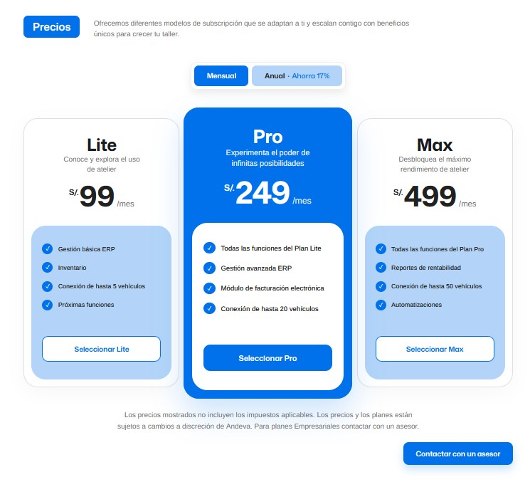
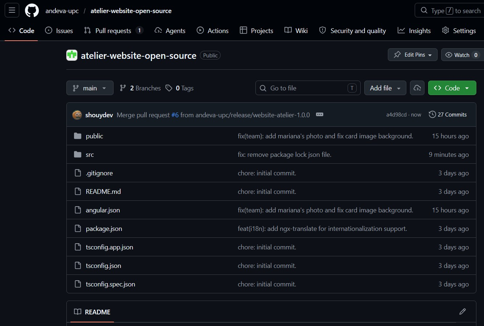

## 5.2. Landing Page, Services & Applications Implementation {#cap-5-2}

### 5.2.1.&emsp;&emsp;*Sprint 1* {#cap-5-2-1}

#### 5.2.1.1.&emsp;&emsp;*Sprint Planning 1* {#cap-5-2-1-1}

&emsp;&emsp;&emsp;&emsp;En esta sección se especifican los aspectos principales del Sprint Planning Meeting para el primer sprint del proyecto atelier. El objetivo central de esta iteración está enfocado exclusivamente en el desarrollo, maquetación y despliegue de la Landing Page, la cual servirá como la principal herramienta de captación de clientes y presentación de la propuesta de valor.

&emsp;&emsp;&emsp;&emsp;A continuación, se presenta el cuadro de resumen del sprint planning meeting siguiendo la estructura establecida:

**Tabla**

*Tabla de Sprint 1 de atelier*

| Sprint # | Sprint 1 |
|:--------:|:--------|
|    **Sprint Planning Background**      |    --      |
|    Date      |    2026-04-21      |
|    Time      |    07:00 PM      |
|    Location      |    Reunión virtual mediante el canal de voz de Discord      |
|    Prepared By      |     Huamani Estefanero, Joel     |
|    Attendees     |     Huamani Estefanero, Joel/Granda Ibarra, Luis Daniel/Machacca Soto, Aldo Jeanfranco/Morocho Pinedo, Mariana Hortencia/Sanchez Santin, Adiel Abdiaz     |
|    Sprint 1 – 1 Review Summary      |    --      |
|    Sprint 1 – 1 Retrospective Summary      |     --     |
|     **Sprint Goal & User Stories**     |          |
|     Sprint 1 Goal     |     Our focus is on offering a comprehensive and attractive initial digital presence through a fully functional landing page for the atelier platform. We believe it delivers a clear understanding of the ERP and IoT value proposition, transparent comparison of subscription plans, and trust in the brand to our target audience. This will be confirmed when visitors access the site to seamlessly navigate through the service modules across different devices, read the legal policies, and interact with the landing page.     |
|     Sprint 1 Velocity     |    24      |
|     Sum of Story Points     |   8       |

#### 5.2.1.2.&emsp;&emsp;*Aspect Leaders and Collaborators* {#cap-5-2-1-2}

&emsp;&emsp;&emsp;&emsp;Dado que el objetivo exclusivo de este primer sprint es la construcción de la Landing Page de Atelier, los principales aspectos que se toman en cuenta corresponden a los subconjuntos del alcance funcional. Estos aspectos son: Propuesta de Valor, Exploración de Módulos, Planes de Suscripción, Presentación del Equipo y Información Legal y Footer.

**Tabla**

*Leadership-and-Collaboration Matrix*

| Team Member | GitHub Username | Propuesta de Valor | Exploración de Módulos | Planes de Subcripción | Presentación de Equipo | Información Legal y Footer |
|:-----------:|:---------------:|--------------------|------------------------|-----------------------|------------------------|----------------------------|
|      Granda Ibarra, Luis Daniel       |      danieltyuyu           |                    |          L              |                       |                        |                            |
|     Huamani Estefanero, Joel        |       shouydev          |        L            |        C                |                       |            C            |          C                  |
|    Machacca Soto, Aldo Jeanfranco         |       AldoDev20          |                    |                        |     L                  |                        |                            |
|     Morocho Pinedo, Mariana Hortencia        |     Patto04            |                    |                        |                       |                        |              L             |
|      Sanchez Santin, Adiel Abdiaz       |      xs4el           |                    |                        |                       |             L           |                            |

#### 5.2.1.3.&emsp;&emsp;*Sprint Backlog 1* {#cap-5-2-1-3}

&emsp;&emsp;&emsp;&emsp;Como se estableció en el Sprint Planning, el objetivo principal de este primer sprint es el desarrollo, maquetación y despliegue de la primera versión funcional de la Landing Page de Atelier. Esto implica implementar todas las secciones visuales que comuniquen la propuesta de valor, los planes de suscripción, el equipo desarrollador y la adaptabilidad móvil.

&emsp;&emsp;&emsp;&emsp;A continuación, se presenta una captura de pantalla del sprint backlog en la herramienta de gestión Trello, junto con su respectivo enlace público: [https://trello.com/invite/b/69e53a1f24bfdaee349e4ae0/ATTI7bbd33d5db1338ca2c51df8c95727a2a46CEA512/atelier](https://trello.com/invite/b/69e53a1f24bfdaee349e4ae0/ATTI7bbd33d5db1338ca2c51df8c95727a2a46CEA512/atelier).

&emsp;&emsp;&emsp;&emsp;Seguidamente, se detalla la tabla de control de estado con la descomposición de las User Stories en tareas específicas asignadas a los miembros del equipo, estimadas en horas y con su estado actual de progreso.

**Tabla**

*Sprint Backlog #1 atelier*

| Sprint #   | Sprint 1                             |                  |                                                              |                                                                                                                                                                        |                    |                 |                                                |
|------------|--------------------------------------|------------------|--------------------------------------------------------------|------------------------------------------------------------------------------------------------------------------------------------------------------------------------|--------------------|-----------------|------------------------------------------------|
| User Story |                                      | Work-Item / Task |                                                              |                                                                                                                                                                        |                    |                 |                                                |
| Id         | Title                                | Id               | Title                                                        | Description                                                                                                                                                            | Estimation (Hours) | Assigned To     | Status (To-do / In-Process / To-Review / Done) |
| US033      | Visualización de propuesta de valor  | ET01             | Implementación integral de Hero Component y CTA              | Desarrollar la estructura HTML semántica de la cabecera principal, aplicar estilos CSS avanzados con tipografía Mona Sans y configurar el botón Call to Action.        | 5                  | Joel Huamani    | Done                                           |
| US034      | Exploración de módulos               | ET02             | Maquetación de cuadrícula de servicios y visualización       | Construir el sistema de grid responsivo para los beneficios de ERP e IoT, integrar recursos gráficos optimizados y asegurar el correcto espaciado (padding/margin).    | 5                  | Luis Granda     | Done                                           |
| US035      | Comparación de planes de suscripción | ET03             | Desarrollo de componentes de tablas de precios y comparativa | Estructurar las tarjetas comparativas (Lite, Pro, Max) en HTML, insertar listas de características técnicas y aplicar estilos de contraste visual.                     | 6                  | Aldo Machacca   | Done                                           |
| US036      | Presentación del equipo              | ET04             | Codificación de sección de equipo y estilización de perfiles | Desarrollar la estructura base de la sección Team, integrar fotografías y perfiles profesionales y aplicar estilos visuales consistentes a las tarjetas de perfil.     | 4                  | Adiel Sanchez   | Done                                           |
| US037      | Acceso a información legal           | ET05             | Estructuración de Footer e integración de accesos legales    | Desarrollar la estructura semántica del pie de página, integrar los hipervínculos a Términos, Condiciones y Políticas, y aplicar estilización Dark Primary responsiva. | 4                  | Mariana Morocho | Done                                           |

#### 5.2.1.4.&emsp;&emsp;*Development Evidence for Sprint Review* {#cap-5-2-1-4}

&emsp;&emsp;&emsp;&emsp;En esta sección se explican y presentan los avances en implementación correspondientes al primer sprint del proyecto Atelier. De acuerdo con el alcance establecido en el Sprint Planning para esta iteración inicial, el esfuerzo del equipo de desarrollo se centró exclusivamente en el producto correspondiente a la Landing Page.

&emsp;&emsp;&emsp;&emsp;A continuación, se presenta la tabla detallada que incluye, para el repositorio del sitio web estático, los commits directamente relacionados con la implementación de las características mencionadas:

**Tabla**

*Tabla de Commits del Sprint #1*

| Repository | Branch | Commit Id | Commit Message | Commit Message Body | Commited On |
|:----------:|:------:|-----------|----------------|---------------------|-------------|
|     andeva-upc/atelier-website-open-source       |    develop    |     6e76e6df      |       chore: initial commit.         |                     |     23/04/2026 11:57        |
|     andeva-upc/atelier-website-open-source       |    develop    |     32dd8f39      |      feat(material-design): add angular material theming and update styles.          |                     |      23/04/2026 12:02       |
|     andeva-upc/atelier-website-open-source       |    develop    |     4786effa      |    feat(i18n): add ngx-translate for internationalization support.            |                     |      23/04/2026 at 12:04       |
|     andeva-upc/atelier-website-open-source       |     develop   |    302e7c70       |      feat(i18n): integrate ngx-translate for multilingual support and add language files.          |                     |      23/04/2026 12:14       |
|     andeva-upc/atelier-website-open-source       |   develop     |     09075a73      |       feat(header): add header component with logo and buttons.         |                     |      23/04/2026 13:57       |
|     andeva-upc/atelier-website-open-source       |   develop     |    6e46c61d       |        feat(value-proposition): add hero component with title, subtitle, and buttons.        |                     |      23/04/2026 at 15:19       |
|     andeva-upc/atelier-website-open-source       |   develop     |     fedbfc39      |       style(header): update media query to hide button container on smaller screens.         |                     |      23/04/2026 15:22       |
|     andeva-upc/atelier-website-open-source       |    develop    |     b80c7e97      |        style(value-proposition): adjust background position for improved layout        |                     |      23/04/2026 15:27       |
|     andeva-upc/atelier-website-open-source       |    develop    |      e53f7f1b     |       style(header): hide logo text on smaller screens and update hero z-index.         |                     |      23/04/2026 15:32       |
|     andeva-upc/atelier-website-open-source       |    develop    |     3aae419f      |        style(value-proposition): update button styles and adjust layout for improved responsiveness.        |                     |       on 23/04/2026 at 15:47      |
|     andeva-upc/atelier-website-open-source       |   develop     |      070f4fd8     |        feat(benefits): add card component with animation and styling.        |                     |     23/04/2026 19:50        |
|     andeva-upc/atelier-website-open-source       |     develop   |     9f2e6d86      |        feat(pricing): initialize pricing component structure and integration.        |                     |     25/04/2026 00:17        |
|     andeva-upc/atelier-website-open-source       |   develop     |     aff3e5e2      |       feat(pricing): implement pricing toggle with signals and responsive styles.         |                     |     25/04/2026 00:21        |
|     andeva-upc/atelier-website-open-source       |   develop     |     d4d445e7      |       feat(pricing): implement pricing cards with dual-background design and dynamic prices.         |                     |      25/04/2026 00:48       |
|     andeva-upc/atelier-website-open-source       |   develop     |     774ba6b6      |        feat(pricing): complete pricing section with footer disclaimer, contact button and full responsive design.        |                     |      25/04/2026 01:15       |
|     andeva-upc/atelier-website-open-source       |   develop     |     5609a2fd      |       feat(team-info): add team component with member profiles.         |                     |       25/04/2026 10:32      |
|     andeva-upc/atelier-website-open-source       |   develop     |     d859ca4c      |         fix(team): add mariana's photo and fix card image background.       |                     |        25/04/2026 15:53     |
|     andeva-upc/atelier-website-open-source       |   develop     |     5ec553fd      |         feat: add footer in the landing page.       |                     |      25/04/2026 19:56       |
|     andeva-upc/atelier-website-open-source       |   develop     |      1c51d1ac     |        fix(footer): reorganize footer component imports and file structure.        |                     |      26/04/2026 07:07       |
|     andeva-upc/atelier-website-open-source       |   main     |     a4d98cd5      |        Release/website atelier 1.0.0        |                     |      26/04/2026 07:23       |

#### 5.2.1.5.&emsp;&emsp;*Execution Evidence for Sprint Review* {#cap-5-2-1-5}

&emsp;&emsp;&emsp;&emsp;Esta sección inicia con un resumen detallado de los objetivos alcanzados durante el primer sprint del proyecto Atelier. Durante esta iteración, el esfuerzo del equipo se enfocó exitosamente en el desarrollo e implementación de la primera versión funcional de la Landing Page. Se logró construir y estilizar las interfaces visuales clave para el embudo de captación comercial, abarcando la cabecera principal con la propuesta de valor, la cuadrícula de exploración de los módulos, la tabla comparativa de planes de suscripción, la presentación del equipo desarrollador y el pie de página con accesos legales. Asimismo, se garantizó un diseño completamente responsivo para una correcta adaptabilidad en dispositivos móviles y de escritorio.

&emsp;&emsp;&emsp;&emsp;A continuación, se presentan las capturas de pantalla de las principales vistas implementadas, junto con un enlace a un video demostrativo que ilustra y explica a detalle la visualización y navegación logrados en este Sprint: .

**Figura**

*Capturas de Pantalla de la Landing Page de atelier*

#### 5.2.1.6.&emsp;&emsp;*Services Documentation Evidence for Sprint Review* {#cap-5-2-1-6}

&emsp;&emsp;&emsp;&emsp;En este primer sprint, de acuerdo con el Sprint Goal y la planificación establecida, el esfuerzo y el alcance técnico se centraron de manera exclusiva en el desarrollo, maquetación y despliegue del Landing Page de la plataforma atelier.

&emsp;&emsp;&emsp;&emsp;Por consiguiente, durante esta iteración inicial no se ha desarrollado, integrado ni desplegado ningún Web Service o API RESTful. La implementación y documentación técnica de endpoints mediante OpenAPI, así como la tabla de acciones y sintaxis de llamadas requerida, comenzarán a elaborarse y evidenciarse a partir de los siguientes sprints, una vez que el equipo inicie el desarrollo arquitectónico de la aplicación Backend.

#### 5.2.1.7.&emsp;&emsp;*Software Deployment Evidence for Sprint Review* {#cap-5-2-1-7}

&emsp;&emsp;&emsp;&emsp;En esta sección se resumen los procesos realizados en relación con el despliegue durante el primer sprint del proyecto atelier. De acuerdo con los objetivos trazados en el Sprint Planning, el alcance técnico de esta iteración se limitó exclusivamente a la construcción del Landing Page. Por consiguiente, durante este periodo no se realizaron despliegues vinculados a las Web Applications ni a los Web Services.

&emsp;&emsp;&emsp;&emsp;Paso 1: Integración de la rama de lanzamiento. Como paso inicial, el equipo consolidó todos los avances de diseño y maquetación de las distintas ramas de características hacia la rama principal de despliegue. Esto asegura que el código a desplegar sea la versión estable y aprobada del Sprint.

**Figura**

*Repositorio del website de atelier*

&emsp;&emsp;&emsp;&emsp;Paso 2: Configuración del entorno en Vercel.

**Figura**

*Captura de pantalla de la seccion de proyectos de Vercel*

&emsp;&emsp;&emsp;&emsp;Paso 3: Selección el repositorio y desplegar.

**Figura**

*Captura de pantalla de la seccion de despliegue de Vercel*

**Figura**

*Captura de pantalla de la configuración de despliegue de Vercel*

&emsp;&emsp;&emsp;&emsp;Paso 4: Obtención del enlace público y validación: [https://atelier-11848.vercel.app/](https://atelier-11848.vercel.app/).

#### 5.2.1.8.&emsp;&emsp;*Team Collaboration Insights during Sprint* {#cap-5-2-1-8}

&emsp;&emsp;&emsp;&emsp;En esta sección el equipo explica cómo se han desarrollado las actividades de implementación durante el primer sprint y se presentan las evidencias analíticas de colaboración en GitHub.

&emsp;&emsp;&emsp;&emsp;Joel Huamani: Lideró la estructuración semántica de la cabecera principal, configuró los botones de llamado a la acción y enlazó las normativas legales. Además, trabajó en los media queries para la adaptabilidad móvil de estas vistas.

&emsp;&emsp;&emsp;&emsp;Adiel Sanchez: Se encargó de la maquetación de la sección de presentación del equipo, aplicó los estilos visuales principales al Hero y aseguró el comportamiento responsivo del pie de página.

&emsp;&emsp;&emsp;&emsp;Luis Granda: Fue el responsable de estructurar la sección de exploración de módulos, asegurando el correcto espaciado y layout mediante CSS.

&emsp;&emsp;&emsp;&emsp;Aldo MAchacca: Lideró la codificación de la tabla comparativa de los planes de suscripción, integró los recursos gráficos optimizados e implementó la vista responsiva de la matriz de precios.

&emsp;&emsp;&emsp;&emsp;Mariana Morocho: Se enfocó en la maquetación y estilizado del pie de página general, además de colaborar en la carga de la información de los perfiles en la sección del equipo.

&emsp;&emsp;&emsp;&emsp;A continuación, se presentan las capturas en imagen de los analíticos de colaboración y commits extraídos de la pestaña "Insights" del repositorio en GitHub, las cuales evidencian la participación de todos los miembros del equipo:

**Figura**

*Gráfico de commits*

